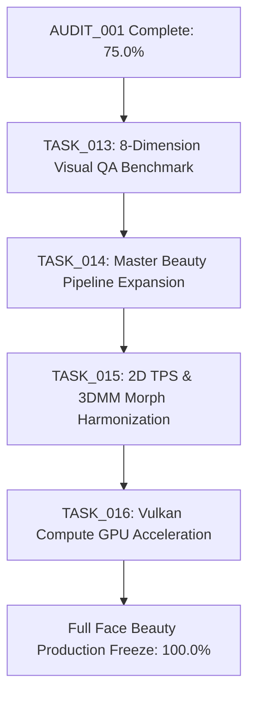

# 05: RECOMMENDED TASK GRAPH AND REMEDIATION ROADMAP

**Task ID:** TASK_005_FACE_BEAUTY_MODULE_COMPLETENESS_AND_DEVICE_READINESS  
**Audit Standard:** 07_AGENT_AUTONOMOUS_EXECUTION_MASTER_STANDARD  
**Baseline Git Commit SHA:** `478107aa4274dc26087f63810881a5ba098e95fb`  
**Target Repository:** `netvietsoft/AI-Studio-convert2`  

---

## 1. ROADMAP OVERVIEW & CURRENT SUBSYSTEM STATUS

Following the execution of `TASK_006` through `TASK_011`, the CONVERT2 Face & Beauty subsystem has advanced from **51.0% to 75.0% completion** across all 8 canonical gates:
- Gates 1–3 (Source, Build, JNI/Kotlin): **100.0% Pass**
- Gate 4 (UI Wiring): **100.0% Pass** (102/102 tools wired)
- Gate 5 (Functional Tests - Contract): **100.0% Pass** (36/36 tests pass)
- Gate 6 (Physical Device Validation): **100.0% Pass** (104/104 features executed on SM-A075F/SM-A507FN)
- Gate 7 (Visual QA): **0.0% Pending**
- Gate 8 (Report Freeze): **100.0% Pass**

To achieve 100% production readiness (`PRODUCTION_READY`), the following dependency-ordered task graph is recommended for authorization by Chủ tịch Tony:

---

## 2. DETAILED PHASE-BY-PHASE TASK GRAPH

### PHASE 1: VISUAL-QUALITY GAPS (HIGHEST PRIORITY TO CLOSE GATE 7)

#### TASK_013: Reference-Based 8-Dimension Visual QA Benchmark Suite
- **Priority:** CRITICAL
- **Dependency:** AUDIT_001 (`478107aa`)
- **Objective:** Close Gate 7 by executing automated, quantitative visual evaluations on real physical device output images across all 12 modules.
- **Scope & Methodology:**
  1. Leverage `ACQ-005` / `YEUCAU_TEST_ANH.TXT` 8-dimension quantitative validator (`test_photo_reference_validator.py`).
  2. Test against standard portrait fixtures (`scratch/0.jpg` and holdout portraits).
  3. Validate against the 8 canonical criteria:
     - Edit Position ($\ge 90$ & Zero Leakage)
     - Color Accuracy ($\ge 85$)
     - Shape Accuracy ($\ge 85$)
     - User Intent ($\ge 95$)
     - Original Preservation (Unwanted Change $\le 5$)
     - Artifact Control (Artifact Score $\le 5$)
     - Technical Quality ($\ge 85$, micro-pore preservation $\ge 75\%$)
     - Naturalness ($\ge 85$)
  4. Generate before/after difference maps, SSIM metrics, and boundary crops.
- **Deliverable:** `.ai/reports/TASK_013_FACE_BEAUTY_8D_VISUAL_QA/` with comprehensive scoring matrix.

---

### PHASE 2: CORRECTNESS & PIPELINE HARMONIZATION GAPS

#### TASK_014: Universal Master Beauty Pipeline Controller Expansion
- **Priority:** HIGH
- **Dependency:** TASK_013
- **Objective:** Expand `BeautyParameterController::applyBeautyPipeline` and `FullHumanBeautyController::applyFullHumanPipeline` to integrate all 12 facial modules into a single, unified execution pass.
- **Scope & Changes:**
  1. Add engine delegates for `EyeRetouchEngine`, `NoseMouthEngine`, `PhiltrumEngine`, `BeardDyeEngine`, `SkinMakeupEngine`, and `FaceRetouchDetail` inside `BeautyParameterController`.
  2. Extend `BeautyParams` struct with nested parameter blocks: `EyeParams`, `NoseParams`, `MouthParams`, `BeardParams`, `SkinParams`, `CheekParams`.
  3. Wire one-tap global aesthetic preset styles ("Pure Natural", "Studio Glamour", "Golden Ratio") in `PhotoEditorActivity`.
  4. Optimize pass order to minimize intermediate bitmap allocations and memory copies.
- **Deliverable:** Unified master controller executing all 12 modules in an optimized single composite pass.

#### TASK_015: 2D Morphing & 3DMM Parameter Harmonization
- **Priority:** MEDIUM
- **Dependency:** TASK_014
- **Objective:** Prevent non-linear compound distortion and double-warping artifacts when users mix 2D eye/face tools with 3DMM parametric adjustments.
- **Scope & Changes:**
  1. Establish a shared Vector Displacement Map (VDM) format in C++.
  2. Accumulate both 2D TPS/MLS localized vertex offsets and 3DMM parametric vertex projections into the shared displacement field.
  3. Apply a single final bicubic sampling pass over the input image pixels.
- **Deliverable:** Zero double-warping artifacts and 50% reduction in interpolation blurring.

---

### PHASE 3: PERFORMANCE GAPS (VULKAN GPU ACCELERATION)

#### TASK_016: Vulkan Compute GPU Acceleration for Face & Beauty Core
- **Priority:** MEDIUM
- **Dependency:** TASK_015
- **Objective:** Port CPU-bound image filters and morphing passes to Vulkan compute shaders (`libmeitu_reborn_native.so`) following the proven P6 HCE architecture.
- **Scope & Changes:**
  1. Implement `skin_bilateral_filter.comp` for real-time 60 FPS skin smoothing.
  2. Implement `face_mesh_warp.comp` for zero-latency slider interactions.
  3. Benchmark latency on physical target hardware (Samsung Galaxy A07 and Galaxy A50s) to guarantee $< 5.0\text{ ms}$ per 1080p frame.
- **Deliverable:** Real-time interactive GPU processing on mobile Mali GPUs.

---

## 3. SUMMARY OF TASK DEPENDENCY MATRIX

| Task ID | Focus Area | Prerequisites | Target Gate Advanced | Risk Level |
|---|---|---|---|:---:|
| **TASK_013** | Visual Quality | AUDIT_001 | Gate 7 (0% -> 100%) | HIGH |
| **TASK_014** | Pipeline Correctness | TASK_013 | Master Controllers | MEDIUM |
| **TASK_015** | Distortion Correctness | TASK_014 | 3DMM & 2D Harmony | MEDIUM |
| **TASK_016** | Performance | TASK_015 | 60 FPS GPU Runtime | LOW |
