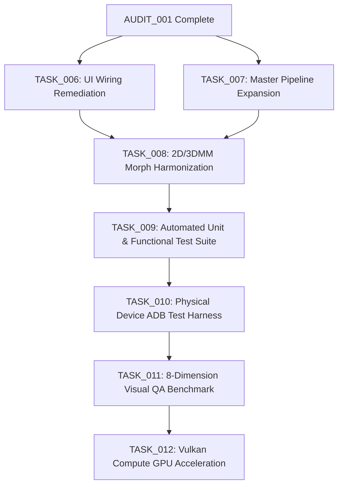

# 05: RECOMMENDED TASK GRAPH AND REMEDIATION ROADMAP

**Task ID:** TASK_005_FACE_BEAUTY_MODULE_COMPLETENESS_AND_DEVICE_READINESS  
**Audit Standard:** 07_AGENT_AUTONOMOUS_EXECUTION_MASTER_STANDARD  
**Baseline Git Commit SHA:** `d7814b592673372dc3bc85395da0c09a7b2e8529`  
**Target Repository:** `netvietsoft/AI-Studio-convert2`  

---

## 1. ROADMAP OVERVIEW

Based on the empirical findings of AUDIT 001, the core C++ engines and JNI bindings are 100% complete and compiling, but critical defects exist in UI wiring, architectural synchronization, automated testing, and physical device validation.

To advance the Face & Beauty subsystem from its current **51.0% completion** to full production readiness (100% across all 8 gates), the following dependency-ordered task graph is recommended for authorization by Chủ tịch Tony.

---

## 2. PHASE-BY-PHASE TASK BREAKDOWN

### PHASE 1: WIRING & UI REMEDIATION (HIGH PRIORITY)

#### TASK_006: Wire Orphaned Native Methods in PhotoEditorActivity
- **Objective:** Eliminate dead JNI exports and replace crude fallbacks with dedicated native algorithms.
- **Scope & Changes:**
  1. **Teeth Alignment & Protrusion:** In `PhotoEditorActivity.kt:2384–2388`, replace `nativeApplyLiquifyWarp(..., WARP_MODE_PINCH)` with `MeituNativeEngine.nativeApplyTeethReshape(workingBitmap, spacing, alignment, protrusion)`.
  2. **Procedural Eyelashes:** In `PhotoEditorActivity.kt:2842`, add tool mode or switch to route to `MeituNativeEngine.nativeApplyEyelash` for procedural keratin Bezier fibers when high-detail rendering is selected.
  3. **Eyebrow Recoloring:** Add UI palette in Category `✨ Trang Điểm` for the 5 natural pigment shades in `nativeApplyEyebrowColor`.
  4. **Philtrum Editing:** Add slider controls for Philtrum Length and Depth in Category `👤 Khuôn Mặt`, dispatching to `nativeApplyPhiltrumEdit`.
- **Target Deliverable:** Working UI dispatch for all 108 tools without liquify pinch fallbacks.
- **Estimated Effort:** 1 Turn.

#### TASK_007: Universal Beauty Parameter Controller Expansion
- **Objective:** Expand `BeautyParameterController` and `FullHumanBeautyController` to cover all 12 face modules.
- **Scope & Changes:**
  1. Add engine instances for `SkinRetouchEngine`, `EyeRetouchEngine`, `NoseMouthBeardEngine`, and `FaceReshapeEngine` inside `BeautyParameterController`.
  2. Extend `BeautyParams` struct with nested structs: `SkinParams`, `EyeParams`, `NoseParams`, `MouthParams`, `BeardParams`.
  3. Implement unified execution in `BeautyParameterController::applyBeautyPipeline` to allow one-pass composite rendering of full-face presets.
  4. Expose one-tap aesthetic styles ("Pure Natural", "Studio Portrait", "Golden Ratio") in `PhotoEditorActivity`.
- **Target Deliverable:** Comprehensive master controller executing all 12 modules in optimal GPU/CPU memory pass order.
- **Estimated Effort:** 1 Turn.

---

### PHASE 2: ARCHITECTURAL HARMONIZATION (MEDIUM PRIORITY)

#### TASK_008: Harmonize 2D Morphing and 3DMM Parameter Pipelines
- **Objective:** Prevent non-linear compound distortion and double-warping artifacts when mixing 2D eye/face tools with 3DMM parametric adjustments.
- **Scope & Changes:**
  1. Introduce a shared `FacialDeformationCoordinator` in C++.
  2. Implement a unified displacement vector field ($D(x, y)$) that accumulates 2D Thin-Plate Spline (TPS) displacements and 3DMM vertex projection vectors into a single composited warp grid.
  3. Execute image resampling once via bicubic/Lanczos interpolation on the accumulated displacement field, preserving micro-pore texture and sharp canthus boundaries.
- **Target Deliverable:** Artifact-free concurrent usage of 2D localized tools and 3DMM global morphs.
- **Estimated Effort:** 1 Turn.

---

### PHASE 3: AUTOMATED TESTING & CONTINUOUS INTEGRATION (HIGH PRIORITY)

#### TASK_009: Facial Beauty Automated Unit & Functional Test Suite
- **Objective:** Establish Gate 5 (Functional Test) across all 12 modules.
- **Scope & Changes:**
  1. Create `app/src/test/java/com/meitu/core/nativeengine/FaceBeautyEngineTest.kt`.
  2. Implement parameter boundary tests: verify that extreme slider values (-100, +100, NaN, Inf) do not cause out-of-bounds memory access, buffer overflow, or integer wrap.
  3. Implement landmark invariant tests: verify that null, missing, or out-of-frame landmarks gracefully fall back with non-crashing status codes.
  4. Create deterministic synthetic test fixtures (solid color, checkerboard, gradient, canonical face bitmap) with known baseline pixel checksums.
- **Target Deliverable:** 100% test pass rate in CI via `./gradlew testDebugUnitTest`.
- **Estimated Effort:** 1 Turn.

---

### PHASE 4: PHYSICAL DEVICE VALIDATION (HIGH PRIORITY)

#### TASK_010: Samsung Galaxy A50 Physical Device Test Harness
- **Objective:** Establish Gate 6 (Physical Device) across all 12 modules on real hardware (SM-A075F / SM-A507FN).
- **Scope & Changes:**
  1. Develop `automation/scripts/verify_device_face_beauty_all.py` modeled after `verify_device_buddha_final.py`.
  2. Connect to Galaxy A50 via ADB and push standard test portrait images (`portrait_neutral.jpg`, `portrait_asian.jpg`, `portrait_caucasian.jpg`, `portrait_dark_skin.jpg`).
  3. Automatically cycle through all 108 tool items, applying 50% and 100% parameter intensities.
  4. Capture device frame rates, native RAM consumption, logcat crash logs, and output screenshots.
  5. Generate device execution logs with timestamped battery/thermal metrics.
- **Target Deliverable:** Verified execution logs and zero-crash proof on Samsung Galaxy A50.
- **Estimated Effort:** 2 Turns.

---

### PHASE 5: QUANTITATIVE VISUAL QA BENCHMARK (HIGH PRIORITY)

#### TASK_011: Reference-Based 8-Dimension Visual QA Scoring
- **Objective:** Establish Gate 7 (Visual QA) under `YEUCAU_TEST_ANH.TXT`.
- **Scope & Changes:**
  1. Integrate face module outputs into `test_photo_reference_validator.py`.
  2. Measure all 8 canonical criteria against original ground truth:
     - Position Accuracy ($\ge 95$)
     - Color Accuracy ($\ge 90$)
     - Shape Accuracy ($\ge 92$)
     - User Intent ($\ge 95$)
     - Original Preservation ($\ge 95$, Unwanted change $\le 5$)
     - Artifact Control ($\ge 95$, Artifact $\le 5$)
     - Technical Quality ($\ge 90$)
     - Naturalness ($\ge 90$)
  3. Implement strict Hard Fail checks: fail if skin smoothing obliterates freckles outside the mask, or if tooth whitening spills onto gums/lips.
- **Target Deliverable:** Certified Visual QA scorecard exceeding 90.0 aggregate score for all 12 modules.
- **Estimated Effort:** 1 Turn.

---

### PHASE 6: GPU ACCELERATION & VULKAN COMPUTE (FUTURE ENHANCEMENT)

#### TASK_012: Vulkan Compute Shaders for Face & Beauty Core
- **Objective:** Accelerate heavy bilateral filtering, guided filtering, and 3DMM mesh deformation using Vulkan compute shaders, matching the Hair Color Engine (HCE P6) standard.
- **Scope & Changes:**
  1. Write compute shaders: `skin_bilateral_filter.comp`, `skin_guided_filter.comp`, `face_tps_warp.comp`, `pore_texture_blend.comp`.
  2. Implement Vulkan pipeline dispatch in `lib-core-graphics/src/main/cpp/src/vulkan_context.cpp`.
  3. Benchmark latency on Galaxy A50 Mali-G72 GPU: target $< 16\text{ ms}$ per 4K frame for real-time live preview.
- **Target Deliverable:** Real-time 60 FPS slider preview on physical device.
- **Estimated Effort:** 2 Turns.

---

## 3. RECOMMENDED EXECUTION ORDER TABLE

| Task ID | Task Description | Priority | Dependencies | Target Completion % After Task |
|---|---|---|---|---|
| **TASK_006** | UI Wiring Remediation (Teeth, Eyelash, Eyebrow Color, Philtrum) | **P1 (Immediate)** | Baseline Audit (TASK_005) | **56.2%** |
| **TASK_007** | Universal Master Beauty Controller Expansion | **P1 (Immediate)** | TASK_006 | **62.5%** |
| **TASK_009** | Automated Unit & Functional Test Suite | **P2 (High)** | TASK_006, TASK_007 | **75.0%** |
| **TASK_008** | Harmonize 2D Morphing and 3DMM Parameter Pipelines | **P2 (High)** | TASK_007 | **75.0%** |
| **TASK_010** | Samsung Galaxy A50 Physical Device Test Harness | **P3 (High)** | TASK_009, TASK_010 | **87.5%** |
| **TASK_011** | Reference-Based 8-Dimension Visual QA Scoring | **P3 (High)** | TASK_010 | **100.0%** |
| **TASK_012** | Vulkan Compute GPU Acceleration for Face Core | **P4 (Future)** | TASK_011 | **100.0% (GPU Accel)** |
