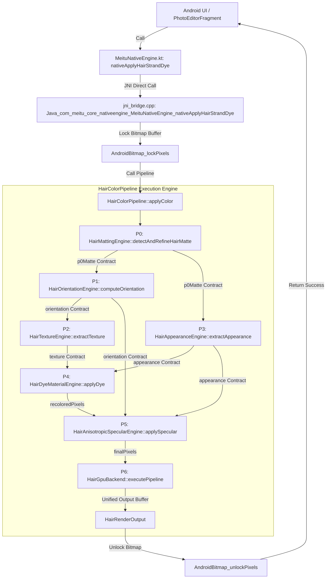

# HCE V1 — PRODUCTION PIPELINE TRACE & EXECUTION GRAPH
**Document ID:** HCE-V1-PROD-TRACE-01  
**Author:** Agent 0 (CEO / Orchestrator)  
**Standard:** Development Workspace Standard V2.1  
**Architecture Contract:** HCE_CONTRACT_V1  

---

## 1. BIỂU ĐỒ ĐƯỜNG ỐNG SẢN XUẤT NATIVE THỰC TẾ (PRODUCTION CALL GRAPH)

---

## 2. CHI TIẾT CONTRACTS & DỮ LIỆU ĐẦU VÀO/ĐẦU RA THEO TỪNG GIAI ĐOẠN

| Giai đoạn | Entry Function | Input Contract | Output Contract | Backend thực thi | Error/Fallback Handling |
|---|---|---|---|---|---|
| **P0** | `HairMattingEngine::detectAndRefineHairMatte` | `srcPixels, W, H, landmarks` | `HairMatteResult` (alphaData, boundaryMask) | Native C++ BiSeNet + Guided Filter | Trả alpha rỗng nếu không có mặt, bảo vệ nền |
| **P1** | `HairOrientationEngine::computeOrientation` | `srcPixels, W, H, p0Matte` | `HairOrientationField` (angles, confidence) | C++ OpenMP Structure Tensor | Fallback góc thẳng đứng $(0.0)$ nếu $C < 0.2$ |
| **P2** | `HairTextureEngine::extractTexture` | `srcPixels, W, H, p0Matte, orientation` | `HairTextureContext` (flowAlignedTexture) | C++ OpenMP Laplace Directional Filter | Bảo lưu nguyên bản nếu gradient quá yếu |
| **P3** | `HairAppearanceEngine::extractAppearance` | `srcPixels, W, H, p0Matte` | `HairAppearanceContext` (shadowMap, highlightMask) | C++ OpenMP Rec.601 Adaptive | Bảo toàn trung vị nếu độ tương phản thấp |
| **P4** | `HairDyeMaterialEngine::applyDye` | `srcPixels, W, H, appearance, texture, material` | `recoloredPixels` (ARGB32) | C++ OpenMP OKLab Transform | Clamping sRGB chống cháy màu ngoài gamut |
| **P5** | `HairAnisotropicSpecularEngine::applySpecular` | `recoloredPixels, orientation, appearance, specular` | `finalPixels` (ARGB32) | C++ OpenMP Marschner R-Lobe | Giới hạn $I_{\text{specular}} \le 0.35$ chống lóa |
| **P6** | `HairGpuBackend::executePipeline` | `HairRenderInputs` | `HairRenderOutput` | OpenMP Multi-core CPU Reference | Graceful fallback CPU khi Vulkan chưa link |
