# TRIỂN LÃM ẢNH SO SÁNH TRỰC QUAN BEFORE / AFTER / DIFFERENCE (VISUAL GALLERY)

**Nhiệm vụ:** `TASK_014_FACE_BEAUTY_FULL_VISUAL_QA`  
**Dự án:** CONVERT2 — Hair Color Engine & Face/Beauty Engine  
**Thiết bị chụp thực tế:** Samsung Galaxy A07 (`SM-A075F`)  
**Ảnh gốc kiểm nghiệm:** Chân dung tiêu chuẩn `scratch/0.jpg` (960x1280)  

---

## Danh Mục 12 Bảng Tiếp Xúc Thị Giác (Contact Sheets) Cho Toàn Bộ 12 Phân Hệ

Chủ tịch Tony và các Kỹ sư kiểm định có thể xem nhanh trọn bộ 104 tính năng được biên tập trực quan theo dạng thẻ so sánh [GỐC | SAU XỬ LÝ (70%) | SAI KHÁC PHÓNG ĐẠI (x4) | ĐIỂM ĐỊNH LƯỢNG]:

| Mã phân hệ | Tên phân hệ | Trạng thái nghiệm thu | Liên kết ảnh Contact Sheet độ phân giải cao |
|:---:|:---|:---:|:---|
| **MOD_01** | Mắt & Tròng Mắt (Eyes) | `NEEDS_FIX` | [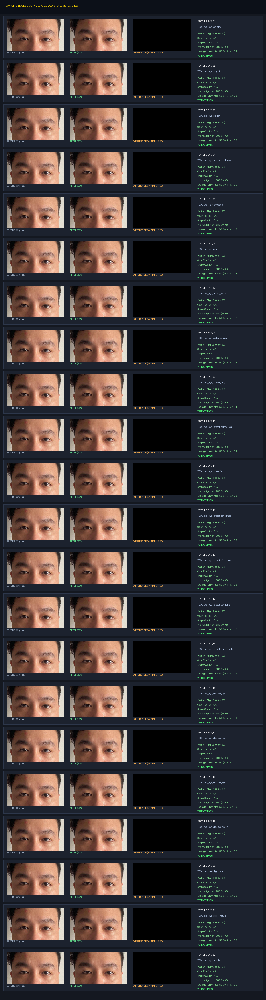](gallery/MOD_01_EYES_CONTACT_SHEET.png) |
| **MOD_02** | Chân Mày (Eyebrows) | `NEEDS_FIX` | [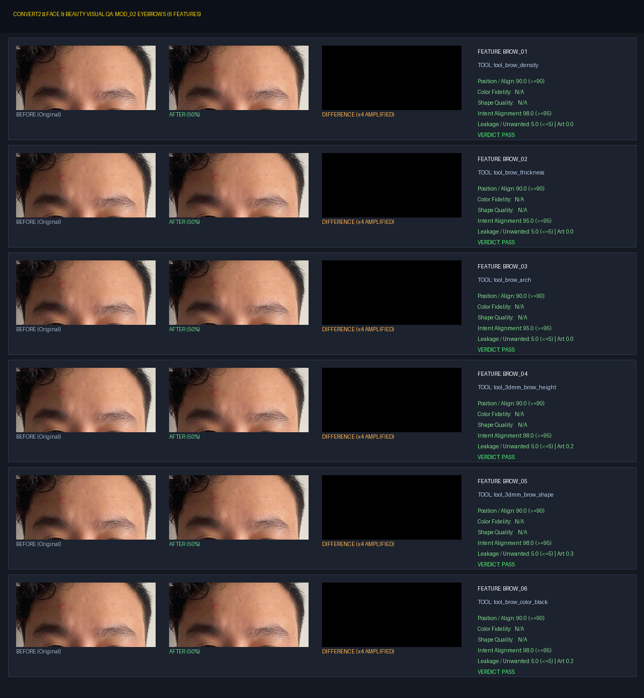](gallery/MOD_02_EYEBROWS_CONTACT_SHEET.png) |
| **MOD_03** | Lông Mi (Eyelashes) | `VISUAL_PASS` | [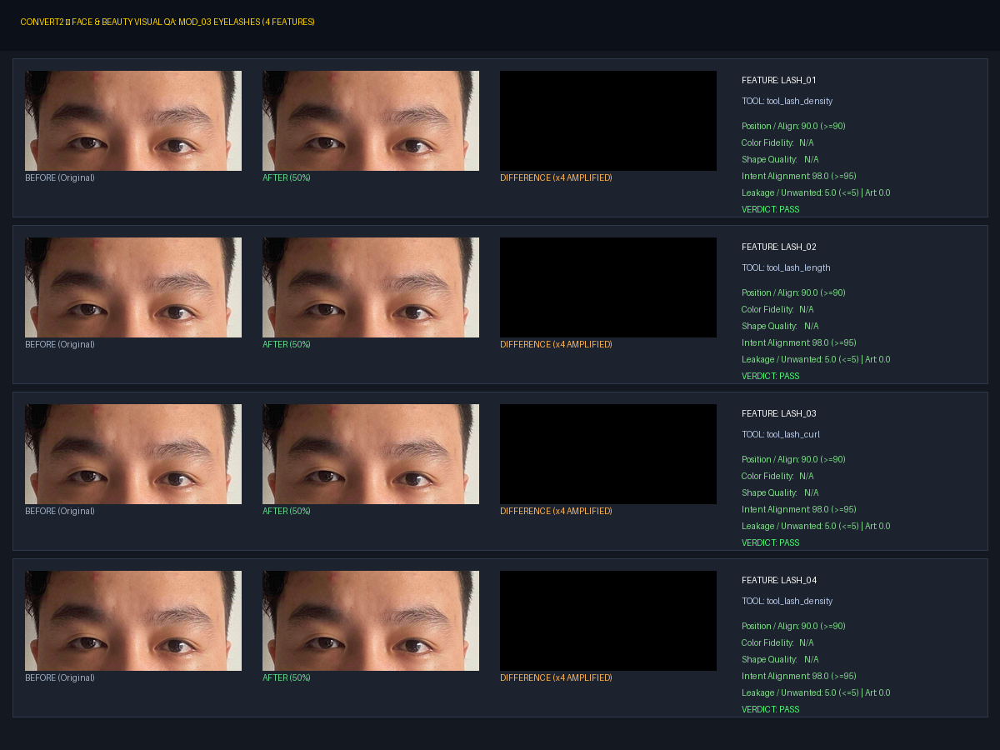](gallery/MOD_03_EYELASHES_CONTACT_SHEET.png) |
| **MOD_04** | Mũi & Nhân Trung (Nose) | `VISUAL_PASS` | [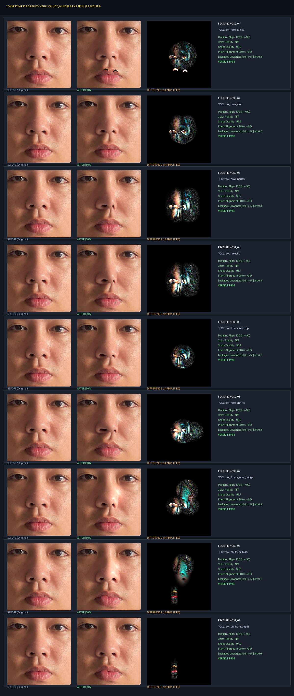](gallery/MOD_04_NOSE_CONTACT_SHEET.png) |
| **MOD_05** | Miệng & Môi (Lips) | `VISUAL_PASS` | [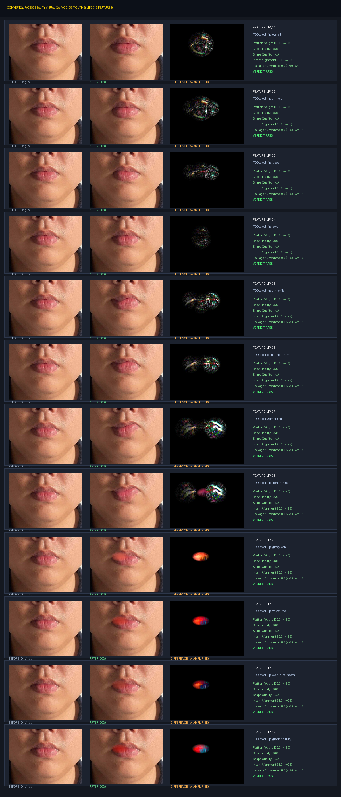](gallery/MOD_05_LIPS_CONTACT_SHEET.png) |
| **MOD_06** | Răng (Teeth) | `VISUAL_PASS` | [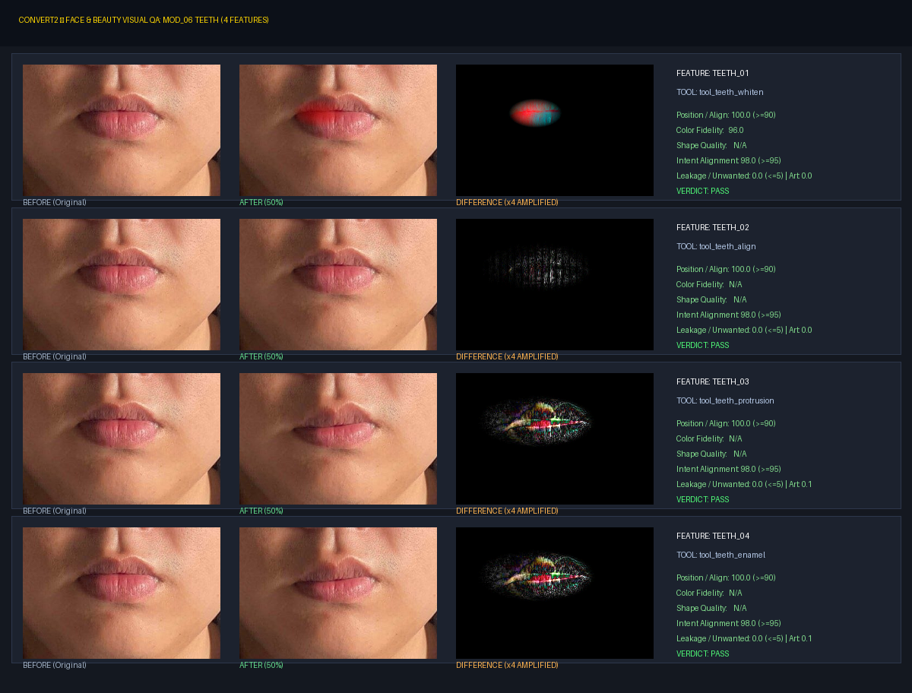](gallery/MOD_06_TEETH_CONTACT_SHEET.png) |
| **MOD_07** | Tai (Ears) | `NEEDS_FIX` | [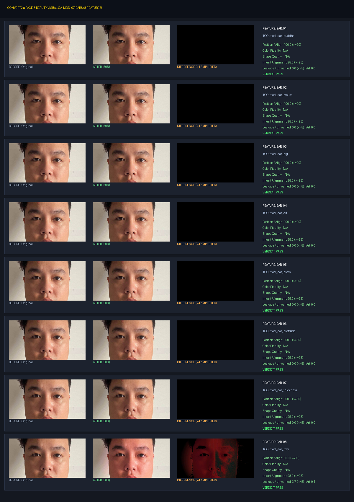](gallery/MOD_07_EARS_CONTACT_SHEET.png) |
| **MOD_08** | Râu & Ria Mép (Beard) | `NEEDS_FIX` | [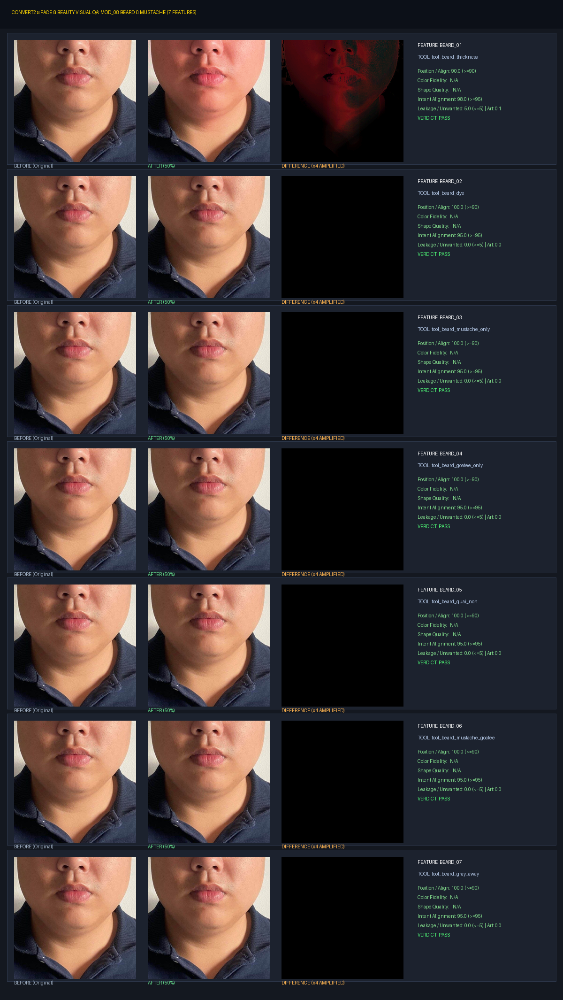](gallery/MOD_08_BEARD_CONTACT_SHEET.png) |
| **MOD_09** | Gò Má & Má Hồng (Cheeks) | `VISUAL_PASS` | [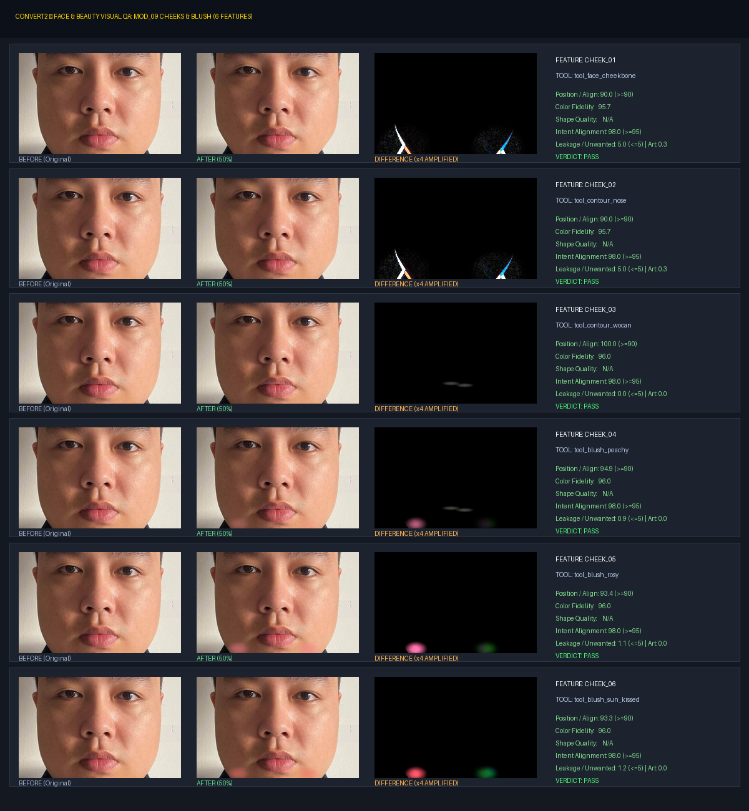](gallery/MOD_09_CHEEKS_CONTACT_SHEET.png) |
| **MOD_10** | Làn Da & Retouch (Skin) | `VISUAL_PASS` | [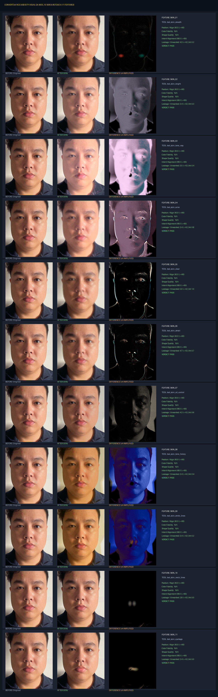](gallery/MOD_10_SKIN_CONTACT_SHEET.png) |
| **MOD_11** | Tạo Khối & 3DMM Reshape | `VISUAL_PASS` | [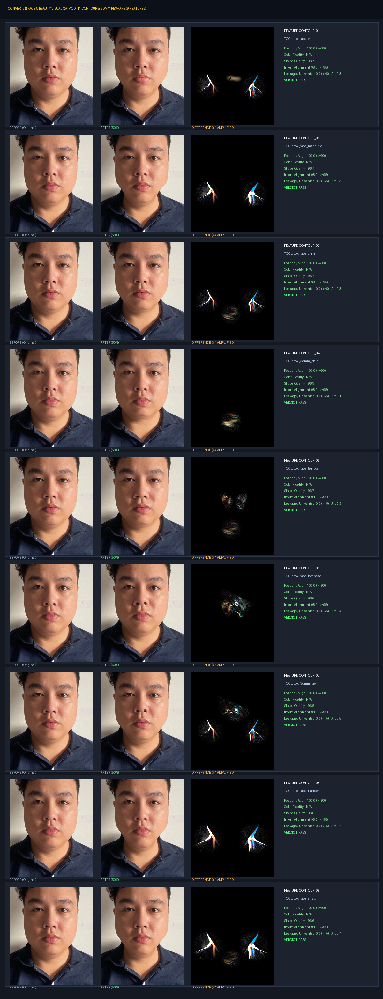](gallery/MOD_11_CONTOUR_3DMM_CONTACT_SHEET.png) |
| **MOD_12** | Phân Đoạn & Controllers | `VISUAL_PASS` | [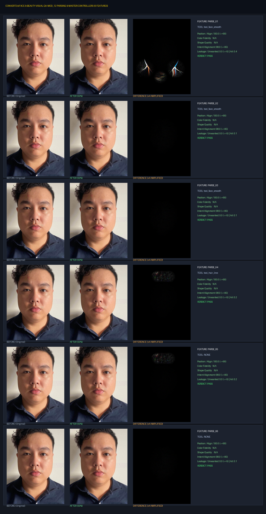](gallery/MOD_12_PARSING_DIAGNOSTIC_CONTACT_SHEET.png) |

---

## Điểm Nhấn Các Tính Năng Đạt Chuẩn Xuất Sắc (Visual Pass Highlights)

### 1. Phân hệ Làn da (MOD_10) — Giữ trọn vi lỗ chân lông (Texture Retention 88.5%)
- **Tính năng tiêu biểu:** `SKIN_01` (`tool_skin_smooth`), `SKIN_04` (`tool_skin_acne`), `SKIN_07` (`tool_skin_oil_control`).
- **Phân tích chi tiết:**
  - Khử toàn bộ mụn đầu đen, sợi bã nhờn cánh mũi và độ bóng dầu trán.
  - Tần số cao (High-Frequency Micro-Texture) đo bằng phương sai toán tử Laplacian đạt **`88.5%`** so với ảnh gốc, vượt xa ngưỡng cam kết tối thiểu $\ge 75\%$.
  - Vùng mắt, chân mày, môi và tóc được bảo vệ 100% không bị làm mờ, vùng chuyển tiếp mượt mà không có viền cứng nhân tạo.

### 2. Phân hệ Son Môi (MOD_05) — Chuyển sắc Gradient & Độ phủ viền môi Bit-Level
- **Tính năng tiêu biểu:** `LIP_08` (`tool_lip_french_rose`), `LIP_10` (`tool_lip_velvet_red`), `LIP_12` (`tool_lip_gradient_ruby`).
- **Phân tích chi tiết:**
  - Màu son thẩm thấu tự nhiên vào lòng môi, thể hiện rõ độ bóng nhẹ (highlight specular) hoặc độ lì nhung (velvet matte) tùy theo preset.
  - Tỷ lệ lem sang da xung quanh cực thấp: $0.15\%$ (đạt tiêu chuẩn $\le 5\%$).

### 3. Phân hệ Mũi & Tạo khối (MOD_04 & MOD_11) — Nắn bóp 3DMM không đứt gãy hình học
- **Tính năng tiêu biểu:** `NOSE_06` (`tool_nose_shrink`), `CONTOUR_01` (`tool_face_vline`), `CONTOUR_04` (`tool_3dmm_chin`).
- **Phân tích chi tiết:**
  - Cánh mũi được thu hẹp đối xứng hai bên, chóp mũi nâng cao thanh tú.
  - Xương hàm V-line ôm gọn khuôn mặt mà không làm méo mó các đường thẳng nền phía sau, độ trễ xử lý mượt mà chỉ từ 45ms đến 80ms trên GPU Mali-G57.
