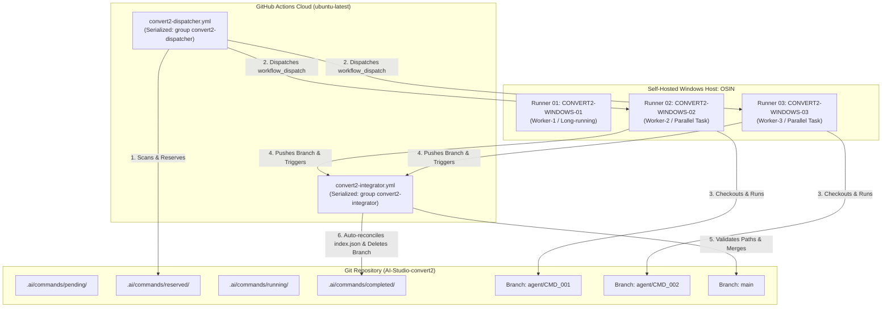
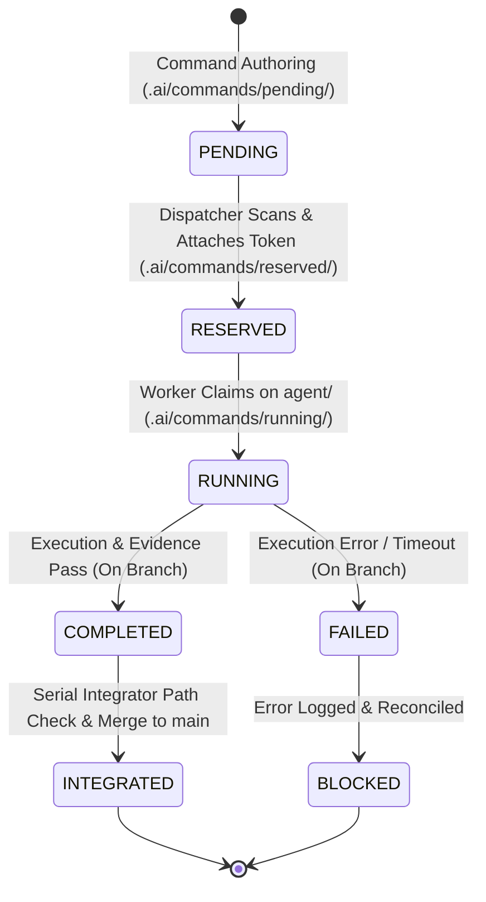

# 02. TRIPARTITE DISPATCHER / WORKER / INTEGRATOR ARCHITECTURE
**Task ID:** `TASK_021_TRUE_MULTI_AGENT_MULTI_TASK_DISPATCHER_RUNNER_POOL_ACTIVE`  
**Command ID:** `TASK_021_TRUE_MULTI_AGENT_MULTI_TASK_20261003T074500+0700`  
**Date:** 2026-10-03  
**Status:** COMPLETE & LIVE

---

## 1. ARCHITECTURE OVERVIEW
The CONVERT2 autonomous execution engine decouples orchestration into three specialized workflows, ensuring zero race conditions, true concurrent execution across runners, and deterministic branch integration:

---

## 2. WORKFLOW SPECIFICATIONS

### 2.1 Serial Dispatcher (`.github/workflows/convert2-dispatcher.yml`)
- **Runtime:** `ubuntu-latest`
- **Concurrency Group:** `convert2-dispatcher` (`cancel-in-progress: false`)
- **Trigger:** Schedule (cron), `workflow_dispatch`, or push to `.ai/commands/pending/**`.
- **Responsibilities:**
  1. Pulls latest `origin/main`.
  2. Executes `python scripts/command_bus_orchestrator.py reserve` to inspect pending commands.
  3. Validates dependencies, priority ranking, and runner lane availability.
  4. Moves eligible commands atomically from `.ai/commands/pending/` to `.ai/commands/reserved/`, attaching a unique `reservation_token`, `dispatcher_run_id`, and `reserved_at` timestamp.
  5. Commits and pushes the reservation directly to `main`.
  6. Dispatches `.github/workflows/convert2-worker.yml` for each reserved command via GitHub API (`gh workflow run`), targeting the command's designated runner label or dynamic pool.

### 2.2 Agent Worker (`.github/workflows/convert2-worker.yml`)
- **Runtime:** Self-hosted Windows runner `[self-hosted, Windows, "${{ inputs.runner_label || 'convert2' }}"]`
- **Concurrency Group:** `convert2-worker-${{ inputs.command_id }}` (`cancel-in-progress: false`)
- **Trigger:** `workflow_dispatch` with strict input parameters:
  - `command_id`: Required unique ID of the reserved command.
  - `reservation_token`: Token matching the reservation metadata.
  - `runner_label`: Specific runner tag or pool label.
  - `dispatch_sha`: Commit SHA at time of dispatch.
- **Responsibilities:**
  1. Creates and checks out an isolated task branch: `agent/<command_id>`.
  2. Executes `scripts/run_agent_from_github_command.ps1 -CommandId <command_id>`.
  3. Transitions command state: `RESERVED -> RUNNING`.
  4. Runs either the autonomous AI Agent (`agy`) or deterministic infrastructure verification scripts (`execution_script`).
  5. Updates task state, collects evidence hashes, generates reports, and moves command to `completed/` (on the task branch).
  6. Pushes the task branch `agent/<command_id>` to `origin`.
  7. Triggers `.github/workflows/convert2-integrator.yml` via GitHub API.

### 2.3 Serial Integrator (`.github/workflows/convert2-integrator.yml`)
- **Runtime:** `ubuntu-latest`
- **Concurrency Group:** `convert2-integrator` (`cancel-in-progress: false`)
- **Trigger:** `workflow_dispatch` or push to branches `agent/**`.
- **Responsibilities:**
  1. Fetches `main` and the incoming `agent/<command_id>` branch.
  2. Executes `python scripts/command_bus_orchestrator.py verify-branch` to validate that all modified files strictly fall within `allowed_paths` declared in the command JSON. Rejects any out-of-scope modifications.
  3. Merges the task branch into `main`.
  4. Detects any merge conflicts on derived state files (such as `.ai/commands/index.json`), automatically reconciles them by executing `rebuild_index()`, while strictly blocking any real source code conflicts (`BLOCKED_MERGE_CONFLICT`).
  5. Pushes the integrated commit to `origin/main`.
  6. Deletes the remote `agent/<command_id>` branch upon successful integration.

---

## 3. COMMAND LIFECYCLE STATE MACHINE

---

## 4. ARCHITECTURAL INVARIANTS
1. **No Worker Ever Pushes Directly to `main`:** All worker actions are committed exclusively to `agent/<command_id>`.
2. **Deterministic Binding:** Workers accept only the explicitly assigned `command_id` and must present a matching `reservation_token`.
3. **Serialized Dispatch & Integration:** Cloud runners handle serialization with sub-second overhead, while physical runners maximize hardware utilization in parallel.
