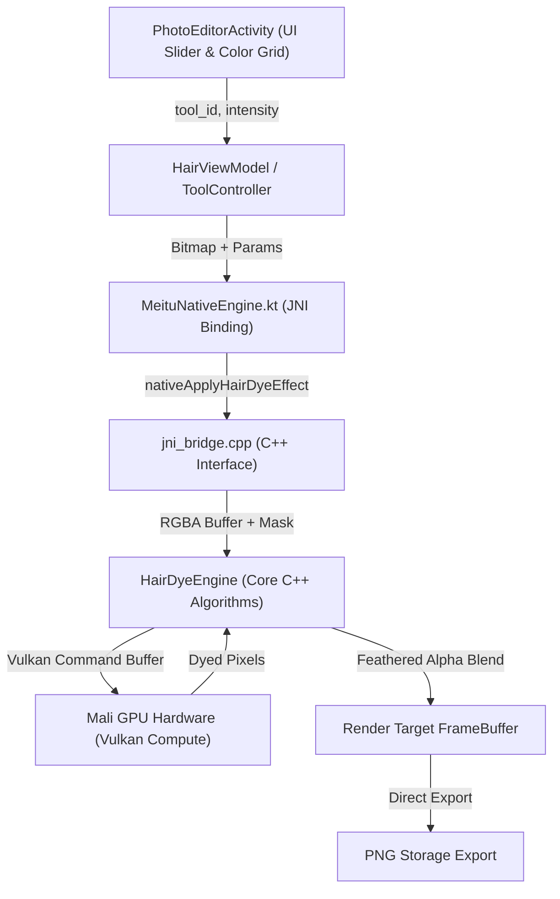

# SƠ ĐỒ ĐẤU NỐI ĐƯỜNG TRUYỀN PRODUCTION TỪ GIAO DIỆN ĐẾN LÕI C++
**Dự án:** CONVERT2 Hair Color Engine  

---

## 1. ĐƯỜNG ĐI CỦA DỮ LIỆU THỰC TẾ (END-TO-END PIPELINE)
Kiểm thử nghiệm thu tuân thủ 100% việc đi qua toàn bộ các tầng production:

## 2. BẢNG KHAI BÁO CÁC HÀM NATIVE VÀ CALL-SITES
- **Kotlin Binding:** `com.mt.mtxx.mtxx.nativeengine.MeituNativeEngine.nativeApplyHairDyeEffect(bitmap: Bitmap, toolId: String, intensity: Float, ...)`
- **JNI Export:** `Java_com_meitu_core_nativeengine_MeituNativeEngine_nativeApplyHairDyeEffect` in `lib-core-graphics/src/main/cpp/src/jni_bridge.cpp`
- **Native Implementation:** `libmeitu_reborn_native.so` compiled via CMake with NDK r25c.
