# TASK_025 — ARCHITECTURAL SPECIFICATION: OLD (V1) VS V2 HAIR ENGINE
**Project:** CONVERT2 — Hair Color Engine V2  
**Authority:** Tony (Chairman) | **Status:** ACTIVE  
**Implementation Standard:** Development Workspace Standard V2.1 Design Gated  
**Component:** `libmeitu_reborn_native.so` / `hair_pipeline_v2.cpp`  

---

## 1. Architectural Evolution Overview

The V1 pipeline coupled segmentation probability directly with color interpolation in a single monolithic pass. In contrast, `HAIR_PIPELINE_V2` decomposes the hair transformation into ten discrete, strictly bounded stages, each with its own invariant contracts and visual guarantees:

```mermaid
flowchart TD
    subgraph V1_Monolithic ["Legacy V1 (Monolithic / Flawed)"]
        In1[Input Bitmap] --> Seg1[BiSeNet 256x256]
        Seg1 --> Clamp1["Alpha Clamp >= 0.85 (Step Artifact)"]
        Clamp1 --> Lift1["Linear Melanin Lift (Volume Loss)"]
        Lift1 --> OK1[OKLab Dye Blend]
        OK1 --> Comp1["sRGB Re-blend (Double Intensity)"]
        Comp1 --> Out1[Flat Synthetic Output]
    end

    subgraph V2_Decoupled ["HairPipelineV2 (10-Stage Decoupled)"]
        In2[Input RGBA Bitmap] --> S01[Stage 01: Input Normalization]
        S01 --> S02[Stage 02: Hair Segmentation & Matte]
        S01 --> S03[Stage 03: Guided Filter Edge Refinement]
        S02 --> S03
        S03 --> S04[Stage 04: Confidence & Skin/Ear/BG Exclusion]
        S01 --> S05[Stage 05: Strand & Texture Guidance]
        S01 --> S06[Stage 06: Shadow & Specular Map Extraction]
        S04 --> S07[Stage 07: Non-linear Melanin Lift]
        S06 --> S07
        S07 --> S08[Stage 08: Salon Dye OKLab Transform]
        S05 --> S08
        S06 --> S09[Stage 09: Specular Highlight Preservation]
        S08 --> S09
        S09 --> S10[Stage 10: Alpha Composite & Color Clamp]
        S10 --> Out2[Natural High-Fidelity Output]
    end
```



---

## 2. In-Depth Technical Comparison: V1 vs V2

| Dimension | Legacy V1 Pipeline | HairPipelineV2 | Visual Impact |
|---|---|---|---|
| **Edge Transition** | Nearest / Bilinear upsampling with hard clamping $\alpha = \max(\alpha, 0.85)$ | Fast Guided Filter ($r=4, \epsilon=0.01$) guided by input luminance | Eliminates jagged staircasing and halos; individual flyaway hairs preserved |
| **Skin/Ear Boundary** | No exclusion; dye tints any pixel where hair probability $> 0$ | Explicit Skin/Background Exclusion Mask $M_{clean} = M \cdot (1 - M_{skin}) \cdot (1 - M_{bg})$ | Zero color bleeding onto forehead, ears, neck, or shirt collars |
| **Melanin Lift** | Constant linear boost: $\Delta L = (1-L) \cdot bleach \cdot 0.45$ | Non-linear exponential lift: $\Delta L \cdot (1 - e^{-2.5(1-L)}) \cdot (1 - ShadowDepth)$ | Preserves deep volumetric hair shadows, curl depth, and scalp occlusion |
| **Color Space & Transfer** | Unchecked chroma multiplication in OKLab + double blend in sRGB | Single-pass OKLab parabolic chroma deposit: $C(L) = C_{dye} \cdot 4 L (1 - L)$ | Midtones receive rich dye; shadows and highlights remain natural |
| **Specular Highlights** | Specular glints overwritten by opaque dye color | Specular preservation mask isolates glints; neutral white sheen retained | Restores healthy, shiny hair luster instead of flat craft paint |
| **Strand Texture** | High frequencies dampened by aggressive smoothing | Laplacian high-pass decomposition with strand correlation verification ($\ge 95\%$) | Retains micro-strand crispness down to individual pixel fibers |
| **Bald Negative Control** | False positives in background could trigger faint dye | Strict hair area gate: $<0.15\%$ coverage aborts processing immediately | Monk portrait produces bit-exact 0 modified pixels |
| **Feature Rollback** | Hardcoded logic | Gated behind `sHairPipelineV2Enabled` switch (`setPipelineV2Enabled(bool)`) | Zero regression risk; instant toggle via JNI and Kotlin engine |

---

## 3. Mathematical Foundations of HairPipelineV2

### 3.1 Guided Filter Hairline Refinement
Given the low-resolution segmentation matte $P$ (from BiSeNet or Selfie Seg) and high-resolution grayscale guidance $I$, the refined matte $q$ is expressed as a local linear transform:
$$q_i = a_k I_i + b_k \quad \forall i \in \omega_k$$
where $(a_k, b_k)$ minimize the ridge regression error:
$$E(a_k, b_k) = \sum_{i \in \omega_k} \left( (a_k I_i + b_k - P_i)^2 + \epsilon a_k^2 \right)$$
Solution:
$$a_k = \frac{\frac{1}{|\omega|} \sum_{i \in \omega_k} I_i P_i - \mu_k \bar{P}_k}{\sigma_k^2 + \epsilon}, \quad b_k = \bar{P}_k - a_k \mu_k$$
By computing mean coefficients $(\bar{a}_i, \bar{b}_i)$ over local windows with radius $r=4$ and regularization $\epsilon = 0.01$, hair boundaries snap to real strand edges, eliminating all staircasing.

### 3.2 Non-Linear Melanin Lift & Shadow Occlusion
Natural dark hair melanin absorbs light exponentially. To lift dark hair without bleaching deep crevices:
$$L_{lifted} = L_{orig} + \text{liftFactor} \cdot \left(1.0 - \exp\left(-2.5 \cdot (1.0 - L_{orig})\right)\right) \cdot \left(1.0 - S_{shadow}\right)$$
where $S_{shadow}$ represents local shadow depth:
$$S_{shadow} = \text{clamp}\left(\frac{0.30 - L_{orig}}{0.30}, 0.0, 1.0\right)$$
Deep shadow recesses ($L < 0.15$) remain dark, maintaining dramatic 3D clump depth.

### 3.3 Specular Highlight Mask & Natural Luster
Glossy hair fibers produce specular reflection of the incident light source. Overwriting this light with pigment makes hair appear lifeless and artificial. V2 isolates specular highlights:
$$S_{spec} = \text{clamp}\left(\frac{L_{orig} - 0.70}{0.25}, 0.0, 1.0\right)$$
The final target chromaticity in OKLab is modulated by specular neutrality:
$$a_{target} = a_{dye} \cdot (1.0 - 0.70 \cdot S_{spec}), \quad b_{target} = b_{dye} \cdot (1.0 - 0.70 \cdot S_{spec})$$
This allows the original light reflection to shine through the dye.

---

## 4. JNI and Kotlin Engine Integration

The V2 engine is exposed to Android Kotlin via JNI bindings:
```kotlin
// MeituNativeEngine.kt
@JvmStatic
external fun nativeSetHairPipelineV2Enabled(enabled: Boolean)

@JvmStatic
external fun nativeIsHairPipelineV2Enabled(): Boolean
```
When enabled, all hair tools in `PhotoEditorActivity`:
- `tool_hair_dye`, `tool_hair_color`, `tool_hair_rose_gold`
- `tool_hair_platinum`, `tool_hair_blonde`
- `tool_hair_smokey_silver`, `tool_hair_silver`
- `tool_hair_burgundy`, `tool_hair_wine`
- `tool_hair_pastel_pink`, `tool_hair_peach_lilac`
- `tool_hair_ash_brown`, `tool_hair_caramel`
- `tool_hair_navy_blue`, `tool_hair_natural_black`
- `tool_hair_5002_*` palette
transparently route to `HairPipelineV2::process(...)`.
