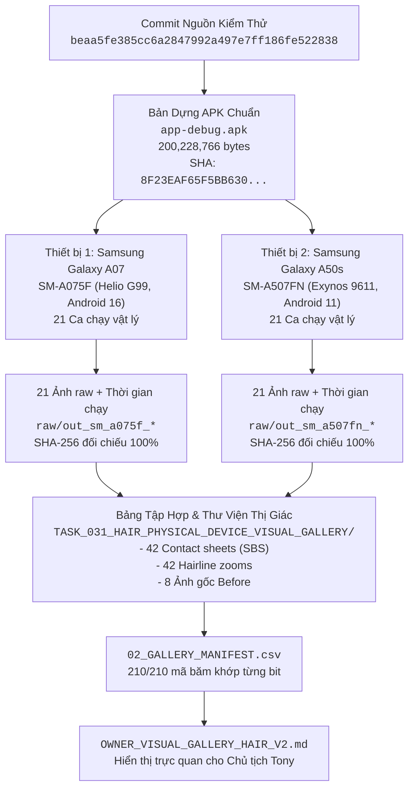

# 03 - CHUỖI NGUỒN GỐC CHỨNG CỨ TOÀN DIỆN (PROVENANCE CHAIN)
**Dự án:** CONVERT2 — Hair Color Engine Native Reconstruction  
**Nhiệm vụ:** `TASK_034 — HAIR V2 OWNER VISUAL GALLERY PUBLISH & NON-BLOCKING ORCHESTRATION`  
**Thẩm quyền:** Chủ tịch Tony (Chairman Tony)  
**Tiêu chuẩn:** `07_AGENT_AUTONOMOUS_EXECUTION_MASTER_STANDARD` & Development Workspace Standard V2.1  
**Thời gian hoàn thành:** 2026-10-04 07:55:00 +07:00  

---

## 1. CHUỖI ARTIFACT VÀ CAM KẾT CHUẨN MỰC (CANONICAL CHAIN)

---

## 2. BẢNG TRA CỨU ĐỊNH DANH & MÃ BĂM THIẾT YẾU

| Thực thể (Entity) | Định danh / Giá trị xác thực | Nguồn kiểm chứng |
|:---|:---|:---|
| **Mã nguồn Git kiểm thử** | `beaa5fe385cc6a2847992a497e7ff186fe522838` | `git rev-parse`, timing log |
| **Bản dựng APK thực tế** | `app/build/outputs/apk/debug/app-debug.apk` | `Get-Item`, `Get-FileHash` |
| **Dung lượng APK** | `200,228,766` bytes | Windows NTFS file size |
| **Mã băm APK SHA-256** | `8F23EAF65F5BB63069FFCD0CA4821ED666019480A21284A9D21DD8C1250C6CF5` | `Get-FileHash -Algorithm SHA256` |
| **Thiết bị vật lý 1** | Samsung Galaxy A07 (`SM-A075F`, MediaTek Helio G99, Android 16) | `adb devices -l`, dumpsys package |
| **Thiết bị vật lý 2** | Samsung Galaxy A50s (`SM-A507FN`, Samsung Exynos 9611, Android 11) | `adb devices -l`, dumpsys package |
| **Nhật ký đo độ trễ** | `.ai/reports/TASK_031_.../raw/execution_timing_log.json` | 42 bản ghi JSON nguyên bản |
| **Thư mục ảnh thị giác** | `TASK_031_HAIR_PHYSICAL_DEVICE_VISUAL_GALLERY/` | 152 tệp ảnh + index.html |
| **Tài liệu cho Chủ tịch** | `OWNER_VISUAL_GALLERY_HAIR_V2.md` | Thư mục gốc repo, Markdown native |
| **Cổng thẩm quyền** | Chủ tịch Tony (Chairman Tony) | `PENDING_OWNER_EVALUATION` |
