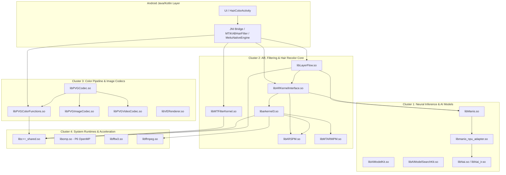

# 05 — NEEDED DEPENDENCY GRAPH & ARCHITECTURAL CLUSTER ANALYSIS

## 1. Architectural Overview & Cluster Classification

All 46 native libraries (`45` vendor libraries + `1` OpenMP runtime) form a multi-tiered dependency graph governed by `DT_NEEDED` dynamic tags. The libraries cleanly partition into 4 functional clusters:

---

## 2. Cluster Breakdown & Library Roles

### Cluster 1: Neural Inference & AI Model Execution
- **`libManis.so` (9,928,576 B):**
  - Meitu's proprietary neural inference engine.
  - Executes facial parsing and hair matting models (BiSeNet 19-class segmentation).
  - Depends on `libc++_shared.so`, `libEGL.so`, `libGLESv2.so`, `liblog.so`, `libandroid.so`.
- **`libAIModelKit.so` (280,608 B) & `libAIModelSearchKit.so` (1,027,728 B):**
  - Manages encrypted AI model weights, schema registration, and hardware backend routing (CPU vs GPU vs NPU).
- **`libmanis_npu_adapter.so` (1,022,088 B) & `libhiai*.so`:**
  - Specialized hardware acceleration delegates for Qualcomm/MediaTek/Kirin NPUs.

### Cluster 2: AR, Filter Graph & Hair Recolor Engine Core
- **`libMTFilterKernel.so` (1,858,440 B):**
  - **PRIMARY HAIR RECOLOR RUNTIME**.
  - Implements `MTFilterKernel::MTSoftHairFilter` and `MTFilterKernel::CMTFilterSoftHair`.
  - Exposes dedicated FBO render targets: `GrayFilterToFBO`, `HairMaskFilterToFBO`, `BlurHFilterToFBO`, `BlurVFilterToFBO`, `SoftHairFilterToFBO`.
  - Depends on `libyuv.so`, `libjnigraphics.so`, `libEGL.so`, `libGLESv2.so`, `libc++_shared.so`.
- **`libarkernel3.so` (17,786,488 B):**
  - Meitu AR Kernel 3.0.
  - Contains complete hair shaders: `Shaders/HairSoft/MTFilter_PsSoftLightr.fs`, `MTFilter_gradient.fs`, `MTFilter_HairSoftMix.fs`.
  - Implements `mtlabar3::MakeupHairSoftPart`, `mtlabar3::MakeupHairPart::HairDict`.
- **`libLayerFlow.so` (5,544,776 B):**
  - Multi-layer compositor uniting neural masks with AR filters.
  - Implements `LFDenseHairModular`, `decodeHairDyeConfig`, `loadHairDyeConfig`.
- **`libARKernelInterface.so` (17,829,224 B):**
  - JNI translation boundary routing high-level parameter changes to `libarkernel3.so` and `libManis.so`.

### Cluster 3: Color Pipeline, Matting & Codecs
- **`libPVGColorFunctions.so` (380,224 B):**
  - Core color transformation library.
  - Implements gamut conversion, ICC profile application (sRGB, Display-P3, AdobeRGB), and LUT transcode pipelines (`transcode`, `setColorspaceDetails`).
- **`libVERenderer.so` (429,728 B):**
  - Visual Effects rendering engine for composition passes.
- **`libPVGImageCodec.so` (5,133,080 B):**
  - High-performance bitmap compression/decompression and raw memory management.

### Cluster 4: System Runtimes & Hardware Acceleration
- **`libc++_shared.so` (1,292,904 B):**
  - Standard LLVM C++ STL runtime linked by all 45 native modules.
- **`libomp.so` (1,205,616 B - Added in Phase P6):**
  - Multi-threaded OpenMP CPU parallel acceleration runtime.
  - Powers parallel loops for structure tensor calculations and guided filter passes in CONVERT2 `HairPipelineV2`.
- **`libffmpeg.so` (7,546,632 B):**
  - Video stream decoding and audio synchronization engine.

---

## 3. Complete DT_NEEDED Dependency Catalog

| Library | DT_NEEDED Shared Libraries |
|---|---|
| `libAIModelKit.so` | `libandroid.so`, `liblog.so`, `libm.so`, `libdl.so`, `libc.so` |
| `libAIModelSearchKit.so` | `libandroid.so`, `liblog.so`, `libm.so`, `libdl.so`, `libc.so` |
| `libARKernelInterface.so` | `liblog.so`, `libandroid.so`, `libjnigraphics.so`, `libEGL.so`, `libGLESv2.so`, `libGLESv3.so`, `libc++_shared.so`, `libz.so`, `libMTARMPM.so`, `libaicodec.so`, `libManis.so`, `libyuv.so`, `libARSPM.so`, `libm.so`, `libdl.so`, `libc.so` |
| `libARSPM.so` | `liblog.so`, `libz.so`, `libEGL.so`, `libGLESv2.so`, `libm.so`, `libc++_shared.so`, `libdl.so`, `libc.so` |
| `libCtaApiLib.so` | `liblog.so`, `libm.so`, `libstdc++.so`, `libdl.so`, `libc.so` |
| `libKKMusicFX.so` | `libPVGVideoCodec.so`, `libmtmvcore.so`, `liblog.so`, `libm.so`, `libc++_shared.so`, `libdl.so`, `libc.so` |
| `libLayerFlow.so` | `libARKernelInterface.so`, `libvldp.so`, `libmttypes.so`, `libmtImageKit.so`, `libvlai.so`, `libmtee.so`, `libmtrteffectcore.so`, `libManis.so`, `libmtlabrecord.so`, `libyuv.so`, `libz.so`, `libandroid.so`, `liblog.so`, `libEGL.so`, `libGLESv1_CM.so`, `libGLESv2.so`, `libjnigraphics.so`, `libm.so`, `libc++_shared.so`, `libdl.so`, `libc.so` |
| `libMTARMPM.so` | `liblog.so`, `libffmpeg.so`, `libm.so`, `libc++_shared.so`, `libdl.so`, `libc.so` |
| `libMTFilterKernel.so` | `libyuv.so`, `liblog.so`, `libandroid.so`, `libjnigraphics.so`, `libEGL.so`, `libGLESv2.so`, `libm.so`, `libc++_shared.so`, `libdl.so`, `libc.so` |
| `libMTGif.so` | `libffmpeg.so`, `liblog.so`, `libdl.so`, `libm.so`, `libc++_shared.so`, `libc.so` |
| `libMTLReportTool.so` | `liblog.so`, `libvllog.so`, `libm.so`, `libc++_shared.so`, `libdl.so`, `libc.so` |
| `libManis.so` | `libmtlabrecord.so`, `libvllog.so`, `libEGL.so`, `libGLESv2.so`, `liblog.so`, `libandroid.so`, `libm.so`, `libc++_shared.so`, `libdl.so`, `libc.so` |
| `libMtlabSign.so` | `liblog.so`, `libm.so`, `libc++_shared.so`, `libdl.so`, `libc.so` |
| `libPVGCodec.so` | `libffmpegfilter.so`, `libffmpeg.so`, `libPVGVideoCodec.so`, `libvllog.so`, `libPVGImageCodec.so`, `libPVGColorFunctions.so`, `liblog.so`, `libEGL.so`, `libGLESv3.so`, `libm.so`, `libc++_shared.so`, `libdl.so`, `libc.so` |
| `libPVGColorFunctions.so` | `libffmpeg.so`, `libandroid.so`, `liblog.so`, `libEGL.so`, `libGLESv3.so`, `libz.so`, `libjnigraphics.so`, `libm.so`, `libc++_shared.so`, `libdl.so`, `libc.so` |
| `libPVGImageCodec.so` | `libz.so`, `liblog.so`, `libm.so`, `libc++_shared.so`, `libdl.so`, `libc.so` |
| `libPVGLive.so` | `liblog.so`, `libvllog.so`, `libm.so`, `libc++_shared.so`, `libdl.so`, `libc.so` |
| `libPVGVideoCodec.so` | `libffmpeg.so`, `libvllog.so`, `libGLESv3.so`, `libEGL.so`, `libandroid.so`, `liblog.so`, `libm.so`, `libc++_shared.so`, `libdl.so`, `libc.so` |
| `libVERenderer.so` | `libandroid.so`, `liblog.so`, `libEGL.so`, `libGLESv3.so`, `libz.so`, `libjnigraphics.so`, `libm.so`, `libc++_shared.so`, `libdl.so`, `libc.so` |
| `libaicodec.so` | `libffmpeg.so`, `libGLESv2.so`, `libEGL.so`, `libandroid.so`, `liblog.so`, `libm.so`, `libc++_shared.so`, `libdl.so`, `libc.so` |
| `libaidetectionplugin.so` | `libmtmvcore.so`, `libvlai.so`, `libvldp.so`, `libvllog.so`, `libVERenderer.so`, `libGLESv2.so`, `libEGL.so`, `libandroid.so`, `liblog.so`, `libm.so`, `libc++_shared.so`, `libdl.so`, `libc.so` |
| `libarkernel3.so` | `libz.so`, `libyuv.so`, `libvldp.so`, `libMTARMPM.so`, `libffmpeg.so`, `libGLESv3.so`, `libmediandk.so`, `libfantasy.so`, `liblog.so`, `libandroid.so`, `libARSPM.so`, `libm.so`, `libc++_shared.so`, `libdl.so`, `libc.so` |
| `libarkernel3_android.so` | `libarkernel3.so`, `libandroid.so`, `liblog.so`, `libm.so`, `libc++_shared.so`, `libdl.so`, `libc.so` |
| `libarkernel3_c.so` | `libarkernel3.so`, `libm.so`, `libc++_shared.so`, `libdl.so`, `libc.so` |
| `libbmpKit.so` | `liblog.so`, `libandroid.so`, `libjnigraphics.so`, `libmttypes.so`, `libm.so`, `libdl.so`, `libc.so` |
| `libbuffer_pgl.so` | `liblog.so`, `libm.so`, `libdl.so`, `libc.so` |
| `libbytehook.so` | `liblog.so`, `libshadowhook.so`, `libm.so`, `libdl.so`, `libc.so` |
| `libc++_shared.so` | `libc.so`, `libm.so`, `libdl.so` |
| `libdexvmp.so` | `liblog.so`, `libc.so`, `libm.so`, `libstdc++.so`, `libdl.so` |
| `libfantasy.so` | `liblog.so`, `libm.so`, `libc++_shared.so`, `libdl.so`, `libc.so` |
| `libffavc.so` | `liblog.so`, `libm.so`, `libdl.so`, `libc.so` |
| `libffmpeg.so` | `libm.so`, `libz.so`, `libandroid.so`, `liblog.so`, `libmediandk.so`, `libdl.so`, `libc.so` |
| `libffmpegfilter.so` | `libm.so`, `libz.so`, `libffmpeg.so`, `libdl.so`, `libc.so` |
| `libfftw3.so` | `libm.so`, `libdl.so`, `libc.so` |
| `libfile_lock_pgl.so` | `liblog.so`, `libm.so`, `libdl.so`, `libc.so` |
| `libfntvcrash.so` | `liblog.so`, `libdl.so`, `libm.so`, `libc.so` |
| `libglide-webp.so` | `liblog.so`, `libjnigraphics.so`, `libdl.so`, `libc.so`, `libm.so` |
| `libhiai.so` | `liblog.so`, `libdl.so`, `libm.so`, `libc++_shared.so`, `libc.so` |
| `libhiai_ir.so` | `liblog.so`, `libm.so`, `libc++_shared.so`, `libdl.so`, `libc.so` |
| `libhiai_ir_build.so` | `libhiai_ir.so`, `liblog.so`, `libhiai.so`, `libm.so`, `libc++_shared.so`, `libdl.so`, `libc.so` |
| `libhttpelf.so` | `liblog.so`, `libandroid.so`, `libm.so`, `libc++_shared.so`, `libdl.so`, `libc.so` |
| `libkoom-strip-dump.so` | `libbytehook.so`, `liblog.so`, `libm.so`, `libdl.so`, `libc.so` |
| `liblabdeviceinfo.so` | `libEGL.so`, `libGLESv2.so`, `liblog.so`, `libm.so`, `libc++_shared.so`, `libdl.so`, `libc.so` |
| `libmanis_npu_adapter.so` | `libhiai_ir_build.so`, `libhiai_ir.so`, `libhiai.so`, `liblog.so`, `libm.so`, `libc++_shared.so`, `libdl.so`, `libc.so` |
| `libmfxkit.so` | None (Direct JNI statically linked) |
| `libomp.so` | `libdl.so`, `libc.so` |
