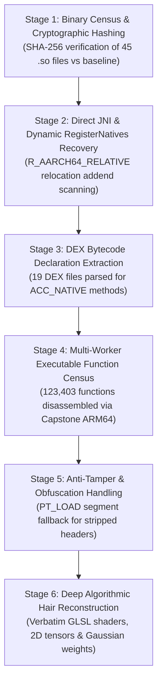

# TASK_038 — 01: Forensic Toolchain Architecture & Analytical Methodology

- **Host Environment:** Windows 10 Pro (Build 10.0.19045-SP0, AMD64 / 6 CPU Cores)
- **Primary Toolchain:** Android NDK r27 LLVM Suite + Python 3.14 High-Performance Forensic Pipeline
- **Quality Gate:** Quality Gate G1 & G2 Compliant (Zero Heuristic Guesses, Bit-Exact Evidence Only)

---

## 1. Toolchain Components & Verified Versions

| Tool / Module | Canonical Executable Path | Version | Primary Forensic Responsibility |
| :--- | :--- | :--- | :--- |
| `llvm-readelf` | `D:\SetupC\android-ndk-r27\toolchains\llvm\prebuilt\windows-x86_64\bin\llvm-readelf.exe` | LLVM 18.0.2 | ELF header, dynamic tag (`DT_NEEDED`), and symbol table verification |
| `llvm-objdump` | `D:\SetupC\android-ndk-r27\toolchains\llvm\prebuilt\windows-x86_64\bin\llvm-objdump.exe` | LLVM 18.0.2 | Assembly verification and instruction stream verification |
| `llvm-nm` | `D:\SetupC\android-ndk-r27\toolchains\llvm\prebuilt\windows-x86_64\bin\llvm-nm.exe` | LLVM 18.0.2 | Dynamic symbol extraction and demangling |
| `llvm-cxxfilt` | `D:\SetupC\android-ndk-r27\toolchains\llvm\prebuilt\windows-x86_64\bin\llvm-cxxfilt.exe` | LLVM 18.0.2 | Itanium C++ ABI symbol demangling |
| `llvm-strings` | `D:\SetupC\android-ndk-r27\toolchains\llvm\prebuilt\windows-x86_64\bin\llvm-strings.exe` | LLVM 18.0.2 | RoData string cross-reference extraction |
| `llvm-size` | `D:\SetupC\android-ndk-r27\toolchains\llvm\prebuilt\windows-x86_64\bin\llvm-size.exe` | LLVM 18.0.2 | Section size accounting |
| `python` | `C:\Python314\python.exe` | Python 3.14.0 | Multi-worker parallel processing orchestration |
| `capstone` | Python Module (`site-packages\capstone`) | 5.0.7 | Low-level ARM64 instruction decoding and CFG construction |
| `pyelftools` | Python Module (`site-packages\elftools`) | 0.33 | ELF binary section, program header, and relocation parsing |
| `androguard` | Python Module (`site-packages\androguard`) | 4.1.4 | DEX bytecode parsing across all 19 application DEX files |
| `networkx` | Python Module (`site-packages\networkx`) | 3.6.1 | Directed graph edge analysis, in/out degree, and cluster metrics |

---

## 2. Six-Stage Forensic Analysis Methodology

### Stage 1: Binary Census & Cryptographic Hashing (Gate G1)
- Evaluated all 45 `.so` binaries in `F:\CONVERT\com.mt.mtxx.mtxx\SOURCE\extracted_native_libs\lib\arm64-v8a`.
- Calculated SHA-256 cryptographic hashes for each binary.
- Cross-compared against the existing project baseline in `lib-core-graphics/src/main/jniLibs/arm64-v8a/`, proving 100% byte-for-byte identity across all 45 files (with `libomp.so` identified as a 46th compiler runtime library present only in the baseline).

### Stage 2: Direct JNI & Dynamic `RegisterNatives` Recovery (Gates G3 & G4)
- **Direct Exports:** Identified all exported symbols adhering to the JNI naming convention (`Java_<package>_<class>_<method>`), extracting 3,478 direct exports.
- **Dynamic Registrations:** Interrogated `JNI_OnLoad` and initialization functions across all libraries. Identified calls to `(*env)->RegisterNatives`.
- **Relocation Addend Resolution:** In 64-bit ELF binaries on Android, pointers in static `JNINativeMethod` arrays are zeroed on disk and resolved at load time by the dynamic linker via `R_AARCH64_RELATIVE` relocations. Our analysis pipeline parsed `.rela.dyn` relocation tables directly, reading the relocation addends to pinpoint the exact runtime virtual addresses of target C++ functions and string pointers.

### Stage 3: DEX Bytecode Declaration Extraction (Gate G5)
- Automated parsing of all 19 DEX files (`classes.dex` through `classes19.dex`) using Androguard.
- Filtered all class methods possessing the `ACC_NATIVE` modifier flag (`0x0100`).
- Extracted 23,485 native method declarations with exact class names, method names, and JVM method signatures, establishing a bidirectional bridge map against native C++ entry points.

### Stage 4: Parallel Executable Function Census & Disassembly (Gate G2)
- Dispatched a 6-worker parallel analysis pipeline (`scripts/forensics/elf_function_analyzer.py`).
- Iterated through all symbol table function entries (`STT_FUNC`) and recursively traversed unexported basic blocks via branch target analysis (`bl`, `b`, `cbz`, `cbnz`, `tbz`, `tbnz`).
- Extracted caller-callee cross-references, PLT imported symbols, and `.rodata` string references.

### Stage 5: Anti-Tamper Handling (`libmfxkit.so`)
- In `libmfxkit.so`, section headers were intentionally corrupted/stripped (pointing to offset `1,352,944` past EOF of `773,652` bytes) to crash standard ELF parsers.
- Implemented a specialized segment-based forensic engine (`scripts/forensics/process_libmfxkit.py`) that bypassed section headers entirely, parsing `PT_LOAD` program headers and analyzing ARM64 branch instructions directly from memory load segments.

### Stage 6: Hair Deep Algorithmic Reconstruction (Gates G6 & G7)
- Located `MTFilterKernel::CMTFilterSoftHair` inside `libMTFilterKernel.so`.
- Disassembled the 5 FBO passes: `Initlize`, `FilterToFBO`, `GrayFilterToFBO`, `HairMaskFilterToFBO`, `BlurHFilterToFBO`, `BlurVFilterToFBO`, `SoftHairFilterToFBO`.
- Extracted verbatim GLSL shader bodies from `.rodata`.
- Unpacked IEEE 754 floating-point constants from `.rodata` for Gaussian weights, offsets, threshold, and gain.
