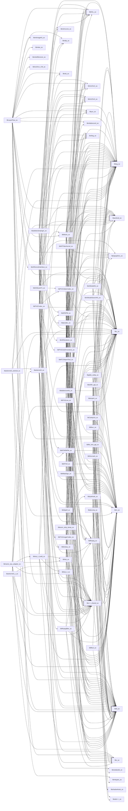

# 08 — CROSS-LIBRARY DT_NEEDED DEPENDENCY GRAPH

```mermaid
graph LR
    libAIModelKit_so --> libandroid_so
    libAIModelKit_so --> liblog_so
    libAIModelKit_so --> libm_so
    libAIModelKit_so --> libdl_so
    libAIModelKit_so --> libc_so
    libAIModelSearchKit_so --> libandroid_so
    libAIModelSearchKit_so --> liblog_so
    libAIModelSearchKit_so --> libm_so
    libAIModelSearchKit_so --> libdl_so
    libAIModelSearchKit_so --> libc_so
    libARKernelInterface_so --> liblog_so
    libARKernelInterface_so --> libandroid_so
    libARKernelInterface_so --> libjnigraphics_so
    libARKernelInterface_so --> libEGL_so
    libARKernelInterface_so --> libGLESv2_so
    libARKernelInterface_so --> libGLESv3_so
    libARKernelInterface_so --> libc++_shared_so
    libARKernelInterface_so --> libz_so
    libARKernelInterface_so --> libMTARMPM_so
    libARKernelInterface_so --> libaicodec_so
    libARKernelInterface_so --> libManis_so
    libARKernelInterface_so --> libyuv_so
    libARKernelInterface_so --> libARSPM_so
    libARKernelInterface_so --> libm_so
    libARKernelInterface_so --> libdl_so
    libARKernelInterface_so --> libc_so
    libARSPM_so --> liblog_so
    libARSPM_so --> libz_so
    libARSPM_so --> libEGL_so
    libARSPM_so --> libGLESv2_so
    libARSPM_so --> libm_so
    libARSPM_so --> libc++_shared_so
    libARSPM_so --> libdl_so
    libARSPM_so --> libc_so
    libCtaApiLib_so --> liblog_so
    libCtaApiLib_so --> libm_so
    libCtaApiLib_so --> libstdc++_so
    libCtaApiLib_so --> libdl_so
    libCtaApiLib_so --> libc_so
    libKKMusicFX_so --> libPVGVideoCodec_so
    libKKMusicFX_so --> libmtmvcore_so
    libKKMusicFX_so --> liblog_so
    libKKMusicFX_so --> libm_so
    libKKMusicFX_so --> libc++_shared_so
    libKKMusicFX_so --> libdl_so
    libKKMusicFX_so --> libc_so
    libLayerFlow_so --> libARKernelInterface_so
    libLayerFlow_so --> libvldp_so
    libLayerFlow_so --> libmttypes_so
    libLayerFlow_so --> libmtImageKit_so
    libLayerFlow_so --> libvlai_so
    libLayerFlow_so --> libmtee_so
    libLayerFlow_so --> libmtrteffectcore_so
    libLayerFlow_so --> libManis_so
    libLayerFlow_so --> libmtlabrecord_so
    libLayerFlow_so --> libyuv_so
    libLayerFlow_so --> libz_so
    libLayerFlow_so --> libandroid_so
    libLayerFlow_so --> liblog_so
    libLayerFlow_so --> libEGL_so
    libLayerFlow_so --> libGLESv1_CM_so
    libLayerFlow_so --> libGLESv2_so
    libLayerFlow_so --> libjnigraphics_so
    libLayerFlow_so --> libm_so
    libLayerFlow_so --> libc++_shared_so
    libLayerFlow_so --> libdl_so
    libLayerFlow_so --> libc_so
    libMTARMPM_so --> liblog_so
    libMTARMPM_so --> libffmpeg_so
    libMTARMPM_so --> libm_so
    libMTARMPM_so --> libc++_shared_so
    libMTARMPM_so --> libdl_so
    libMTARMPM_so --> libc_so
    libMTFilterKernel_so --> libyuv_so
    libMTFilterKernel_so --> liblog_so
    libMTFilterKernel_so --> libandroid_so
    libMTFilterKernel_so --> libjnigraphics_so
    libMTFilterKernel_so --> libEGL_so
    libMTFilterKernel_so --> libGLESv2_so
    libMTFilterKernel_so --> libm_so
    libMTFilterKernel_so --> libc++_shared_so
    libMTFilterKernel_so --> libdl_so
    libMTFilterKernel_so --> libc_so
    libMTGif_so --> libffmpeg_so
    libMTGif_so --> liblog_so
    libMTGif_so --> libdl_so
    libMTGif_so --> libm_so
    libMTGif_so --> libc++_shared_so
    libMTGif_so --> libc_so
    libMTLReportTool_so --> liblog_so
    libMTLReportTool_so --> libvllog_so
    libMTLReportTool_so --> libm_so
    libMTLReportTool_so --> libc++_shared_so
    libMTLReportTool_so --> libdl_so
    libMTLReportTool_so --> libc_so
    libManis_so --> libmtlabrecord_so
    libManis_so --> libvllog_so
    libManis_so --> libEGL_so
    libManis_so --> libGLESv2_so
    libManis_so --> liblog_so
    libManis_so --> libandroid_so
    libManis_so --> libm_so
    libManis_so --> libc++_shared_so
    libManis_so --> libdl_so
    libManis_so --> libc_so
    libMtlabSign_so --> liblog_so
    libMtlabSign_so --> libm_so
    libMtlabSign_so --> libc++_shared_so
    libMtlabSign_so --> libdl_so
    libMtlabSign_so --> libc_so
    libPVGCodec_so --> libffmpegfilter_so
    libPVGCodec_so --> libffmpeg_so
    libPVGCodec_so --> libPVGVideoCodec_so
    libPVGCodec_so --> libvllog_so
    libPVGCodec_so --> libPVGImageCodec_so
    libPVGCodec_so --> libPVGColorFunctions_so
    libPVGCodec_so --> liblog_so
    libPVGCodec_so --> libEGL_so
    libPVGCodec_so --> libGLESv3_so
    libPVGCodec_so --> libm_so
    libPVGCodec_so --> libc++_shared_so
    libPVGCodec_so --> libdl_so
    libPVGCodec_so --> libc_so
    libPVGColorFunctions_so --> libffmpeg_so
    libPVGColorFunctions_so --> libandroid_so
    libPVGColorFunctions_so --> liblog_so
    libPVGColorFunctions_so --> libEGL_so
    libPVGColorFunctions_so --> libGLESv3_so
    libPVGColorFunctions_so --> libz_so
    libPVGColorFunctions_so --> libjnigraphics_so
    libPVGColorFunctions_so --> libm_so
    libPVGColorFunctions_so --> libc++_shared_so
    libPVGColorFunctions_so --> libdl_so
    libPVGColorFunctions_so --> libc_so
    libPVGImageCodec_so --> libz_so
    libPVGImageCodec_so --> liblog_so
    libPVGImageCodec_so --> libm_so
    libPVGImageCodec_so --> libc++_shared_so
    libPVGImageCodec_so --> libdl_so
    libPVGImageCodec_so --> libc_so
    libPVGLive_so --> liblog_so
    libPVGLive_so --> libvllog_so
    libPVGLive_so --> libm_so
    libPVGLive_so --> libc++_shared_so
    libPVGLive_so --> libdl_so
    libPVGLive_so --> libc_so
    libPVGVideoCodec_so --> libffmpeg_so
    libPVGVideoCodec_so --> libvllog_so
    libPVGVideoCodec_so --> libGLESv3_so
    libPVGVideoCodec_so --> libEGL_so
    libPVGVideoCodec_so --> libandroid_so
    libPVGVideoCodec_so --> liblog_so
    libPVGVideoCodec_so --> libm_so
    libPVGVideoCodec_so --> libc++_shared_so
    libPVGVideoCodec_so --> libdl_so
    libPVGVideoCodec_so --> libc_so
    libVERenderer_so --> libandroid_so
    libVERenderer_so --> liblog_so
    libVERenderer_so --> libEGL_so
    libVERenderer_so --> libGLESv3_so
    libVERenderer_so --> libz_so
    libVERenderer_so --> libjnigraphics_so
    libVERenderer_so --> libm_so
    libVERenderer_so --> libc++_shared_so
    libVERenderer_so --> libdl_so
    libVERenderer_so --> libc_so
    libaicodec_so --> libffmpeg_so
    libaicodec_so --> libGLESv2_so
    libaicodec_so --> libEGL_so
    libaicodec_so --> libandroid_so
    libaicodec_so --> liblog_so
    libaicodec_so --> libm_so
    libaicodec_so --> libc++_shared_so
    libaicodec_so --> libdl_so
    libaicodec_so --> libc_so
    libaidetectionplugin_so --> libmtmvcore_so
    libaidetectionplugin_so --> libvlai_so
    libaidetectionplugin_so --> libvldp_so
    libaidetectionplugin_so --> libvllog_so
    libaidetectionplugin_so --> libVERenderer_so
    libaidetectionplugin_so --> libGLESv2_so
    libaidetectionplugin_so --> libEGL_so
    libaidetectionplugin_so --> libandroid_so
    libaidetectionplugin_so --> liblog_so
    libaidetectionplugin_so --> libm_so
    libaidetectionplugin_so --> libc++_shared_so
    libaidetectionplugin_so --> libdl_so
    libaidetectionplugin_so --> libc_so
    libarkernel3_so --> libz_so
    libarkernel3_so --> libyuv_so
    libarkernel3_so --> libvldp_so
    libarkernel3_so --> libMTARMPM_so
    libarkernel3_so --> libffmpeg_so
    libarkernel3_so --> libGLESv3_so
    libarkernel3_so --> libmediandk_so
    libarkernel3_so --> libfantasy_so
    libarkernel3_so --> liblog_so
    libarkernel3_so --> libandroid_so
    libarkernel3_so --> libARSPM_so
    libarkernel3_so --> libm_so
    libarkernel3_so --> libc++_shared_so
    libarkernel3_so --> libdl_so
    libarkernel3_so --> libc_so
    libarkernel3_android_so --> libarkernel3_so
    libarkernel3_android_so --> libandroid_so
    libarkernel3_android_so --> liblog_so
    libarkernel3_android_so --> libm_so
    libarkernel3_android_so --> libc++_shared_so
    libarkernel3_android_so --> libdl_so
    libarkernel3_android_so --> libc_so
    libarkernel3_c_so --> libarkernel3_so
    libarkernel3_c_so --> libm_so
    libarkernel3_c_so --> libc++_shared_so
    libarkernel3_c_so --> libdl_so
    libarkernel3_c_so --> libc_so
    libbmpKit_so --> liblog_so
    libbmpKit_so --> libandroid_so
    libbmpKit_so --> libjnigraphics_so
    libbmpKit_so --> libmttypes_so
    libbmpKit_so --> libm_so
    libbmpKit_so --> libdl_so
    libbmpKit_so --> libc_so
    libbuffer_pgl_so --> liblog_so
    libbuffer_pgl_so --> libm_so
    libbuffer_pgl_so --> libdl_so
    libbuffer_pgl_so --> libc_so
    libbytehook_so --> liblog_so
    libbytehook_so --> libshadowhook_so
    libbytehook_so --> libm_so
    libbytehook_so --> libdl_so
    libbytehook_so --> libc_so
    libc++_shared_so --> libc_so
    libc++_shared_so --> libm_so
    libc++_shared_so --> libdl_so
    libdexvmp_so --> liblog_so
    libdexvmp_so --> libc_so
    libdexvmp_so --> libm_so
    libdexvmp_so --> libstdc++_so
    libdexvmp_so --> libdl_so
    libfantasy_so --> liblog_so
    libfantasy_so --> libm_so
    libfantasy_so --> libc++_shared_so
    libfantasy_so --> libdl_so
    libfantasy_so --> libc_so
    libffavc_so --> liblog_so
    libffavc_so --> libm_so
    libffavc_so --> libdl_so
    libffavc_so --> libc_so
    libffmpeg_so --> libm_so
    libffmpeg_so --> libz_so
    libffmpeg_so --> libandroid_so
    libffmpeg_so --> liblog_so
    libffmpeg_so --> libmediandk_so
    libffmpeg_so --> libdl_so
    libffmpeg_so --> libc_so
    libffmpegfilter_so --> libm_so
    libffmpegfilter_so --> libz_so
    libffmpegfilter_so --> libffmpeg_so
    libffmpegfilter_so --> libdl_so
    libffmpegfilter_so --> libc_so
    libfftw3_so --> libm_so
    libfftw3_so --> libdl_so
    libfftw3_so --> libc_so
    libfile_lock_pgl_so --> liblog_so
    libfile_lock_pgl_so --> libm_so
    libfile_lock_pgl_so --> libdl_so
    libfile_lock_pgl_so --> libc_so
    libfntvcrash_so --> liblog_so
    libfntvcrash_so --> libdl_so
    libfntvcrash_so --> libm_so
    libfntvcrash_so --> libc_so
    libglide_webp_so --> liblog_so
    libglide_webp_so --> libjnigraphics_so
    libglide_webp_so --> libdl_so
    libglide_webp_so --> libc_so
    libglide_webp_so --> libm_so
    libhiai_so --> liblog_so
    libhiai_so --> libdl_so
    libhiai_so --> libm_so
    libhiai_so --> libc++_shared_so
    libhiai_so --> libc_so
    libhiai_ir_so --> liblog_so
    libhiai_ir_so --> libm_so
    libhiai_ir_so --> libc++_shared_so
    libhiai_ir_so --> libdl_so
    libhiai_ir_so --> libc_so
    libhiai_ir_build_so --> libhiai_ir_so
    libhiai_ir_build_so --> liblog_so
    libhiai_ir_build_so --> libhiai_so
    libhiai_ir_build_so --> libm_so
    libhiai_ir_build_so --> libc++_shared_so
    libhiai_ir_build_so --> libdl_so
    libhiai_ir_build_so --> libc_so
    libhttpelf_so --> liblog_so
    libhttpelf_so --> libandroid_so
    libhttpelf_so --> libm_so
    libhttpelf_so --> libc++_shared_so
    libhttpelf_so --> libdl_so
    libhttpelf_so --> libc_so
    libkoom_strip_dump_so --> libbytehook_so
    libkoom_strip_dump_so --> liblog_so
    libkoom_strip_dump_so --> libm_so
    libkoom_strip_dump_so --> libdl_so
    libkoom_strip_dump_so --> libc_so
    liblabdeviceinfo_so --> libEGL_so
    liblabdeviceinfo_so --> libGLESv2_so
    liblabdeviceinfo_so --> liblog_so
    liblabdeviceinfo_so --> libm_so
    liblabdeviceinfo_so --> libc++_shared_so
    liblabdeviceinfo_so --> libdl_so
    liblabdeviceinfo_so --> libc_so
    libmanis_npu_adapter_so --> libhiai_ir_build_so
    libmanis_npu_adapter_so --> libhiai_ir_so
    libmanis_npu_adapter_so --> libhiai_so
    libmanis_npu_adapter_so --> liblog_so
    libmanis_npu_adapter_so --> libm_so
    libmanis_npu_adapter_so --> libc++_shared_so
    libmanis_npu_adapter_so --> libdl_so
    libmanis_npu_adapter_so --> libc_so
```
