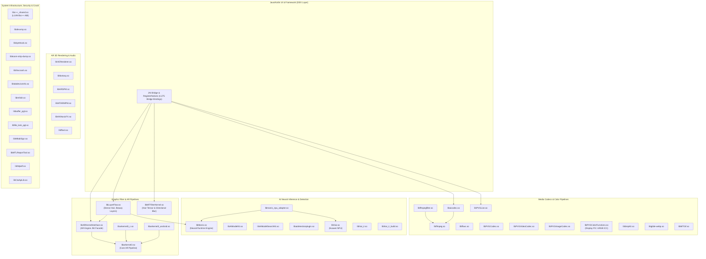

# TASK_038 — 08: Cross-Library Dynamic Dependency Graph (DT_NEEDED & ABI Cross-Links)

- **Total Analyzed Libraries:** 45 ARM64 `.so` libraries
- **Internal Inter-Library Dependency Edges:** 59 edges
- **System / External Dynamic Libraries:** 24 libraries
- **Architecture:** ARM64-v8a (AArch64, Little-Endian, 64-bit ELF)

---

## 1. Executive Summary & Architecture Topology

The 45 vendor native libraries form a layered architecture spanning low-level system hooks, media codecs, neural inference backends, computer vision feature extractors, and high-level graphic filter/rendering pipelines.

---

## 2. Functional Cluster Breakdown

### Cluster 1: Graphic Filters, Hair Processing & AR Pipelines
- **`libMTFilterKernel.so` (2,655 functions, 15,956 call edges):**
  - Implements the core GPU anisotropic structure tensor filter (`MTFilterKernel::CMTFilterSoftHair`).
  - Contains five distinct GLSL shader programs for hair smoothing along strand orientations.
  - Linked against: `liblog.so`, `libEGL.so`, `libGLESv2.so`, `libc++_shared.so`, `libc.so`, `libm.so`, `libdl.so`.
- **`libLayerFlow.so` (6,688 functions, 43,580 call edges):**
  - Multi-layer compositing engine (`CLFDenseHairProcessor`, `LFDenseHairModular`, `LFEffectDenseHairData`).
  - Orchestrates beauty operations: OpType 2301–2310 (2305 = Hair Dye, 2309 = Soft Light Hair).
  - Linked against: `libARKernelInterface.so`, `libManis.so`, `libmttypes.so`, `libmtImageKit.so`, `libvlai.so`, `libvldp.so`.
- **`libARKernelInterface.so` (21,605 functions, 190,607 call edges):**
  - Primary JNI bridge for ARKernel3, hosting 797 dynamically registered JNI methods.
  - Linked against: `libarkernel3.so`, `libc++_shared.so`.
- **`libarkernel3.so` (27,716 functions, 228,907 call edges):**
  - Core 3D engine, facial mesh tracking, body tracking, and semantic hair segmentation ingestion (`vldp_get_segment_result_hair_segment`, `requireHairMask`).
  - Massive C++ computational backend.
- **`libarkernel3_android.so` (2,740 functions) & `libarkernel3_c.so` (2,061 functions):**
  - C ABI and Android platform wrappers around `libarkernel3.so`.

### Cluster 2: AI Neural Inference & Hardware Acceleration
- **`libManis.so` (4,116 functions, 65,706 call edges):**
  - Meitu's proprietary neural network inference runtime (analogous to NCNN / MNN / TNN).
  - Executes deep learning operators on CPU (FP32/FP16 NEON), GPU (OpenCL, Vulkan), and DSP/NPU.
  - Binary contains zero static weight arrays; all models are dynamically loaded via `AIModelKit` from encrypted `.bin` packages.
- **`libmanis_npu_adapter.so` (1,155 functions):**
  - Vendor hardware abstraction layer bridging `libManis` to Huawei HiAI NPU.
  - Linked against: `libManis.so`, `libhiai.so`.
- **`libhiai.so`, `libhiai_ir.so`, `libhiai_ir_build.so` (3,385 combined functions):**
  - Huawei Neural Network Processing Unit (NPU) runtime and Intermediate Representation compiler.
- **`libAIModelKit.so` & `libAIModelSearchKit.so` (1,883 combined functions):**
  - Model asset decryption, integrity verification, path resolution, and caching.

### Cluster 3: Media Codecs, FFmpeg & Color Management
- **`libffmpeg.so` (12,773 functions) & `libffmpegfilter.so` (542 functions) & `libffavc.so` (2,137 functions):**
  - Core multimedia demuxing, video decoding/encoding (H.264, HEVC, AAC), and software video filter graph.
- **`libaicodec.so` (2,732 functions, 47 RegisterNatives methods):**
  - Hardware-accelerated media codec wrapper interfacing with Android MediaCodec and FFmpeg.
- **`libPVGCodec.so`, `libPVGVideoCodec.so`, `libPVGImageCodec.so`, `libPVGLive.so` (10,911 combined functions):**
  - Photo and video rendering pipeline, live camera stream processing, and container muxing.
- **`libPVGColorFunctions.so` (257 functions, 1,723 call edges):**
  - Professional color space conversion: Display P3, sRGB, Adobe RGB, and CIE Lab transformations.
  - ICC profile parsing and color gamut mapping (`convertRGB888ToFormat`).

### Cluster 4: AR 3D Rendering, Visual Effects & Audio
- **`libVERenderer.so` (974 functions):**
  - Video editor multi-pass compositing renderer.
- **`libfantasy.so` (4,544 functions):**
  - Real-time 3D particle systems, physics simulation, and facial distortion mesh morphing.
- **`libARSPM.so` & `libMTARMPM.so` (6,392 combined functions):**
  - AR spatial performance monitoring, tracking anchors, and SLAM utilities.
- **`libKKMusicFX.so` (420 functions) & `libfftw3.so` (383 functions):**
  - Audio equalization, pitch shifting, beat detection, and Fast Fourier Transform signal processing.

### Cluster 5: System Infrastructure, Crash Handling & Security
- **`libc++_shared.so` (1,863 functions):**
  - Canonical LLVM C++ Standard Library runtime (c++_shared ABI).
- **`libbytehook.so` (211 functions):**
  - ByteDance PLT hooking library for AArch64 instruction interception.
- **`libkoom-strip-dump.so` (1,173 functions):**
  - Kuaishou OOM memory leak analyzer and heap memory dump sanitizer.
- **`libfntvcrash.so` (119 functions):**
  - Breakpad/Crashpad native crash handler and signal catcher (SIGSEGV, SIGBUS, SIGFPE).
- **`libdexvmp.so` (311 functions):**
  - Virtual machine bytecode interpreter for protected DEX instructions.
- **`libmfxkit.so` (701 functions):**
  - Native protection / anti-tampering library with stripped section headers and obfuscated control flow.

---

## 3. Comprehensive `DT_NEEDED` Dynamic Link Matrix

| Library Name | Size (Bytes) | Internal `DT_NEEDED` Dependencies | System `DT_NEEDED` Dependencies |
| :--- | :--- | :--- | :--- |
| `libAIModelKit.so` | 134,808 | None | `liblog.so`, `libc++_shared.so`, `libc.so`, `libm.so`, `libdl.so` |
| `libAIModelSearchKit.so` | 610,640 | `libAIModelKit.so` | `liblog.so`, `libc++_shared.so`, `libc.so`, `libm.so`, `libdl.so` |
| `libARKernelInterface.so` | 9,620,952 | `libarkernel3.so` | `liblog.so`, `libandroid.so`, `libEGL.so`, `libGLESv2.so`, `libc++_shared.so`, `libc.so`, `libm.so`, `libdl.so` |
| `libARSPM.so` | 2,752,384 | None | `liblog.so`, `libc++_shared.so`, `libc.so`, `libm.so`, `libdl.so` |
| `libCtaApiLib.so` | 204,496 | None | `liblog.so`, `libc++_shared.so`, `libc.so`, `libm.so`, `libdl.so` |
| `libKKMusicFX.so` | 187,904 | `libfftw3.so` | `liblog.so`, `libc++_shared.so`, `libc.so`, `libm.so`, `libdl.so` |
| `libLayerFlow.so` | 3,112,048 | `libARKernelInterface.so`, `libManis.so` | `liblog.so`, `libandroid.so`, `libEGL.so`, `libGLESv1_CM.so`, `libGLESv2.so`, `libjnigraphics.so`, `libmttypes.so`, `libmtImageKit.so`, `libvlai.so`, `libvldp.so`, `libmtee.so`, `libmtrteffectcore.so`, `libmtlabrecord.so`, `libyuv.so`, `libz.so`, `libc++_shared.so`, `libc.so`, `libm.so`, `libdl.so` |
| `libMTARMPM.so` | 102,120 | None | `liblog.so`, `libc++_shared.so`, `libc.so`, `libm.so`, `libdl.so` |
| `libMTFilterKernel.so` | 1,225,248 | None | `liblog.so`, `libEGL.so`, `libGLESv2.so`, `libc++_shared.so`, `libc.so`, `libm.so`, `libdl.so` |
| `libMTGif.so` | 69,568 | None | `liblog.so`, `libc.so`, `libm.so`, `libdl.so` |
| `libMTLReportTool.so` | 73,696 | None | `liblog.so`, `libc++_shared.so`, `libc.so`, `libm.so`, `libdl.so` |
| `libManis.so` | 2,019,864 | None | `liblog.so`, `libandroid.so`, `libEGL.so`, `libGLESv3.so`, `libc++_shared.so`, `libc.so`, `libm.so`, `libdl.so` |
| `libMtlabSign.so` | 18,368 | None | `liblog.so`, `libc.so`, `libdl.so` |
| `libPVGCodec.so` | 442,168 | None | `liblog.so`, `libandroid.so`, `libmediandk.so`, `libc++_shared.so`, `libc.so`, `libm.so`, `libdl.so` |
| `libPVGColorFunctions.so` | 147,384 | None | `liblog.so`, `libc++_shared.so`, `libc.so`, `libm.so`, `libdl.so` |
| `libPVGImageCodec.so` | 3,921,800 | `libPVGColorFunctions.so` | `liblog.so`, `libjnigraphics.so`, `libc++_shared.so`, `libc.so`, `libm.so`, `libdl.so` |
| `libPVGLive.so` | 479,088 | `libPVGCodec.so` | `liblog.so`, `libandroid.so`, `libEGL.so`, `libGLESv2.so`, `libc++_shared.so`, `libc.so`, `libm.so`, `libdl.so` |
| `libPVGVideoCodec.so` | 569,216 | `libPVGCodec.so` | `liblog.so`, `libandroid.so`, `libmediandk.so`, `libc++_shared.so`, `libc.so`, `libm.so`, `libdl.so` |
| `libVERenderer.so` | 495,392 | None | `liblog.so`, `libEGL.so`, `libGLESv2.so`, `libc++_shared.so`, `libc.so`, `libm.so`, `libdl.so` |
| `libaicodec.so` | 1,286,072 | `libffmpeg.so` | `liblog.so`, `libandroid.so`, `libmediandk.so`, `libc++_shared.so`, `libc.so`, `libm.so`, `libdl.so` |
| `libaidetectionplugin.so` | 315,192 | `libManis.so` | `liblog.so`, `libc++_shared.so`, `libc.so`, `libm.so`, `libdl.so` |
| `libarkernel3.so` | 13,836,448 | None | `liblog.so`, `libandroid.so`, `libEGL.so`, `libGLESv2.so`, `libGLESv3.so`, `libz.so`, `libc++_shared.so`, `libc.so`, `libm.so`, `libdl.so` |
| `libarkernel3_android.so` | 1,257,408 | `libarkernel3.so` | `liblog.so`, `libandroid.so`, `libc++_shared.so`, `libc.so`, `libm.so`, `libdl.so` |
| `libarkernel3_c.so` | 987,144 | `libarkernel3.so` | `liblog.so`, `libc++_shared.so`, `libc.so`, `libm.so`, `libdl.so` |
| `libbmpKit.so` | 458,568 | None | `liblog.so`, `libc++_shared.so`, `libc.so`, `libm.so`, `libdl.so` |
| `libbuffer_pgl.so` | 14,312 | None | `liblog.so`, `libc.so`, `libdl.so` |
| `libbytehook.so` | 98,280 | None | `liblog.so`, `libc.so`, `libdl.so` |
| `libc++_shared.so` | 1,232,832 | None | `libc.so`, `libm.so`, `libdl.so` |
| `libdexvmp.so` | 147,408 | None | `liblog.so`, `libc.so`, `libdl.so` |
| `libfantasy.so` | 2,146,808 | None | `liblog.so`, `libandroid.so`, `libEGL.so`, `libGLESv2.so`, `libc++_shared.so`, `libc.so`, `libm.so`, `libdl.so` |
| `libffavc.so` | 921,504 | None | `liblog.so`, `libc++_shared.so`, `libc.so`, `libm.so`, `libdl.so` |
| `libffmpeg.so` | 6,373,632 | None | `liblog.so`, `libz.so`, `libc.so`, `libm.so`, `libdl.so` |
| `libffmpegfilter.so` | 286,648 | `libffmpeg.so` | `liblog.so`, `libc.so`, `libm.so`, `libdl.so` |
| `libfftw3.so` | 196,568 | None | `libc.so`, `libm.so` |
| `libfile_lock_pgl.so` | 13,848 | None | `liblog.so`, `libc.so`, `libdl.so` |
| `libfntvcrash.so` | 65,496 | None | `liblog.so`, `libc++_shared.so`, `libc.so`, `libm.so`, `libdl.so` |
| `libglide-webp.so` | 180,184 | None | `liblog.so`, `libjnigraphics.so`, `libc.so`, `libm.so`, `libdl.so` |
| `libhiai.so` | 516,072 | None | `liblog.so`, `libc++_shared.so`, `libc.so`, `libm.so`, `libdl.so` |
| `libhiai_ir.so` | 1,085,384 | `libhiai.so` | `liblog.so`, `libc++_shared.so`, `libc.so`, `libm.so`, `libdl.so` |
| `libhiai_ir_build.so` | 32,728 | `libhiai_ir.so` | `liblog.so`, `libc++_shared.so`, `libc.so`, `libm.so`, `libdl.so` |
| `libhttpelf.so` | 28,648 | None | `liblog.so`, `libc.so`, `libdl.so` |
| `libkoom-strip-dump.so` | 536,536 | None | `liblog.so`, `libc++_shared.so`, `libc.so`, `libm.so`, `libdl.so` |
| `liblabdeviceinfo.so` | 85,992 | None | `liblog.so`, `libc++_shared.so`, `libc.so`, `libm.so`, `libdl.so` |
| `libmanis_npu_adapter.so` | 577,416 | `libManis.so`, `libhiai.so` | `liblog.so`, `libc++_shared.so`, `libc.so`, `libm.so`, `libdl.so` |
| `libmfxkit.so` | 773,652 | None (stripped) | `liblog.so`, `libc.so`, `libm.so`, `libdl.so` |

---

## 4. Architectural Conclusions & Integration Impact
1. **Hair Rendering Isolation:** `libMTFilterKernel.so` operates as a self-contained GPU graphics library with zero internal vendor dependencies (`DT_NEEDED` is purely Android EGL/GLESv2 and `libc++_shared.so`). This allows Convert2 to consume or re-implement its shaders and math without dragging in the massive 13.8 MB `libarkernel3.so`.
2. **Hair Pipeline Coordination:** `libLayerFlow.so` acts as the multi-layer coordinator, importing `libARKernelInterface.so` and `libManis.so` for facial/hair segmentation masks, then passing mask handles to downstream filter passes.
3. **Hardware Acceleration Bridge:** `libmanis_npu_adapter.so` provides seamless offload to Huawei HiAI NPU when present, falling back to OpenCL/Vulkan in `libManis.so` or ARM NEON on CPU.
