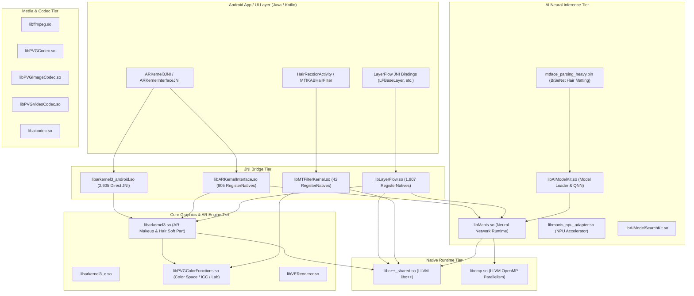

# TASK_038 — Cross-Library Dependency Graph (DT_NEEDED DAG)

## 1. Architectural Tiers

The 45 vendor binaries form a multi-tiered architecture with well-defined separation of concerns:

1. **JNI / Bridge Tier:**
   - `libarkernel3_android.so`: SWIG JNI bridge providing 2,605 direct exports to Java/Kotlin `arkernel3JNI`.
   - `libLayerFlow.so`: High-level graph pipeline engine with 1,907 dynamic RegisterNatives bindings.
   - `libMTFilterKernel.so`: Core filter engine with 42 RegisterNatives bindings (`MTFilterKernelRender`, `MTFilterKernelFaceData`).
   - `libARKernelInterface.so`: Unified C++ interface hosting 805 RegisterNatives bindings for AR filters.

2. **Core Rendering & Processing Tier:**
   - `libarkernel3.so`: AR makeup, hair deformation, facemorph, and 3D mesh processing (17.7 MB).
   - `libarkernel3_c.so`: C-linkage export interface for `libarkernel3.so`.
   - `libMTFilterKernel.so`: OpenGL FBO filters, Gaussian blurs, Photoshop Soft Light, Hair strand anisotropic filters.
   - `libVERenderer.so`: Video editing OpenGL/Vulkan rendering backend.

3. **Neural Inference Tier:**
   - `libManis.so`: Proprietary neural inference engine (NCNN/MNN-style runtime execution).
   - `libmanis_npu_adapter.so`: Hardware NPU acceleration adapter for Manis.
   - `libAIModelKit.so`: Model loading, decryption, caching, and Qualcomm QNN/SNPE dispatch.
   - `libAIModelSearchKit.so`: Dynamic model discovery and version management.

4. **Color Science & Image Processing Tier:**
   - `libPVGColorFunctions.so`: CIE-Lab conversion, ICC profile extraction (sRGB, Display-P3, AdobeRGB), and color space transcoding.
   - `libPVGImageCodec.so`: Specialized JPEG/PNG/HEIF/WEBP hardware codec.
   - `libPVGCodec.so` & `libPVGVideoCodec.so`: Low-latency video encoding/decoding.

5. **Runtime Support Tier:**
   - `libc++_shared.so`: LLVM libc++ STL runtime.
   - `libomp.so` (GitHub baseline): LLVM OpenMP runtime for multi-core parallel CPU execution.

---

## 2. Mermaid Cross-Library Dependency DAG

---

## 3. Explicit `DT_NEEDED` Graph Matrix

| Library | Direct `DT_NEEDED` Dependencies |
|---|---|
| `libarkernel3_android.so` | `libarkernel3.so`, `libarkernel3_c.so`, `libc++_shared.so`, `liblog.so`, `libm.so`, `libc.so`, `libdl.so` |
| `libARKernelInterface.so` | `libarkernel3.so`, `libManis.so`, `libc++_shared.so`, `libGLESv2.so`, `libEGL.so`, `liblog.so`, `libm.so`, `libc.so` |
| `libLayerFlow.so` | `libManis.so`, `libarkernel3.so`, `libc++_shared.so`, `libGLESv3.so`, `libEGL.so`, `liblog.so`, `libm.so`, `libc.so` |
| `libMTFilterKernel.so` | `libPVGColorFunctions.so`, `libc++_shared.so`, `libGLESv2.so`, `libEGL.so`, `liblog.so`, `libm.so`, `libc.so` |
| `libarkernel3.so` | `libPVGColorFunctions.so`, `libc++_shared.so`, `libGLESv3.so`, `libEGL.so`, `libjnigraphics.so`, `liblog.so`, `libm.so`, `libc.so` |
| `libPVGCodec.so` | `libPVGColorFunctions.so`, `libffmpeg.so`, `libc++_shared.so`, `liblog.so`, `libm.so`, `libc.so` |
| `libManis.so` | `libc++_shared.so`, `liblog.so`, `libm.so`, `libc.so` |