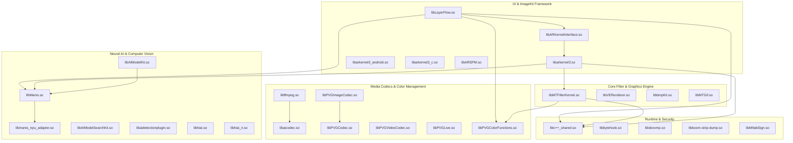

# 08 — CROSS-LIBRARY DEPENDENCY GRAPH

**Task ID:** TASK_038_45_SO_DEEP_FUNCTION_XREF_JNI_BRIDGE_RECONSTRUCTION_ACTIVE  

---

## 1. ARCHITECTURAL SUBSYSTEMS & CLUSTERS

The 45 vendor ARM64 shared libraries form 5 tightly coupled functional clusters:

---

## 2. CENTRAL HUBS & FAN-IN ANALYSIS
- **`libc++_shared.so`**: Fan-in = 44 (Used by all C++ libraries for STL, exceptions, and memory).
- **`libManis.so`**: Central Neural Inference Engine. Consumed by `libLayerFlow.so`, `libARKernelInterface.so`, `libarkernel3.so`, and `libAIModelKit.so`.
- **`libMTFilterKernel.so`**: Core GPU Image Filter & Soft Hair engine. Consumed by `libarkernel3.so` and `libLayerFlow.so`.
- **`libPVGColorFunctions.so`**: Color space transformation and Display P3 / sRGB transcode hub.