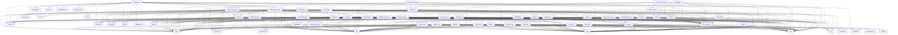

# TASK_038 — CROSS-LIBRARY DEPENDENCY GRAPH

```mermaid
graph TD
    libAIModelKit --> libandroid
    libAIModelKit --> liblog
    libAIModelKit --> libm
    libAIModelKit --> libdl
    libAIModelKit --> libc
    libAIModelSearchKit --> libandroid
    libAIModelSearchKit --> liblog
    libAIModelSearchKit --> libm
    libAIModelSearchKit --> libdl
    libAIModelSearchKit --> libc
    libARKernelInterface --> liblog
    libARKernelInterface --> libandroid
    libARKernelInterface --> libjnigraphics
    libARKernelInterface --> libEGL
    libARKernelInterface --> libGLESv2
    libARKernelInterface --> libGLESv3
    libARKernelInterface --> libc++_shared
    libARKernelInterface --> libz
    libARKernelInterface --> libMTARMPM
    libARKernelInterface --> libaicodec
    libARKernelInterface --> libManis
    libARKernelInterface --> libyuv
    libARKernelInterface --> libARSPM
    libARKernelInterface --> libm
    libARKernelInterface --> libdl
    libARKernelInterface --> libc
    libARSPM --> liblog
    libARSPM --> libz
    libARSPM --> libEGL
    libARSPM --> libGLESv2
    libARSPM --> libm
    libARSPM --> libc++_shared
    libARSPM --> libdl
    libARSPM --> libc
    libCtaApiLib --> liblog
    libCtaApiLib --> libm
    libCtaApiLib --> libstdc++
    libCtaApiLib --> libdl
    libCtaApiLib --> libc
    libKKMusicFX --> libPVGVideoCodec
    libKKMusicFX --> libmtmvcore
    libKKMusicFX --> liblog
    libKKMusicFX --> libm
    libKKMusicFX --> libc++_shared
    libKKMusicFX --> libdl
    libKKMusicFX --> libc
    libLayerFlow --> libARKernelInterface
    libLayerFlow --> libvldp
    libLayerFlow --> libmttypes
    libLayerFlow --> libmtImageKit
    libLayerFlow --> libvlai
    libLayerFlow --> libmtee
    libLayerFlow --> libmtrteffectcore
    libLayerFlow --> libManis
    libLayerFlow --> libmtlabrecord
    libLayerFlow --> libyuv
    libLayerFlow --> libz
    libLayerFlow --> libandroid
    libLayerFlow --> liblog
    libLayerFlow --> libEGL
    libLayerFlow --> libGLESv1_CM
    libLayerFlow --> libGLESv2
    libLayerFlow --> libjnigraphics
    libLayerFlow --> libm
    libLayerFlow --> libc++_shared
    libLayerFlow --> libdl
    libLayerFlow --> libc
    libMTARMPM --> liblog
    libMTARMPM --> libffmpeg
    libMTARMPM --> libm
    libMTARMPM --> libc++_shared
    libMTARMPM --> libdl
    libMTARMPM --> libc
    libMTFilterKernel --> libyuv
    libMTFilterKernel --> liblog
    libMTFilterKernel --> libandroid
    libMTFilterKernel --> libjnigraphics
    libMTFilterKernel --> libEGL
    libMTFilterKernel --> libGLESv2
    libMTFilterKernel --> libm
    libMTFilterKernel --> libc++_shared
    libMTFilterKernel --> libdl
    libMTFilterKernel --> libc
    libMTGif --> libffmpeg
    libMTGif --> liblog
    libMTGif --> libdl
    libMTGif --> libm
    libMTGif --> libc++_shared
    libMTGif --> libc
    libMTLReportTool --> liblog
    libMTLReportTool --> libvllog
    libMTLReportTool --> libm
    libMTLReportTool --> libc++_shared
    libMTLReportTool --> libdl
    libMTLReportTool --> libc
    libManis --> libmtlabrecord
    libManis --> libvllog
    libManis --> libEGL
    libManis --> libGLESv2
    libManis --> liblog
    libManis --> libandroid
    libManis --> libm
    libManis --> libc++_shared
    libManis --> libdl
    libManis --> libc
    libMtlabSign --> liblog
    libMtlabSign --> libm
    libMtlabSign --> libc++_shared
    libMtlabSign --> libdl
    libMtlabSign --> libc
    libPVGCodec --> libffmpegfilter
    libPVGCodec --> libffmpeg
    libPVGCodec --> libPVGVideoCodec
    libPVGCodec --> libvllog
    libPVGCodec --> libPVGImageCodec
    libPVGCodec --> libPVGColorFunctions
    libPVGCodec --> liblog
    libPVGCodec --> libEGL
    libPVGCodec --> libGLESv3
    libPVGCodec --> libm
    libPVGCodec --> libc++_shared
    libPVGCodec --> libdl
    libPVGCodec --> libc
    libPVGColorFunctions --> libffmpeg
    libPVGColorFunctions --> libandroid
    libPVGColorFunctions --> liblog
    libPVGColorFunctions --> libEGL
    libPVGColorFunctions --> libGLESv3
    libPVGColorFunctions --> libz
    libPVGColorFunctions --> libjnigraphics
    libPVGColorFunctions --> libm
    libPVGColorFunctions --> libc++_shared
    libPVGColorFunctions --> libdl
    libPVGColorFunctions --> libc
    libPVGImageCodec --> libz
    libPVGImageCodec --> liblog
    libPVGImageCodec --> libm
    libPVGImageCodec --> libc++_shared
    libPVGImageCodec --> libdl
    libPVGImageCodec --> libc
    libPVGLive --> liblog
    libPVGLive --> libvllog
    libPVGLive --> libm
    libPVGLive --> libc++_shared
    libPVGLive --> libdl
    libPVGLive --> libc
    libPVGVideoCodec --> libffmpeg
    libPVGVideoCodec --> libvllog
    libPVGVideoCodec --> libGLESv3
    libPVGVideoCodec --> libEGL
    libPVGVideoCodec --> libandroid
    libPVGVideoCodec --> liblog
    libPVGVideoCodec --> libm
    libPVGVideoCodec --> libc++_shared
    libPVGVideoCodec --> libdl
    libPVGVideoCodec --> libc
    libVERenderer --> libandroid
    libVERenderer --> liblog
    libVERenderer --> libEGL
    libVERenderer --> libGLESv3
    libVERenderer --> libz
    libVERenderer --> libjnigraphics
    libVERenderer --> libm
    libVERenderer --> libc++_shared
    libVERenderer --> libdl
    libVERenderer --> libc
    libaicodec --> libffmpeg
    libaicodec --> libGLESv2
    libaicodec --> libEGL
    libaicodec --> libandroid
    libaicodec --> liblog
    libaicodec --> libm
    libaicodec --> libc++_shared
    libaicodec --> libdl
    libaicodec --> libc
    libaidetectionplugin --> libmtmvcore
    libaidetectionplugin --> libvlai
    libaidetectionplugin --> libvldp
    libaidetectionplugin --> libvllog
    libaidetectionplugin --> libVERenderer
    libaidetectionplugin --> libGLESv2
    libaidetectionplugin --> libEGL
    libaidetectionplugin --> libandroid
    libaidetectionplugin --> liblog
    libaidetectionplugin --> libm
    libaidetectionplugin --> libc++_shared
    libaidetectionplugin --> libdl
    libaidetectionplugin --> libc
    libarkernel3 --> libz
    libarkernel3 --> libyuv
    libarkernel3 --> libvldp
    libarkernel3 --> libMTARMPM
    libarkernel3 --> libffmpeg
    libarkernel3 --> libGLESv3
    libarkernel3 --> libmediandk
    libarkernel3 --> libfantasy
    libarkernel3 --> liblog
    libarkernel3 --> libandroid
    libarkernel3 --> libARSPM
    libarkernel3 --> libm
    libarkernel3 --> libc++_shared
    libarkernel3 --> libdl
    libarkernel3 --> libc
    libarkernel3_android --> libarkernel3
    libarkernel3_android --> libandroid
    libarkernel3_android --> liblog
    libarkernel3_android --> libm
    libarkernel3_android --> libc++_shared
    libarkernel3_android --> libdl
    libarkernel3_android --> libc
    libarkernel3_c --> libarkernel3
    libarkernel3_c --> libm
    libarkernel3_c --> libc++_shared
    libarkernel3_c --> libdl
    libarkernel3_c --> libc
    libbmpKit --> liblog
    libbmpKit --> libandroid
    libbmpKit --> libjnigraphics
    libbmpKit --> libmttypes
    libbmpKit --> libm
    libbmpKit --> libdl
    libbmpKit --> libc
    libbuffer_pgl --> liblog
    libbuffer_pgl --> libm
    libbuffer_pgl --> libdl
    libbuffer_pgl --> libc
    libbytehook --> liblog
    libbytehook --> libshadowhook
    libbytehook --> libm
    libbytehook --> libdl
    libbytehook --> libc
    libc++_shared --> libc
    libc++_shared --> libm
    libc++_shared --> libdl
    libdexvmp --> liblog
    libdexvmp --> libc
    libdexvmp --> libm
    libdexvmp --> libstdc++
    libdexvmp --> libdl
    libfantasy --> liblog
    libfantasy --> libm
    libfantasy --> libc++_shared
    libfantasy --> libdl
    libfantasy --> libc
    libffavc --> liblog
    libffavc --> libm
    libffavc --> libdl
    libffavc --> libc
    libffmpeg --> libm
    libffmpeg --> libz
    libffmpeg --> libandroid
    libffmpeg --> liblog
    libffmpeg --> libmediandk
    libffmpeg --> libdl
    libffmpeg --> libc
    libffmpegfilter --> libm
    libffmpegfilter --> libz
    libffmpegfilter --> libffmpeg
    libffmpegfilter --> libdl
    libffmpegfilter --> libc
    libfftw3 --> libm
    libfftw3 --> libdl
    libfftw3 --> libc
    libfile_lock_pgl --> liblog
    libfile_lock_pgl --> libm
    libfile_lock_pgl --> libdl
    libfile_lock_pgl --> libc
    libfntvcrash --> liblog
    libfntvcrash --> libdl
    libfntvcrash --> libm
    libfntvcrash --> libc
    libglide_webp --> liblog
    libglide_webp --> libjnigraphics
    libglide_webp --> libdl
    libglide_webp --> libc
    libglide_webp --> libm
    libhiai --> liblog
    libhiai --> libdl
    libhiai --> libm
    libhiai --> libc++_shared
    libhiai --> libc
    libhiai_ir --> liblog
    libhiai_ir --> libm
    libhiai_ir --> libc++_shared
    libhiai_ir --> libdl
    libhiai_ir --> libc
    libhiai_ir_build --> libhiai_ir
    libhiai_ir_build --> liblog
    libhiai_ir_build --> libhiai
    libhiai_ir_build --> libm
    libhiai_ir_build --> libc++_shared
    libhiai_ir_build --> libdl
    libhiai_ir_build --> libc
    libhttpelf --> liblog
    libhttpelf --> libandroid
    libhttpelf --> libm
    libhttpelf --> libc++_shared
    libhttpelf --> libdl
    libhttpelf --> libc
    libkoom_strip_dump --> libbytehook
    libkoom_strip_dump --> liblog
    libkoom_strip_dump --> libm
    libkoom_strip_dump --> libdl
    libkoom_strip_dump --> libc
    liblabdeviceinfo --> libEGL
    liblabdeviceinfo --> libGLESv2
    liblabdeviceinfo --> liblog
    liblabdeviceinfo --> libm
    liblabdeviceinfo --> libc++_shared
    liblabdeviceinfo --> libdl
    liblabdeviceinfo --> libc
    libmanis_npu_adapter --> libhiai_ir_build
    libmanis_npu_adapter --> libhiai_ir
    libmanis_npu_adapter --> libhiai
    libmanis_npu_adapter --> liblog
    libmanis_npu_adapter --> libm
    libmanis_npu_adapter --> libc++_shared
    libmanis_npu_adapter --> libdl
    libmanis_npu_adapter --> libc
```
