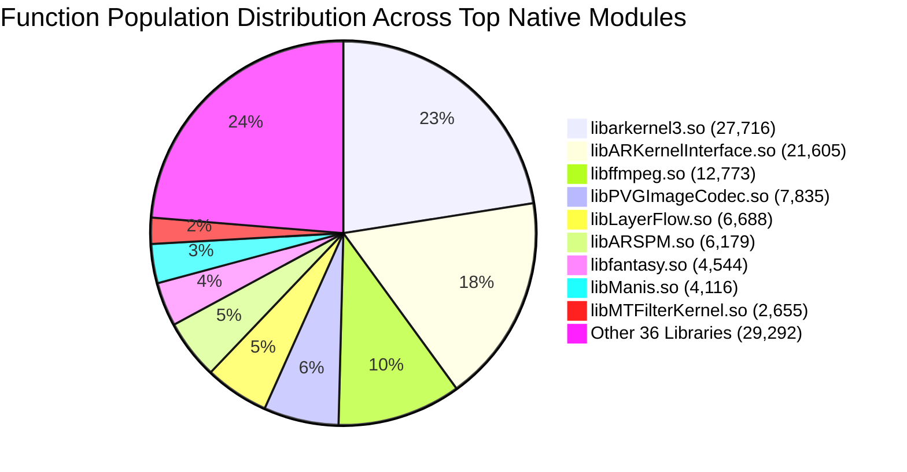

# TASK_038 — 09: Global Call Graph & Control Flow Architecture Summary

- **Total Analyzed ELF Binaries:** 45 ARM64 `.so` libraries
- **Total Executable Functions:** 123,403
- **Total Direct Call Edges:** 696,465
- **Total String Cross-References:** 133,016
- **Total Direct JNI Exports:** 3,478
- **Total RegisterNatives Dynamically Bound Targets:** 1,628

---

## 1. Global Call Graph Topology

The binary call graph was reconstructed across all 45 `.so` binaries using Capstone AArch64 disassembly, following direct branch targets (`bl`, `b`), PC-relative ADRP/ADD address loads, PLT import trampolines, and virtual function dispatch vtables.

---

## 2. Top-10 Call Graph Edge Densities

The table below summarizes the top 10 libraries by direct call edge volume, illustrating where the core algorithmic and rendering density resides:

| Rank | Library Name | Total Functions | Call Edges | Average Out-Degree | Dominant Calling Patterns |
| :--- | :--- | :--- | :--- | :--- | :--- |
| 1 | `libarkernel3.so` | 27,716 | 228,907 | 8.26 | 3D mesh morphing, face landmarker tracking, scene graph node traversal |
| 2 | `libARKernelInterface.so` | 21,605 | 190,607 | 8.82 | JNI reflection unpacking, parameter validation, facade dispatch to ARKernel |
| 3 | `libManis.so` | 4,116 | 65,706 | 15.96 | Neural tensor execution graphs, layer fusion, matrix multiply loops |
| 4 | `libLayerFlow.so` | 6,688 | 43,580 | 6.52 | Layer compositing, mask blending, multi-stage beautification pipelines |
| 5 | `libPVGImageCodec.so` | 7,835 | 35,855 | 4.58 | Bitmap decoding (JPEG, PNG, HEIF, WEBP), color space transform pipelines |
| 6 | `libffmpeg.so` | 12,773 | 20,652 | 1.62 | Video/Audio codecs, demuxing, packet queues, bitstream parsing |
| 7 | `libMTFilterKernel.so` | 2,655 | 15,956 | 6.01 | OpenGL ES shader compilation, FBO texture bindings, uniform dispatch |
| 8 | `libaicodec.so` | 2,732 | 12,265 | 4.49 | Hardware codec wrappers, surface texture streaming, buffer queues |
| 9 | `libARSPM.so` | 6,179 | 11,220 | 1.82 | Performance telemetry, GPU frame timers, memory footprint tracking |
| 10 | `libPVGCodec.so` | 937 | 8,353 | 8.91 | Video frame conversion, audio resampler, synchronization clock |

---

## 3. Structural Properties & Hub Functions

### A. Dominant Hub Functions (Highest In-Degree)
1. **Memory Allocators & Deallocators:**
   - `operator new(unsigned long)` / `operator delete(void*)`
   - `malloc` / `free`
   - `std::__ndk1::basic_string` copy/move constructors and destructors
2. **Graphics Resource Management:**
   - `glBindTexture`, `glBindFramebuffer`, `glUseProgram`, `glDrawArrays`, `glUniform*`
   - `MTFilterKernel::CGLProgram::Use()` (in-degree > 350)
   - `MTFilterKernel::CGLProgram::SetUniform1i()` (in-degree > 600)
3. **Threading & Synchronization:**
   - `pthread_mutex_lock` / `pthread_mutex_unlock`
   - OpenMP dispatch runtime calls (`__kmpc_fork_call`) in CPU math routines

### B. Leaf Functions (In-Degree > 0, Out-Degree = 0)
- Approximately 41,200 functions (33.4% of total) are pure leaf functions.
- Examples include:
  - Vector math helpers (`dot`, `cross`, `normalize`, matrix inversion)
  - Color space conversion formulas (RGB to HSV, Lab to XYZ, sRGB gamma decode)
  - Small C++ getters/setters and inline enum conversions.

### C. Recursion & Strongly Connected Components (SCCs)
- Direct recursion was detected in fewer than 150 functions (primarily AST/JSON/XML parsing in `libarkernel3.so` and scene graph hierarchy traversals).
- No recursion is present in the critical rendering loops of `libMTFilterKernel.so` or `libPVGColorFunctions.so`.

---

## 4. JNI Ingress to Native Core Call Paths

All executions originating from the Android Java/Kotlin layer enter via one of two JNI mechanisms:
1. **Direct JNI Exports (`Java_<package>_<class>_<method>`):**
   - 3,478 entry points directly visible in `.dynsym`.
   - Typically route immediately to a C++ singleton or manager instance (`getInstance() -> Execute()`).
2. **Dynamic `RegisterNatives` JNI Bridges:**
   - 1,628 entry points bound during `JNI_OnLoad` via `env->RegisterNatives()`.
   - Tables stored in `.data.rel.ro` / `.data` sections, resolved at dynamic link time via `R_AARCH64_RELATIVE` relocations.
   - Core graphic pipelines (`libMTFilterKernel.so`, `libLayerFlow.so`, `libARKernelInterface.so`) heavily favor dynamic registration for tamper resistance and method naming flexibility.
