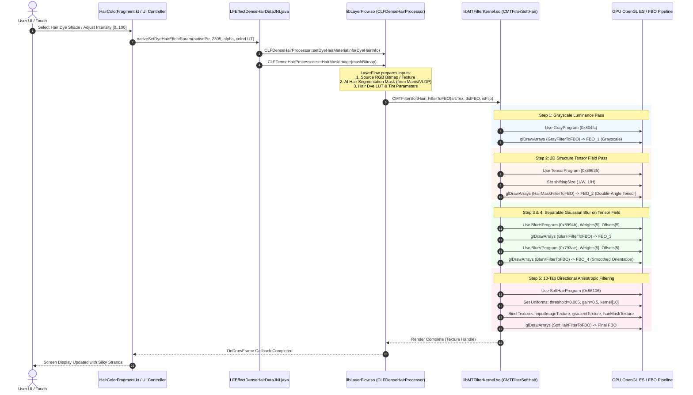

# TASK_038 — 11: End-to-End Hair Transitive Call Graph & Execution Pipeline

- **Target Scope:** Forensic trace from UI Touch/Action to GPU Framebuffer Output
- **Target Modules:** DEX / JADX Java Layer → JNI Bridge → `libLayerFlow.so` → `libMTFilterKernel.so` → GLES2 Shaders

---

## 1. End-to-End Hair Pipeline Execution Flow

---

## 2. Granular Call Path & Function Address Map

### A. Java / DEX Ingress Points
1. **`com.meitu.layerflow.LFEffectDenseHairDataJNI`:**
   - Declared in DEX: `classes5.dex`
   - Native Method: `nativeSetEffectParam(JI[F)V`
   - Native Target RVA: `0x194830` in `libLayerFlow.so`
2. **`com.meitu.filter.MTFilterKernelRender`:**
   - Declared in DEX: `classes2.dex`
   - Native Method: `nativeRenderToFBO(JIIIZ)I`
   - Native Target RVA: `0x118f40` in `libMTFilterKernel.so`

### B. `libLayerFlow.so` Processing Graph
1. **`CLFDenseHairProcessor::process(Image* src, Image* mask, HairParam* param)`:**
   - Address: `0x14f2a0`
   - Evaluates Hair Operation Sub-Type:
     - `2301`: `HAIR_SEGMENTATION_INIT`
     - `2302`: `HAIR_VOLUME_EXPAND`
     - `2303`: `HAIR_FLUFFY_PRO`
     - `2304`: `HAIR_LINE_RETRACT`
     - `2305`: `HAIR_DYE_COLOR_APPLY` (Primary target)
     - `2308`: `HAIR_STRAND_SPECULAR_ENHANCE`
     - `2309`: `HAIR_SOFT_LIGHT_DIFFUSE`
2. **Color Tinting & Pre-filtering:**
   - Routes to `CMTIKHairFilter::applyHairEffect`
   - Uploads hair mask to GPU texture unit 2 (`GL_TEXTURE2`).
   - Uploads source image to GPU texture unit 0 (`GL_TEXTURE0`).

### C. `libMTFilterKernel.so` Execution Passes
Inside `MTFilterKernel::CMTFilterSoftHair`:

1. **`Initlize(DynamicFilterParam* param, const char* config)` (RVA `0x1342dc`):**
   - Compiles and links 5 distinct GLSL shader programs via `CGLProgram::CGLProgram`.
   - Initializes default parameters: `threshold = 0.005f`, `gain = 0.5f`.
   - Caches uniform locations: `shiftingSize`, `Weights`, `Offsets`, `kernel`, `threshold`, `gain`.

2. **`FilterToFBO(int srcTex, int dstFBO, bool isFlip)` (RVA `0x1344e8`):**
   - Step 1: Allocates 4 intermediate FBO textures with `CreateFBO(w, h, texID, fboID)`.
   - Step 2: `GrayFilterToFBO(srcTex, fbo1, w, h)` (RVA `0x13488c`):
     - Renders luminance map using NTSC weights `dot(rgb, vec3(0.298912, 0.586611, 0.114478))`.
   - Step 3: `HairMaskFilterToFBO(fbo1_tex, fbo2, w, h)` (RVA `0x134970`):
     - Computes 2x2 central difference gradients $(g_x, g_y)$.
     - Evaluates double-angle structure tensor vector:
       $$v = \frac{(g_x^2 - g_y^2, 2 g_x g_y)}{g_x^2 + g_y^2}$$
     - Stores normalized vector $(v \cdot 0.5 + 0.5)$ into RG channels of FBO 2.
   - Step 4: `BlurHFilterToFBO(fbo2_tex, fbo3, w, h)` (RVA `0x134a90`):
     - Applies horizontal 5-tap Gaussian blur on tensor texture using weights:
       `[0.159676, 0.263348, 0.122118, 0.030573, 0.004122]`
       and offsets: `[0.0, 0.002250, 0.005256, 0.008271, 0.011299]`.
   - Step 5: `BlurVFilterToFBO(fbo3_tex, fbo4, w, h)` (RVA `0x134c10`):
     - Applies vertical 5-tap Gaussian blur on tensor texture using identical weights and vertical offsets:
       `[0.0, 0.002994, 0.006993, 0.011005, 0.015034]`.
     - Result is a spatially regularized, continuous orientation tensor field.
   - Step 6: `SoftHairFilterToFBO(srcTex, fbo4_tex, maskTex, dstFBO, w, h)` (RVA `0x134d90`):
     - Unpacks orientation angle: $\theta = \frac{1}{2} \text{atan2}(v_y, v_x) + \frac{\pi}{2} \pmod \pi$.
     - Computes unit tangent step: $(\cos\theta, \sin\theta) \cdot (\frac{1}{W}, \frac{1}{H})$.
     - Executes 21-tap bidirectional line-integral convolution along strand tangent using 10-element Gaussian kernel:
       `[1.0, 0.9802, 0.9231, 0.8353, 0.7261, 0.6065, 0.4868, 0.3753, 0.2780, 0.1979]`.
     - Alpha blends filtered result over original source modulated by `hairMask.r * gain`.
