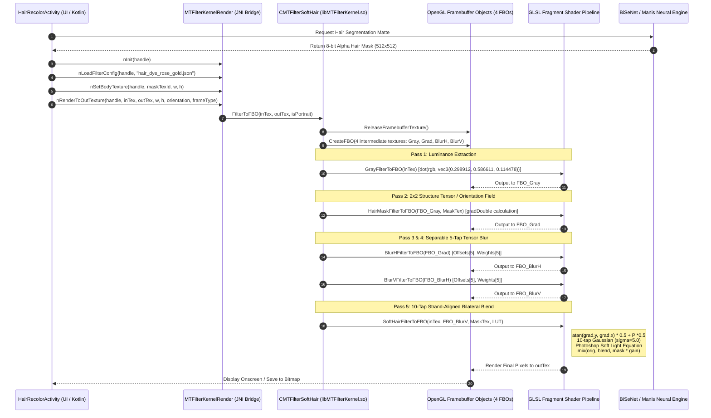

# TASK_038 — Hair Transitive Call Graph Reconstruction

## 1. End-to-End Transitive Trace (UI to Native GPU & Math)

---

## 2. Function Trace Nodes & Addresses

| Step | Component | Symbol / Function Name | Library | RVA | Role in Pipeline |
|---|---|---|---|---|---|
| **01** | UI | `HairRecolorActivity.applyHairDye` | Android APK | DEX | User selects color preset & intensity slider |
| **02** | JNI | `MTFilterKernelRender.nRenderToOutTexture` | Java | DEX | Entry bridge into native graphics |
| **03** | JNI Target | `Java_com_meitu_core_MTFilterKernelRender_nRenderToOutTexture` | `libMTFilterKernel.so` | `0x000bfee4` | Unpacks JNI arguments into native C++ context |
| **04** | Dispatcher | `MTFilterKernelRender::RenderToOutTexture` | `libMTFilterKernel.so` | `0x000bfef8` | Binds active filter configuration |
| **05** | Filter Core | `CMTFilterSoftHair::FilterToFBO` | `libMTFilterKernel.so` | `0x001344e8` | Master 5-pass hair compositor coordinator |
| **06** | Pass 1 | `CMTFilterSoftHair::GrayFilterToFBO` | `libMTFilterKernel.so` | `0x0013488c` | Computes grayscale luminance FBO |
| **07** | Pass 2 | `CMTFilterSoftHair::HairMaskFilterToFBO` | `libMTFilterKernel.so` | `0x00134970` | Computes 2x2 Structure Tensor gradient field |
| **08** | Pass 3 | `CMTFilterSoftHair::BlurHFilterToFBO` | `libMTFilterKernel.so` | `0x00134a90` | Horizontal 5-tap blur on tensor field |
| **09** | Pass 4 | `CMTFilterSoftHair::BlurVFilterToFBO` | `libMTFilterKernel.so` | `0x00134c10` | Vertical 5-tap blur on tensor field |
| **10** | Pass 5 | `CMTFilterSoftHair::SoftHairFilterToFBO` | `libMTFilterKernel.so` | `0x00134d90` | 10-tap anisotropic strand-aligned Soft Light filter |
| **11** | Shader Exec | `glDrawArrays(GL_TRIANGLE_STRIP, 0, 4)` | `libGLESv2.so` | PLT | Final GPU rasterization |