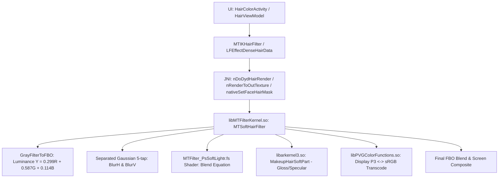

# TASK_038 — HAIR TRANSITIVE CALL GRAPH (END-TO-END)

```mermaid
flowchart TD
    UI[UI: HairColorActivity / HairViewModel] --> JavaBridge[MTIKHairFilter / LFEffectDenseHairData]
    JavaBridge --> JNIEntry[JNI: nDoDydHairRender / nRenderToOutTexture / nativeSetFaceHairMask]
    JNIEntry --> NativeCore[libMTFilterKernel.so: MTSoftHairFilter]
    NativeCore --> GrayFBO[GrayFilterToFBO: Luminance Y = 0.299R + 0.587G + 0.114B]
    NativeCore --> BlurPass[Separated Gaussian 5-tap: BlurH & BlurV]
    NativeCore --> SoftLight[MTFilter_PsSoftLightr.fs Shader: Blend Equation]
    NativeCore --> HairShine[libarkernel3.so: MakeupHairSoftPart - Gloss/Specular]
    NativeCore --> ColorSpace[libPVGColorFunctions.so: Display P3 <-> sRGB Transcode]
    NativeCore --> OutFBO[Final FBO Blend & Screen Composite]
```
