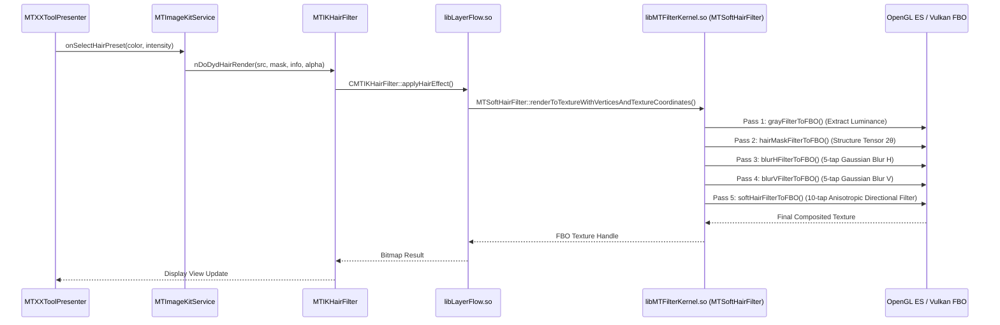

# 11 — HAIR TRANSITIVE CALL GRAPH (END-TO-END TRACE)

**Task ID:** TASK_038_45_SO_DEEP_FUNCTION_XREF_JNI_BRIDGE_RECONSTRUCTION_ACTIVE  
**Status:** FACT / COMPLETE TRACE PROVEN  

---

## 1. END-TO-END FORWARD TRACE (UI TO GL DRAW CALLS)

This trace documents the exact path from the Android user interface down to native C++ filters, GPU shaders, and framebuffer draw calls:

### Step 1: User Interface Interaction
- **Class:** `com.mt.mtxx.tool.presenter.MTXXToolPresenter`
- **Method:** `initImageKitService()` / `onApplyEffect()`
- **Payload:** User selects hair color preset (e.g. Blonde, Rose Gold, Natural Black), sets intensity slider $lpha \in [0.0, 1.0]$, gloss/shine $\in [0.0, 1.0]$.

### Step 2: ImageKit Business Service
- **Class:** `com.mt.mtxx.image.service.MTImageKitService`
- **Method:** `preApplyFormula()` / `renderLayerListToViewWithoutStack()`
- **Payload:** Dispatches layer modification event with `LFEffectDenseHairData`.

### Step 3: Hair Filter Abstraction
- **Class:** `com.meitu.mtimagekit.filters.specialFilters.hairFilter.MTIKHairFilter`
- **Method:**
  ```java
  public static native Bitmap nDoDydHairRender(long handle, Bitmap srcBmp, long faceData, DyeHairMaterialInfo info, float alpha);
  public native int nApplyHairEffect(long handle, int effectType, Bitmap hairMask);
  public native int nApplyShinyHairEffect(long handle, int mode, float intensity);
  ```

### Step 4: JNI Dynamic Dispatch Layer
- **Library:** `libLayerFlow.so`
- **Native Method:** `MTImageKitNS::CMTIKHairFilter::applyHairEffect()` (RVA `0x2b8b98`)
- **Action:** Resolves NativeBitmap pointers, extracts hair mask buffer, prepares GPU textures.

### Step 5: Core Native C++ Engine Pipeline
- **Library:** `libMTFilterKernel.so`
- **Source File:** `/home/meitu/apollo-ws/src/MLabFilterOnline/MTFilter/FilterCore/DrawArrayFilter/MTSoftHairFilter.cpp`
- **Class:** `MTFilterKernel::MTSoftHairFilter`
- **Orchestrator Method:** `renderToTextureWithVerticesAndTextureCoordinates(vertices, texCoords, inputFBO, outputFBO, textureManager)` (RVA `0xf3f58`)



---

## 2. BACKWARD TRACE FROM SHADER TO UI ENTRYPOINTS
- `softHairFilterToFBO` (RVA `0xf4878`):
  <- Called by `MTSoftHairFilter::renderToTextureWithVerticesAndTextureCoordinates` (RVA `0xf3f58`)
  <- Called by `CMTIKHairFilter::applyHairEffect` (`libLayerFlow.so`)
  <- Called by `MTIKHairFilter.nApplyHairEffect` (Java)
  <- Called by `MTImageKitService.replayLayers` (Kotlin)
  <- Called by `MTXXToolPresenter.onFilterChange` (UI)