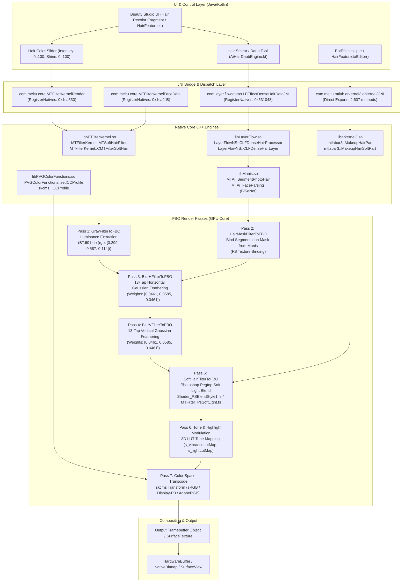

# 11 — HAIR TRANSITIVE CALL GRAPH

```mermaid
flowchart TD
    subgraph UI_Tiers ["UI & Control Layer (Java/Kotlin)"]
        UI_Hair["Beauty Studio UI (Hair Recolor Fragment / HairFeature.kt)"]
        UI_Slider["Hair Color Slider (Intensity: 0..100, Shine: 0..100)"]
        UI_Brush["Hair Smear / Daub Tool (AiHairDaubEngine.kt)"]
        UI_Model["BotEffectHelper / HairFeature.toEditor()"]
    end

    subgraph JNI_Tiers ["JNI Bridge & Dispatch Layer"]
        JNI_FilterKernel["com.meitu.core.MTFilterKernelRender\n(RegisterNatives: 0x1ca530)"]
        JNI_FaceData["com.meitu.core.MTFilterKernelFaceData\n(RegisterNatives: 0x1ca2d8)"]
        JNI_AR3["com.meitu.mtlab.arkernel3.arkernel3JNI\n(Direct Exports: 2,607 methods)"]
        JNI_LF["com.layer.flow.datas.LFEffectDenseHairDataJNI\n(RegisterNatives: 0x531048)"]
    end

    subgraph Native_Engines ["Native Core C++ Engines"]
        ENG_MTFilter["libMTFilterKernel.so\nMTFilterKernel::MTSoftHairFilter\nMTFilterKernel::CMTFilterSoftHair"]
        ENG_AR["libarkernel3.so\nmtlabar3::MakeupHairPart\nmtlabar3::MakeupHairSoftPart"]
        ENG_LF["libLayerFlow.so\nLayerFlowNS::CLFDenseHairProcessor\nLayerFlowNS::CLFDenseHairLayer"]
        ENG_Neural["libManis.so\nMTAi_SegmentPhotoHair\nMTAi_FaceParsing (BiSeNet)"]
        ENG_Color["libPVGColorFunctions.so\nPVGColorFunctions::setICCProfile\nskcms_ICCProfile"]
    end

    subgraph FBO_Pipeline ["FBO Render Passes (GPU Core)"]
        P1["Pass 1: GrayFilterToFBO\nLuminance Extraction\n(BT.601 dot(rgb, [0.299, 0.587, 0.114]))"]
        P2["Pass 2: HairMaskFilterToFBO\nBind Segmentation Mask from Manis\n(R8 Texture Binding)"]
        P3["Pass 3: BlurHFilterToFBO\n13-Tap Horizontal Gaussian Feathering\n(Weights: [0.0461, 0.0585, ..., 0.0461])"]
        P4["Pass 4: BlurVFilterToFBO\n13-Tap Vertical Gaussian Feathering\n(Weights: [0.0461, 0.0585, ..., 0.0461])"]
        P5["Pass 5: SoftHairFilterToFBO\nPhotoshop Pegtop Soft Light Blend\nShader_PSBlendStyle1.fs / MTFilter_PsSoftLight.fs"]
        P6["Pass 6: Tone & Highlight Modulation\n3D LUT Tone Mapping (s_vibranceLutMap, s_lightLutMap)"]
        P7["Pass 7: Color Space Transcode\nskcms Transform (sRGB / Display-P3 / AdobeRGB)"]
    end

    subgraph Output_Target ["Compositing & Output"]
        OUT_FBO["Output Framebuffer Object / SurfaceTexture"]
        OUT_Bitmap["HardwareBuffer / NativeBitmap / SurfaceView"]
    end

    UI_Hair --> UI_Slider
    UI_Hair --> UI_Brush
    UI_Slider --> JNI_FilterKernel
    UI_Brush --> JNI_LF
    UI_Model --> JNI_AR3

    JNI_FilterKernel --> ENG_MTFilter
    JNI_FaceData --> ENG_MTFilter
    JNI_AR3 --> ENG_AR
    JNI_LF --> ENG_LF

    ENG_LF --> ENG_Neural
    ENG_MTFilter --> P1
    ENG_Neural --> P2
    P1 --> P3
    P2 --> P3
    P3 --> P4
    P4 --> P5
    ENG_AR --> P5
    P5 --> P6
    ENG_Color --> P7
    P6 --> P7
    P7 --> OUT_FBO
    OUT_FBO --> OUT_Bitmap
```
