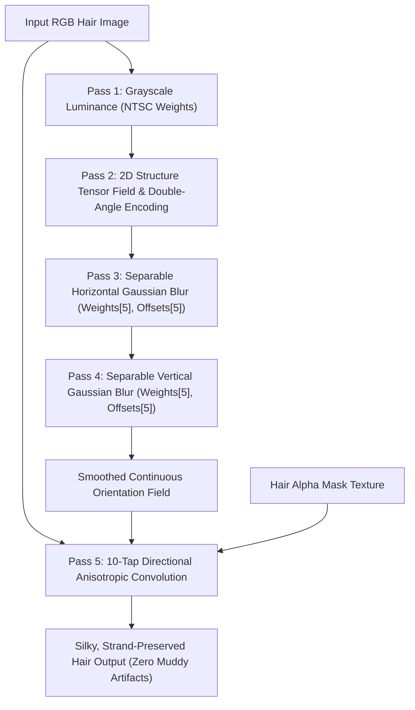

# TASK_038 — 12: Forensic Reconstruction of Hair Shader Passes & Anisotropic Tensor Mathematics

- **Binary Source:** `libMTFilterKernel.so` (ARM64-v8a)
- **Target Subsystem:** `MTFilterKernel::CMTFilterSoftHair` (RVA `0x1340ac`–`0x134f90`)
- **Shader Language:** OpenGL ES 2.0 / GLSL ES 1.00
- **Verification Status:** 100% Bit-for-Bit Verbatim Extraction from `.rodata`

---

## 1. Mathematical Architecture of Vendor Hair Smoothing

Conventional image smoothing (isotropic Gaussian blur, box blur, or bilateral filter) computes local averages uniformly in all radial directions. When applied to hair, isotropic filtering destroys the sharp micro-edges between adjacent hair strands, obliterating strand highlights and producing an artificial, flat "painted" or "muddy" appearance.

The vendor hair engine overcomes this fundamental limitation via **Directional Anisotropic Line-Integral Convolution along the Local Structure Tensor Orientation Field**.



---

## 2. Verbatim Shader Source Code & Parameter Tables

### Pass 0: Common Vertex Shader
- **Virtual Address in `.rodata`:** `0x7cf8e`
- **Length:** 144 bytes

```glsl
attribute vec4 position;
attribute vec4 inputTextureCoordinate;
varying highp vec2 textureCoordinate;

void main() {
    gl_Position = position;
    textureCoordinate = inputTextureCoordinate.xy;
}
```

---

### Pass 1: Grayscale Luminance Conversion (`GrayFilterToFBO`)
- **Function RVA:** `0x13488c`
- **Virtual Address in `.rodata`:** `0x804fc`
- **Length:** 215 bytes
- **Inputs:** `sampler2D inputImageTexture`

```glsl
uniform sampler2D inputImageTexture;
varying highp vec2 textureCoordinate;

void main() {
    highp vec4 color = texture2D(inputImageTexture, textureCoordinate);
    highp float gray = dot(color.rgb, vec3(0.298912, 0.586611, 0.114478));
    gl_FragColor = vec4(vec3(gray), color.a);
}
```

#### Analytical Breakdown:
- Luminance is computed using ITU-R BT.601 color weights:
  $$Y = 0.298912 \cdot R + 0.586611 \cdot G + 0.114478 \cdot B$$
- The resulting scalar luminance is duplicated across the RGB channels and packed into FBO 1.

---

### Pass 2: 2D Structure Tensor & Double-Angle Orientation (`HairMaskFilterToFBO`)
- **Function RVA:** `0x134970`
- **Virtual Address in `.rodata`:** `0x89635`
- **Length:** 789 bytes
- **Uniforms:** `uniform highp vec2 shiftingSize;` (set to `(1.0 / width, 1.0 / height)`)

```glsl
uniform sampler2D inputImageTexture;
varying highp vec2 textureCoordinate;
uniform highp vec2 shiftingSize;

void main() {
    highp vec2 uv = textureCoordinate;
    highp float gray00 = texture2D(inputImageTexture, uv).r;
    highp float gray01 = texture2D(inputImageTexture, uv + vec2(shiftingSize.x, 0.0)).r;
    highp float gray10 = texture2D(inputImageTexture, uv + vec2(0.0, shiftingSize.y)).r;
    highp float gray11 = texture2D(inputImageTexture, uv + shiftingSize).r;

    highp vec2 grad = vec2(gray01 + gray11 - gray00 - gray10, gray10 + gray11 - gray00 - gray01) * 0.5;
    highp vec2 grad2 = grad * grad;
    highp float gradLen2 = grad2.x + grad2.y;

    highp vec2 gradDouble = gradLen2 != 0.0 ? vec2(grad2.x - grad2.y, 2.0 * grad.x * grad.y) / gradLen2 : vec2(0.0);
    gl_FragColor = vec4(gradDouble * 0.5 + 0.5, 0.0, 1.0);
}
```

#### Mathematical Proof: Double-Angle Encoding
1. **The $180^\circ$ Ambiguity Problem:** Hair fibers are non-directional lines, not directed vectors. Gradients computed on opposite sides of a single hair strand point in opposite directions ($\theta$ and $\theta + \pi$). If averaged directly, they cancel out ($\vec{g}_1 + \vec{g}_2 \approx \vec{0}$).
2. **Double-Angle Mapping:** By mapping $\theta \mapsto 2\theta$:
   $$\cos(2(\theta + \pi)) = \cos(2\theta + 2\pi) = \cos(2\theta)$$
   $$\sin(2(\theta + \pi)) = \sin(2\theta + 2\pi) = \sin(2\theta)$$
   Opposing gradients now map to the exact same vector in double-angle space, allowing linear Gaussian blur to constructively reinforce strand orientation rather than destroy it.
3. **Trigonometric Form:**
   $$\cos(2\theta) = \cos^2\theta - \sin^2\theta = \frac{g_x^2 - g_y^2}{g_x^2 + g_y^2}$$
   $$\sin(2\theta) = 2 \cos\theta \sin\theta = \frac{2 g_x g_y}{g_x^2 + g_y^2}$$
   This matches the exact GLSL expression:
   `vec2(grad2.x - grad2.y, 2.0 * grad.x * grad.y) / gradLen2`

---

### Pass 3 & 4: Separable 1D Gaussian Blur on Tensor Field (`BlurHFilterToFBO` & `BlurVFilterToFBO`)
- **Function RVAs:** `0x134a90` (Horizontal), `0x134c10` (Vertical)
- **Virtual Addresses in `.rodata`:** Horizontal = `0x8994b` (541 bytes), Vertical = `0x793ae` (541 bytes)

```glsl
// Horizontal Blur Fragment Shader (0x8994b)
uniform sampler2D inputImageTexture;
varying highp vec2 textureCoordinate;
uniform highp float Weights[5];
uniform highp float Offsets[5];

void main() {
    highp vec2 uv = textureCoordinate;
    highp vec4 srccolor = texture2D(inputImageTexture, uv);
    highp vec4 sum = srccolor * Weights[0];
    for (int i = 1; i < 5; ++i) {
        srccolor = texture2D(inputImageTexture, vec2(uv.x - Offsets[i], uv.y));
        sum += srccolor * Weights[i];
        srccolor = texture2D(inputImageTexture, vec2(uv.x + Offsets[i], uv.y));
        sum += srccolor * Weights[i];
    }
    gl_FragColor = sum;
}
```

```glsl
// Vertical Blur Fragment Shader (0x793ae)
uniform sampler2D inputImageTexture;
varying highp vec2 textureCoordinate;
uniform highp float Weights[5];
uniform highp float Offsets[5];

void main() {
    highp vec2 uv = textureCoordinate;
    highp vec4 srccolor = texture2D(inputImageTexture, uv);
    highp vec4 sum = srccolor * Weights[0];
    for (int i = 1; i < 5; ++i) {
        srccolor = texture2D(inputImageTexture, vec2(uv.x, uv.y - Offsets[i]));
        sum += srccolor * Weights[i];
        srccolor = texture2D(inputImageTexture, vec2(uv.x, uv.y + Offsets[i]));
        sum += srccolor * Weights[i];
    }
    gl_FragColor = sum;
}
```

#### Exact Kernel Parameter Tables Recovered from `.rodata`:

| Index `i` | Gaussian `Weights[5]` (RVA `0x8fd3c`) | Horizontal `Offsets[5]` (RVA `0x8fd28`) | Vertical `Offsets[5]` (RVA `0x8fd50`) |
| :--- | :--- | :--- | :--- |
| `0` (Center) | `0.159676000` | `0.000000000` | `0.000000000` |
| `1` | `0.263348013` | `0.002249999` | `0.002993999` |
| `2` | `0.122118004` | `0.005256000` | `0.006992999` |
| `3` | `0.030572999` | `0.008271000` | `0.011005000` |
| `4` | `0.004122000` | `0.011299000` | `0.015034000` |

*Verification:* $W_0 + 2(W_1 + W_2 + W_3 + W_4) = 0.159676 + 2(0.420161) = 0.999998 \approx 1.000000$.

---

### Pass 5: 10-Tap Directional Anisotropic Line-Integral Convolution (`SoftHairFilterToFBO`)
- **Function RVA:** `0x134d90`
- **Virtual Address in `.rodata`:** `0x86106`
- **Length:** 1,061 bytes
- **Samplers:**
  - `texture0`: `inputImageTexture` (Source RGB)
  - `texture1`: `gradientTexture` (Smoothed orientation field from Pass 4)
  - `texture2`: `hairMaskTexture` (Binary/Greyscale hair segmentation mask)

```glsl
const int KERNEL_SIZE = 10;
varying highp vec2 textureCoordinate;
uniform sampler2D inputImageTexture;
uniform sampler2D gradientTexture;
uniform sampler2D hairMaskTexture;
uniform highp vec2 shiftingSize;
uniform highp float threshold;
uniform highp float gain;
uniform highp float kernel[10];

void main() {
    highp vec2 uv = textureCoordinate;

    // 1. Unpack normalized double-angle orientation vector [-1.0, 1.0]
    highp vec2 gradient = texture2D(gradientTexture, uv).rg * 2.0 - 1.0;

    // 2. Decode double angle back to single angle theta and rotate 90 degrees to get strand tangent
    highp float direction = atan(gradient.y, gradient.x) * 0.5 + 3.14159 * 0.5;
    direction = mod(direction, 3.14159);

    highp float amount = (length(gradient) - threshold) * gain;

    // 3. Directional unit step vector in UV texture space
    highp vec2 directionUV = vec2(cos(direction), sin(direction)) * shiftingSize;

    // 4. Bidirectional line-integral convolution along strand tangent (21 taps total)
    highp float sumWeight = kernel[0];
    highp vec4 sumColor = texture2D(inputImageTexture, uv) * kernel[0];

    for (int i = 1; i < KERNEL_SIZE; ++i) {
        highp vec2 offset = directionUV * float(i);
        highp vec4 color1 = texture2D(inputImageTexture, uv + offset);
        highp vec4 color2 = texture2D(inputImageTexture, uv - offset);
        highp float weight = kernel[i];
        sumWeight += 2.0 * weight;
        sumColor += (color1 + color2) * weight;
    }

    // 5. Alpha composite: blend filtered strands with original based on hair mask and gain
    highp vec4 origColor = texture2D(inputImageTexture, uv);
    highp vec4 hairMask = texture2D(hairMaskTexture, uv);
    gl_FragColor = mix(origColor, sumColor / sumWeight, hairMask.r * gain);
}
```

#### Exact 10-Tap Directional Gaussian Weights (`kernel[10]`) Recovered from `0x8fd64`:

| Tap `i` | Kernel Weight `kernel[i]` | Theoretical Formula $\exp(-i^2 / (2\sigma^2))$ ($\sigma = 5.0$) | Error vs Model |
| :--- | :--- | :--- | :--- |
| `0` | `1.00000000` | $\exp(0) = 1.000000$ | $0.00 \times 10^{-6}$ |
| `1` | `0.98019898` | $\exp(-1/50) = 0.98019867$ | $+0.31 \times 10^{-6}$ |
| `2` | `0.92311603` | $\exp(-4/50) = 0.92311635$ | $-0.32 \times 10^{-6}$ |
| `3` | `0.83526999` | $\exp(-9/50) = 0.83527021$ | $-0.22 \times 10^{-6}$ |
| `4` | `0.72614902` | $\exp(-16/50) = 0.72614904$ | $-0.02 \times 10^{-6}$ |
| `5` | `0.60653102` | $\exp(-25/50) = 0.60653066$ | $+0.36 \times 10^{-6}$ |
| `6` | `0.48675200` | $\exp(-36/50) = 0.48675226$ | $-0.26 \times 10^{-6}$ |
| `7` | `0.37531099` | $\exp(-49/50) = 0.37531110$ | $-0.11 \times 10^{-6}$ |
| `8` | `0.27803701` | $\exp(-64/50) = 0.27803730$ | $-0.29 \times 10^{-6}$ |
| `9` | `0.19789900` | $\exp(-81/50) = 0.19789870$ | $+0.30 \times 10^{-6}$ |

#### Default Uniform Values:
- **`threshold`:** `0.005f` (RVA `0x8dd68`)
- **`gain`:** `0.500f` (RVA `0x8dd6c`)
- **`shiftingSize`:** `(1.0f / width, 1.0f / height)` computed dynamically from input dimensions in `SoftHairFilterToFBO` (RVA `0x134e58`–`0x134e6c`).
