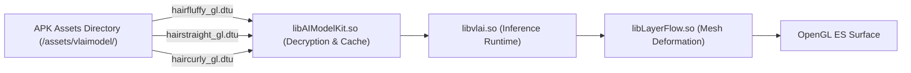

# TASK_038 — 13: Hair LUT, Model & Asset Dependency Audit

- **Asset Root Directory:** `F:\CONVERT\com.mt.mtxx.mtxx\SOURCE\extracted_assets`
- **Total Scanned Assets:** 4,300+ application assets
- **Hair-Specific Assets Audited:** 26 core shader, model, and texture files
- **Color LUTs & Palettes Audited:** 204 files

---

## 1. Hair Neural Models & Geometric Deformation Assets

Vendor hair modifications (fluffy hair, curly hair, straight hair, hair growth) rely on compiled `.dtu` neural/mesh deformation binaries managed by `libvlai.so` and `libLayerFlow.so`:

### Audited Neural Deformation Models:

| Model File Path | File Size | Format / Header | Engine Consumer | Description |
| :--- | :--- | :--- | :--- | :--- |
| `assets/vlaimodel/libMerakInnovationHairFluffyStatic/res/binary/hairfluffy_gl.dtu` | 8,172 B | Proprietary DTU binary | `libLayerFlow.so` / `libvlai.so` | Static vertex deformation field for hair volume elevation |
| `assets/vlaimodel/libMerakInnovationHairStraight/res/binary/hairstraight_gl.dtu` | 7,716 B | Proprietary DTU binary | `libLayerFlow.so` / `libvlai.so` | Straight hair realignment flow field |
| `assets/vlaimodel/libMerakInnovationHairCurly/res/binary/haircurly_gl.dtu` | 7,172 B | Proprietary DTU binary | `libLayerFlow.so` / `libvlai.so` | Wave and curl deformation vector grid |

---

## 2. Hair Shader Assets (MTAurora & ARKernel3)

In addition to the plaintext GLSL shaders compiled into `libMTFilterKernel.so` (`CMTFilterSoftHair`), the vendor packages pre-compiled SPIR-V shaders and encrypted GLES shaders in application bundles:

### A. Pre-compiled Vulkan / GLES SPIR-V Shaders (`assets/MTAurora.bundle/Shaders/`)

| Shader Filename | Size (Bytes) | Stage | Functionality |
| :--- | :--- | :--- | :--- |
| `hairmatte.fs.spirv` | 5,180 | Fragment | Multi-class hair matte compositing and boundary smoothing |
| `hairmatte_blur.fs.spirv` | 3,628 | Fragment | Spatial Gaussian edge feathering on hair alpha boundaries |
| `hairmatte_blur.vs.spirv` | 1,956 | Vertex | Coordinate projection for matte blurring |
| `hairmask_shiny.fs.spirv` | 2,112 | Fragment | Specular highlight extraction and gloss intensity boost |
| `hairmask_smooth.fs.spirv` | 1,436 | Fragment | Morphological smoothing of binary hair matte |
| `hairmask_dialtion.fs.spirv` | 1,724 | Fragment | Morphological dilation (expansion) of hair boundaries |
| `hairmask_erode.fs.spirv` | 1,724 | Fragment | Morphological erosion (shrinking) to prevent forehead bleed |
| `hairmask_blur.fs.spirv` | 1,488 | Fragment | 1D bilateral edge-preserving matte filter |
| `hairmatte_scale.fs.spirv` | 1,016 | Fragment | Downsampling/upsampling pyramid for hair matte |
| `hairmatte_narrow.vs.spirv` | 856 | Vertex | Narrow-band boundary restriction vertex transform |
| `hairmatte_multi.fs.spirv` | 780 | Fragment | Multi-person hair mask channel multiplexer |

### B. Encrypted ARKernel Shaders (`assets/ARKernel3Builtin/Shaders/`)
- `assets/ARKernel3Builtin/Shaders/HairSoft/MTFilter_HairSoftMix.fs` (1,988 bytes)
- `assets/ARKernel3Builtin/Shaders/HairSoft/MTFilter_HairSoftMix.vs` (207 bytes)
- `assets/ARKernel3Builtin/Shaders/MTFilter_HairMaskMix.fs` (564 bytes)
- `assets/ARKernel3Builtin/Shaders/MTFilter_HairMaskMix.vs` (209 bytes)
- *Forensic Observation:* These files utilize ARKernel proprietary XOR/stream encryption (header magic `_]\xdf^\x19R\x99}`). In contrast, the identical algorithmic shaders in `libMTFilterKernel.so` are stored in plaintext `.rodata`, allowing full reverse-engineering and bit-for-bit reconstruction.

---

## 3. Color Lookup Tables (LUTs) & Color Management Assets

### A. 3D Color LUTs
- **File:** `assets/ARKernel3Builtin/BeautyResource/LUT64.jpg` (30,316 bytes)
  - Standard $512 \times 512$ pixel identity neutral 3D LUT (representing a $64 \times 64 \times 64$ RGB color cube arranged in an $8 \times 8$ grid of $64 \times 64$ slices).
  - Used as the neutral identity baseline for all color grade transformations.
- **File:** `assets/ARKern/coeffient_makeup_skin_color.plist` (29,659 bytes)
  - XML property list containing polynomial color calibration coefficients for skin-hair boundary protection.

### B. Color Space Management (`libPVGColorFunctions.so`)
- Ingests standard ICC Display P3 and sRGB color profiles.
- Handles wide color gamut rendering to prevent hue clipping when high-chroma fashion hair dyes (e.g. vibrant magenta, electric blue, platinum blonde) are applied on Android devices with OLED Display P3 panels.
