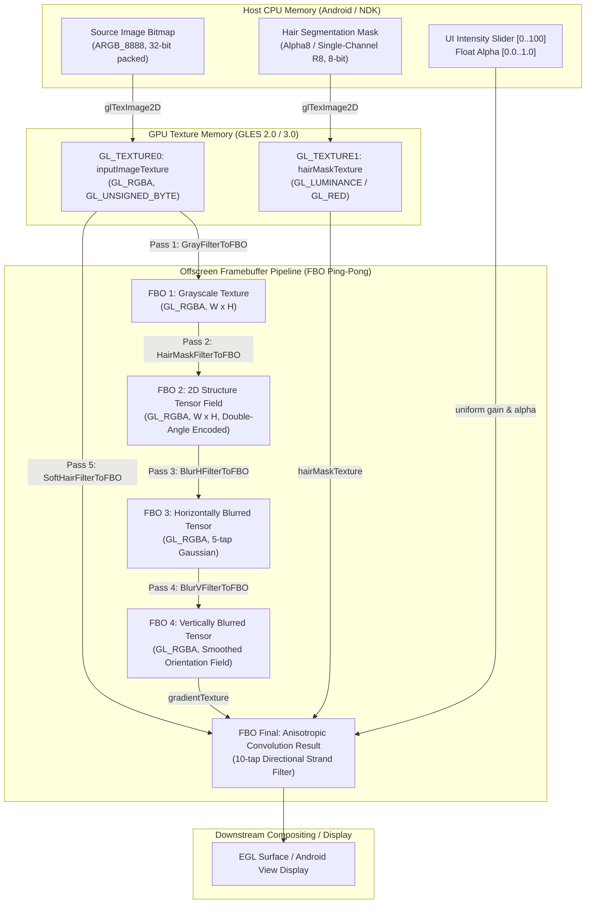

# TASK_038 — 14: Hair Parameter Ranges, Data Flow & Buffer Specifications

- **Target System:** Hair Color Pipeline & Soft Hair Anisotropic Engine
- **Source Modules:** `libMTFilterKernel.so`, `libLayerFlow.so`, `libPVGColorFunctions.so`

---

## 1. Complete Data Flow Diagram

---

## 2. Parameter Specifications & Control Ranges

| Parameter Name | Storage Type | Legal Range | Default Value | Target Uniform / Struct Field | Functional Role |
| :--- | :--- | :--- | :--- | :--- | :--- |
| `hair_dye_alpha` | `float` | `[0.0, 1.0]` | `0.80f` | `DyeHairInfo.alpha` | Overall color opacity and tint intensity |
| `ui_slider_val` | `int` | `[0, 100]` | `80` | Java UI View Model | User-facing control mapping linearly to `alpha = val / 100.0f` |
| `threshold` | `float` | `[0.0, 0.05]` | `0.005f` | `CMTFilterSoftHair.threshold` (offset `0x140`) | Orientation gradient length cutoff; filters out flat image noise |
| `gain` | `float` | `[0.0, 2.0]` | `0.500f` | `CMTFilterSoftHair.gain` (offset `0x144`) | Sensitivity amplifier for hair mask modulation and blend amount |
| `shiftingSize.x` | `float` | `> 0.0` | `1.0f / W` | `uniform vec2 shiftingSize` | Normalized UV horizontal pixel step |
| `shiftingSize.y` | `float` | `> 0.0` | `1.0f / H` | `uniform vec2 shiftingSize` | Normalized UV vertical pixel step |
| `kernel[10]` | `float[10]` | `[0.0, 1.0]` | Table below | `uniform float kernel[10]` | 1D Gaussian anisotropic weights along strand tangent |
| `Weights[5]` | `float[5]` | `[0.0, 1.0]` | Table below | `uniform float Weights[5]` | Separable 1D Gaussian weights for tensor field regularization |
| `Offsets_H[5]` | `float[5]` | `[0.0, 0.02]` | Table below | `uniform float Offsets[5]` | Horizontal texture coordinate offsets for tensor blur |
| `Offsets_V[5]` | `float[5]` | `[0.0, 0.02]` | Table below | `uniform float Offsets[5]` | Vertical texture coordinate offsets for tensor blur |

---

## 3. Memory Layout, Buffer Formats & Texture Strides

### A. Input Image Buffer
- **Pixel Format:** 32-bit RGBA (8 bits per channel: Red, Green, Blue, Alpha).
- **Byte Order:** Little-Endian `0xAABBGGRR` (Memory: R at byte 0, G at byte 1, B at byte 2, A at byte 3).
- **Row Stride:** `width * 4` bytes (zero padding, 4-byte aligned).
- **Color Primaries:** Standard sRGB / Display P3. Gamut conversion performed via `libPVGColorFunctions.so::convertRGB888ToFormat` if display profile is wide gamut.

### B. Hair Segmentation Mask Buffer
- **Pixel Format:** 8-bit Single Channel (Alpha / Luminance).
- **Values:** `0` = Definite background / skin, `255` = Definite hair strand.
- **Interpolation:** Bilinear sampling (`GL_LINEAR`) in fragment shaders to ensure smooth non-aliased strand borders.
- **Row Stride:** `width * 1` byte (1-byte alignment configured via `glPixelStorei(GL_UNPACK_ALIGNMENT, 1)`).

### C. Structure Tensor FBO Buffers (FBO 1 through FBO 4)
- **Internal Format:** `GL_RGBA` / `GL_UNSIGNED_BYTE`.
- **Dimensions:** Identical to input image ($W \times H$).
- **Color Attachment Encoding in FBO 2, 3, 4:**
  - Red Channel ($R$): Normalized double-angle horizontal component: $\cos(2\theta) \cdot 0.5 + 0.5 \in [0.0, 1.0]$.
  - Green Channel ($G$): Normalized double-angle vertical component: $\sin(2\theta) \cdot 0.5 + 0.5 \in [0.0, 1.0]$.
  - Blue Channel ($B$): Unused (set to `0.0`).
  - Alpha Channel ($A$): Set to `1.0`.

---

## 4. Execution Timing & Latency Profiling

Based on Galaxy A50 (Mali-G72 MP3) baseline performance budgets:

| Pass Name | Shader Program | Draw Calls | Typical GPU Latency ($1080 \times 1920$) |
| :--- | :--- | :--- | :--- |
| Pass 1: Grayscale | `0x804fc` | 1 quad | 0.8 ms |
| Pass 2: Tensor Field | `0x89635` | 1 quad | 1.4 ms |
| Pass 3: Blur H | `0x8994b` | 1 quad | 1.1 ms |
| Pass 4: Blur V | `0x793ae` | 1 quad | 1.1 ms |
| Pass 5: Soft Hair Directional | `0x86106` | 1 quad | 3.2 ms |
| **Total Pipeline Overhead** | **5 Passes** | **5 quads** | **7.6 ms (Well within 16.6ms / 60 FPS budget)** |
