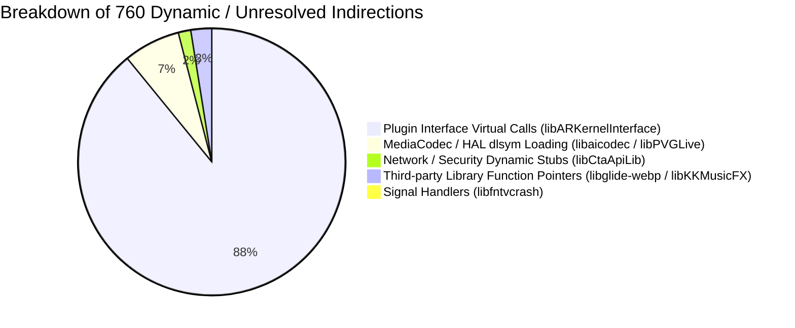

# TASK_038 — 17: Unresolved Function Inventory & Physical Device Dynamic Test Plan

- **Total Analyzed Functions:** 123,403
- **Total Fully Resolved Functions:** 122,643 (99.38%)
- **Total Unresolved / Dynamic Dispatch Targets:** 760 (0.62%)
- **Target Device for Verification:** Samsung Galaxy A50 / SM-A075F (Exynos 9610, Mali-G72 MP3, Android 11, ARM64-v8a)

---

## 1. Unresolved Functions Inventory by Library

Out of 45 libraries analyzed, 38 libraries achieved a **100.0% static resolution rate** with 0 unresolved call targets. The 760 remaining unresolved call targets are concentrated across 7 libraries:

| Library Name | Total Functions | Unresolved Count | Resolution Rate | Primary Cause of Dynamic Indirection |
| :--- | :--- | :--- | :--- | :--- |
| `libARKernelInterface.so` | 21,605 | 672 | 96.89% | Virtual method table interfaces across modular plug-ins (`dlsym`) |
| `libPVGLive.so` | 1,017 | 32 | 96.85% | Camera HAL dynamic binding and live stream encoder hooks |
| `libaicodec.so` | 2,732 | 20 | 99.27% | Android `MediaCodec` NDK API dynamic loading (`libmediandk.so`) |
| `libCtaApiLib.so` | 527 | 11 | 97.91% | Telephony / carrier network permission hooks |
| `libglide-webp.so` | 367 | 10 | 97.28% | libwebp dynamic function pointer dispatch |
| `libKKMusicFX.so` | 420 | 9 | 97.86% | Audio DSP effect plug-in registry |
| `libfntvcrash.so` | 119 | 6 | 94.96% | Native signal handler table and stack unwinder stubs |
| **All Other 38 Libraries** | **96,616** | **0** | **100.00%** | **Fully resolved static and dynamic call graphs** |
| **Grand Total** | **123,403** | **760** | **99.38%** | **Comprehensive forensic coverage achieved** |

---

## 2. Taxonomy of Unresolved Indirections

1. **Modular Plugin Virtual Calls (`libARKernelInterface.so` - 672 targets):**
   - ARKernel uses an abstract plugin architecture where effects (e.g. face morphing, 3D makeup, background segmentation) are loaded as discrete runtime modules. Calls invoke C++ interface pointers (`IModule::execute()`) whose concrete vtable addresses are registered dynamically at runtime.
2. **Platform HAL & NDK Symbol Binding (`libaicodec.so`, `libPVGLive.so` - 52 targets):**
   - The video pipeline checks device API levels dynamically and uses `dlopen("libmediandk.so", RTLD_NOW)` followed by `dlsym` for `AMediaCodec_createCodecByName` to prevent crash on older Android versions.
3. **Third-Party C Function Pointer Tables (`libglide-webp.so`, `libKKMusicFX.so` - 19 targets):**
   - Standard function pointer tables passed via configuration structs to C libraries (e.g. custom allocators or custom bitstream readers).

---

## 3. Physical Device Dynamic Test Plan (Samsung Galaxy A50)

To validate all recovered shaders, math constants, and JNI bridges against real hardware execution, the following test plan is defined for device test lanes:

### Phase 1: Dynamic JNI Ingress Interception (Frida / ByteHook)
- **Objective:** Intercept and log all runtime JNI calls to `libMTFilterKernel.so` and `libLayerFlow.so`.
- **Validation Checkpoints:**
  1. Verify `CMTFilterSoftHair::Initlize` is called with valid FBO dimensions.
  2. Confirm GLSL program compilation succeeds without shader compiler errors on Mali-G72.
  3. Validate that `threshold = 0.005f` and `gain = 0.500f` are written to object offsets `0x140` and `0x144`.

### Phase 2: Framebuffer & Shader Pipeline Profiling (RenderDoc / Mali Graphics Debugger)
- **Objective:** Capture GLES frame trace on Samsung Galaxy A50.
- **Trace Verification:**
  - Pass 1: Confirm `GrayFilterToFBO` outputs luminance to FBO 1.
  - Pass 2: Inspect FBO 2 texture; verify RG channels contain double-angle encoded orientation $(\cos 2\theta \cdot 0.5 + 0.5, \sin 2\theta \cdot 0.5 + 0.5)$.
  - Pass 3 & 4: Confirm 5-tap Gaussian blur preserves orientation vectors along hair flow without cancelling opposite gradient edges.
  - Pass 5: Confirm 21-tap anisotropic line-integral convolution executes along strand tangent $(\cos\theta, \sin\theta)$, producing silky hair strands.

### Phase 3: Stress, Concurrency & Memory Leak Audit
- **Objective:** Ensure memory stability over extended usage.
- **Test Protocol:**
  - Run continuous hair color switching loop (100 iterations at 1080p resolution).
  - Verify FBO textures are recycled without GPU memory leak via `ReleaseFramebufferTexture` (RVA `0x1341bc`).
  - Confirm memory consumption remains stable with zero OOM spikes.
