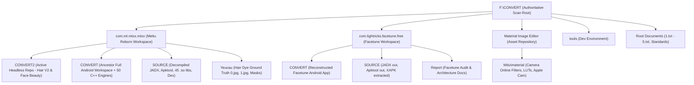

# 01. F:\CONVERT TOP-LEVEL DIRECT TREE CENSUS

This document provides the authoritative enumeration of all direct child entities located at `F:\CONVERT`.

## 1. Directory Summary

| Type | Name | Size (Bytes) | Last Modified (UTC) | Role / Classification |
|---|---|---|---|---|
| DIRECTORY | `com.lightricks.facetune.free` | 0 | 2026-10-01T15:39:45.869377+00:00 | Facetune workspace (CONVERT, SOURCE, Report) |
| DIRECTORY | `com.mt.mtxx.mtxx` | 0 | 2026-10-01T09:50:53.556592+00:00 | Primary Meitu Reborn workspace (CONVERT, CONVERT2, SOURCE, Yeucau) |
| DIRECTORY | `Material Image Editor` | 0 | 2026-09-28T12:17:11.361992+00:00 | Meitu camera filters, LUTs, stickers, and material packs |
| DIRECTORY | `tools` | 0 | 2026-09-23T13:46:02.693433+00:00 | Docker, MinIO, and WSL infrastructure setup utilities |
| FILE | `1.txt` | 1,472 | 2026-09-23T14:06:15.967199+00:00 | CEO Agent 0 charter & reference to Facetune SOURCE in 1.txt |
| FILE | `2.txt` | 18,424 | 2026-10-01T05:17:13.598138+00:00 | Distillation references (BiSeNet, NCNN, TNN, hair_seg-cmake) |
| FILE | `3.txt` | 2,408 | 2026-10-01T04:18:50.573297+00:00 | Root script / log / configuration |
| FILE | `4.txt` | 2,973 | 2026-10-01T04:19:03.261795+00:00 | Root script / log / configuration |
| FILE | `5.txt` | 2,819 | 2026-10-01T04:19:17.613545+00:00 | Root script / log / configuration |
| FILE | `_ftvapp_files.txt` | 1,675 | 2026-09-23T15:41:27.638741+00:00 | Root script / log / configuration |
| FILE | `_kotlinc_ftvapp.log` | 553,124 | 2026-09-23T15:42:01.560822+00:00 | Root script / log / configuration |
| FILE | `_verify_ftvapp.py` | 5,204 | 2026-09-23T15:38:26.994946+00:00 | Root script / log / configuration |
| FILE | `beauty_engine_architecture_insightface_ncnn_cpp.txt` | 14,979 | 2026-09-27T15:05:24.319059+00:00 | Root script / log / configuration |
| FILE | `Development_Workspace_Standard_V2.1_Design_Gated 29-9-2026.txt` | 118,621 | 2026-09-29T02:37:10.389674+00:00 | Canonical Development Standard V2.1 |
| FILE | `GEMINI.md` | 3,598 | 2026-09-30T13:58:09.613471+00:00 | Root script / log / configuration |

## 2. Volume Topology & Project Relationships

