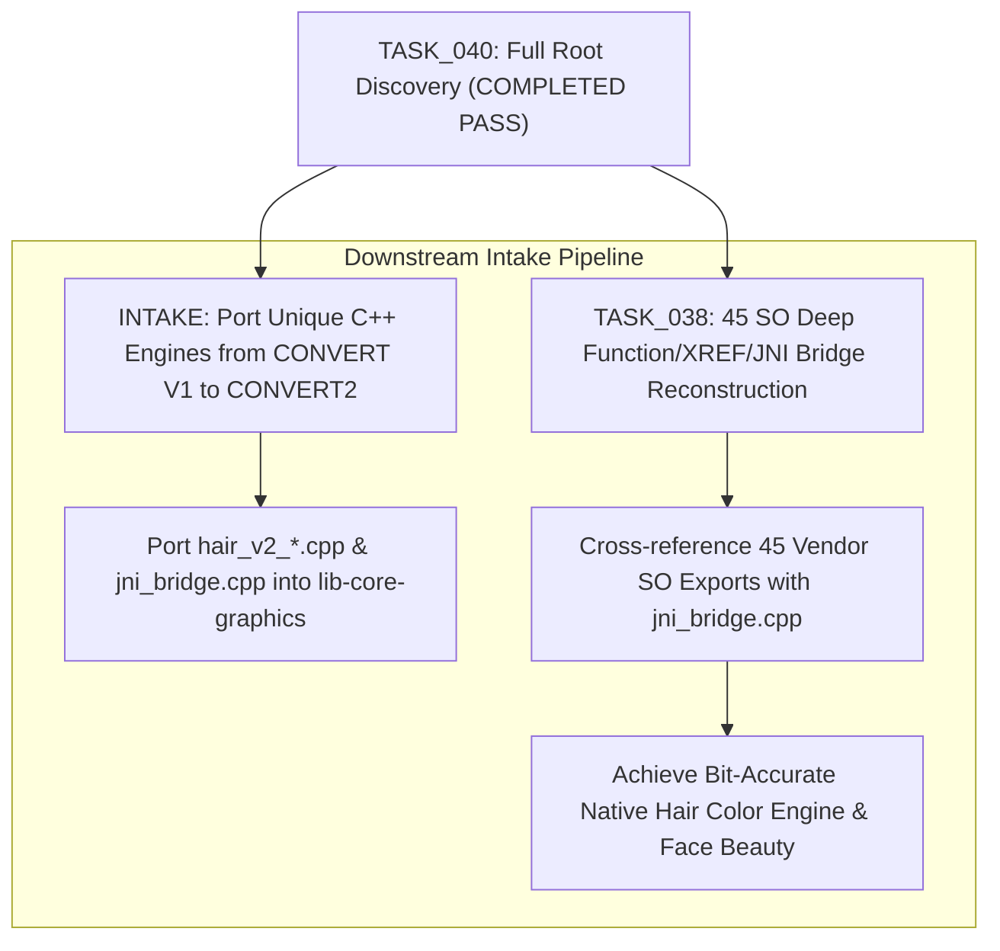

# 09. RECOMMENDED ANALYSIS & RECONSTRUCTION ORDER

Based on file evidence, dependency analysis, and Hair/JNI score ranking, the recommended order for downstream task consumption is:

### Prioritized Intake Sequence:
1. **Intake Step 1 — Native C++ Engine Sync from CONVERT V1**:
   - Source: `F:\CONVERT\com.mt.mtxx.mtxx\CONVERT\apps\android\core\native-bridge\src\main\cpp`
   - Target: `F:\CONVERT\com.mt.mtxx.mtxx\CONVERT2\lib-core-graphics\src\main\cpp\src`
   - Files to cross-verify and port: `hair_v2_pipeline.cpp`, `hair_v2_flow.cpp`, `hair_v2_color.cpp`, `hair_matting_engine.cpp`, `hair_strand_dye.cpp`, and `jni_bridge.cpp`.
2. **Intake Step 2 — Feed TASK_038 with 45 SO Binaries**:
   - Location: `F:\CONVERT\com.mt.mtxx.mtxx\SOURCE\extracted_native_libs\lib\arm64-v8a`
   - Cross-check against JNI method signatures in `jni_bridge.cpp` and `jadx_src`.
3. **Intake Step 3 — Ingest Material Image Editor LUTs**:
   - Location: `F:\CONVERT\Material Image Editor\Mitu\material`
   - Extract hair dye color tables and Apple camera filters.
4. **Intake Step 4 — Sibling Facetune Hair/Retouch Distillation**:
   - Location: `F:\CONVERT\com.lightricks.facetune.free\CONVERT\feature-ai-retouch`
   - Reference skin and hair tone curves.
