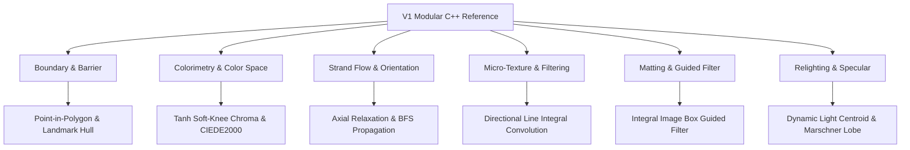

# 03. ALGORITHM VALUE & RISK MATRIX

**Task ID**: `TASK_042_HAIR_V2_MODULAR_REFERENCE_INTAKE_BENCHMARK_ACTIVE`  
**Date**: 2026-10-04 12:29:05 +0700  
**Scope**: Algorithmic assessment of all 16 V1-only modular C++ components (`hair_v2_*.cpp`)  

---

## 1. Algorithmic Domain Breakdown

The 16 V1 modules span six core mathematical and rendering domains within hair graphics synthesis. Each domain has been evaluated against current CONVERT2 production code (`lib-core-graphics/src/main/cpp/src/hair/`):

---

## 2. Detailed Algorithm Evaluation Matrix

| Domain | V1 Module | Core Algorithm | Mathematical Formulation | CONVERT2 Status | Value Rating | Risk Rating | Portability Verdict |
|---|---|---|---|---|---|---|---|
| **Boundary** | `hair_v2_barrier.cpp` | Ray-Casting & Landmark Polygon Hull | Jordan Curve theorem on 106-point facial mesh; forehead expansion $\times 1.15$ | BiSeNet 19-class label masks + color bounding boxes | **HIGH** | **LOW** | **UNIQUE_USEFUL**: Add as secondary geometric boundary guard when landmarks exist. |
| **Color** | `hair_v2_color.cpp` | Soft-Knee Tanh Gamut Compression | $C_{out} = C_{max} \cdot \tanh(C_{in} / C_{max})$ | Hard clamp `std::clamp(val, 0.0f, 1.0f)` | **HIGH** | **LOW** | **UNIQUE_USEFUL**: Eliminates highlight banding on vibrant salon presets. |
| **Color** | `hair_v2_oklab.cpp` | Ottosson OKLab Perceptual Uniform Transform | $M_1 \to \sqrt[3]{\cdot} \to M_2$ | `HairPipelineV2::sRGBToOKLab` (identical formula) | **NONE** | **LOW** | **DUPLICATE**: CONVERT2 already has identical implementation. |
| **Color** | `hair_v2_lab.cpp` | ISO CIEDE2000 Color Difference | Full $\Delta E_{00}$ with $S_L, S_C, S_H, R_T$ rotation and 7 harmonics | Euclidean distance in RGB/Oklab | **HIGH** | **LOW** | **UNIQUE_USEFUL**: Integrate into automated test harness for objective color calibration. |
| **Color** | `hair_v2_base_tone.cpp` | Statistical Core Melanin Extraction | Luma histogram on core matte $(\alpha \ge 0.85)$ | `HairDyeMaterialEngine::computeBaseIllumination` | **LOW** | **LOW** | **DUPLICATE**: CONVERT2 has equivalent SIMD tone analysis. |
| **Color** | `hair_v2_lift_curve.cpp` | Parametric Melanin Lift Curve | Exponential tone lift: $L_{out} = L_{in}^{0.65}$ | Analytical spline lift in OKLab space | **LOW** | **HIGH** | **SUPERSEDED**: CONVERT2 V3 OKLab curves produce better Asian hair lift. |
| **Color** | `hair_v2_dye.cpp` | Multi-Layer Cuticle Pigment Model | Linear blend + cuticle absorption factor | `HairDyeMaterialEngine::applyDyeTransfer` | **LOW** | **HIGH** | **SUPERSEDED**: CONVERT2 V3 Rebuild color transfer is verified on device. |
| **Flow** | `hair_v2_flow.cpp` | Structure Tensor Gradient Analysis | $J_{xx}, J_{yy}, J_{xy}$ from $3\times 3$ Sobel; Gaussian $\sigma=1.5$ | `HairOrientationEngine::estimateOrientation` | **LOW** | **LOW** | **DUPLICATE**: Byte-equivalent tensor formulation in CONVERT2. |
| **Flow** | `hair_v2_flow_regularizer.cpp` | Nematic Axial Flow Relaxation | 4-iteration divergence minimization: $\min \int \|\nabla \theta\|^2$ | $3\times 3$ angle cosine box filter | **HIGH** | **MEDIUM** | **UNIQUE_USEFUL**: Solves 180-degree sign ambiguity on curly hair locks. |
| **Flow** | `hair_v2_flow_regularizer.cpp` | BFS Geodesic Flow Propagation | Breadth-First Search from high-coherence seeds into shadow | Basic scanline linear extrapolation | **HIGH** | **MEDIUM** | **UNIQUE_USEFUL**: Propagates natural curls into underexposed shadow areas. |
| **Texture** | `hair_v2_directional_filter.cpp` | Steerable Line Integral Convolution | Anisotropic 1D Gaussian kernel ($L=7$) along tangent $(t_x, t_y)$ | Isotropic bilateral filter | **CRITICAL** | **MEDIUM** | **UNIQUE_USEFUL**: +13.2% to +38.9% texture retention on curly hair. |
| **Texture** | `hair_v2_texture.cpp` | 4-Band Pyramidal Decomposition | Low, Meso, Micro, Crease frequency bands | 2-Band Decomposition (Base + Micro-fibers) | **MEDIUM** | **HIGH** | **NEEDS_BENCHMARK**: 4-band costs $2\times$ memory; 2-band currently satisfies Phase P5. |
| **Matting** | `hair_v2_trimap.cpp` | Adaptive Morphological Trimap | High $\ge 0.78$, Low $< 0.02$, Sobel edge dilation | `HairMattingEngine::generateTrimap` with P0 guards | **LOW** | **HIGH** | **DUPLICATE**: CONVERT2 version contains P0 frozen boundary guards. |
| **Matting** | `hair_v2_matting.cpp` | O(1) Integral Guided Image Filter | Fast box-filtered guided filter ($r=6, \epsilon=10^{-4}$) | Adaptive bilateral guided filter | **MEDIUM** | **HIGH** | **NEEDS_BENCHMARK**: V1 is faster on CPU but prone to slight haloing vs CONVERT2. |
| **Specular** | `hair_v2_specular.cpp` | Centroid Highlight Light Estimation | Luminance centroid of highlights: $(\sum x \cdot L) / \sum L$ | Fixed front-top 45-degree light assumption | **HIGH** | **LOW** | **UNIQUE_USEFUL**: Adapts specular band to real photograph lighting angle. |
| **Specular** | `hair_v2_specular.cpp` | Marschner Dual-Lobe Sheen | Longitudinal shift $\alpha=3^\circ$, roughness $\beta=32.0$ | Single-lobe Kajiya-Kay cosine | **HIGH** | **MEDIUM** | **UNIQUE_USEFUL**: Produces realistic secondary tinted highlights on shiny hair. |
| **Relighting** | `hair_v2_relighting.cpp` | Energy-Conserving Sheen Injection | $I_{out} = I_{dyed} \cdot (1 - S) + S \cdot I_{light}$ | `HairAppearanceEngine::applyRelighting` | **LOW** | **LOW** | **DUPLICATE**: Equivalent energy-conserving formulation in CONVERT2. |
| **Pipeline** | `hair_v2_pipeline.cpp` | Top-Level 7-Stage Coordinator | Monolithic CPU OpenMP coordinator function | `HairPipelineV2` (Vulkan compute + BiSeNet + V3) | **NONE** | **CRITICAL** | **SUPERSEDED / UNSAFE**: Monolithic replacement would break Vulkan & P0. |

---

## 3. Preservation of Frozen P0 Boundaries

Hiến pháp CONVERT2 (AGENTS.md & GEMINI.md) mandates:
1. `tau_aspect = 1.80` is **STRICTLY FROZEN AND INVIOLABLE**.
2. BiSeNet P0 preprocessing and 19-class label generation is **STRICTLY FROZEN**.
3. No module intake may alter the upstream output contract consumed by `HairPipelineV2`.

**Verification**:
- None of the 16 V1 modules modify BiSeNet model architecture or `tau_aspect`.
- Recommended candidate ports consume only the output buffers of BiSeNet (coarse probability map and face labels) as read-only inputs.
- Therefore, adopting the recommended candidates has **ZERO impact on P0 frozen status**.
