# 03. DEPENDENCY GRAPH & INTER-.SO TOPOLOGY

**Total Vendor Libraries Analyzed**: 45
**Total Inter-Vendor Dependencies**: 59
**Total System/NDK Dependencies**: 260

## 1. Executive Topology Summary

The 45 vendor libraries form a tiered dependency graph where high-level AR, UI, and Color engines depend on core codecs and neural network runtimes:
- **Core Foundation Libraries** (No vendor dependencies): `libManis.so`, `libffmpeg.so`, `libc++_shared.so`, `libfftw3.so`, `libglide-webp.so`.
- **Heavy Subsystem Hubs** (Multiple dependents): `libarkernel3.so` (depended on by `libarkernel3_android.so`), `libffmpeg.so` (depended on by `libPVGColorFunctions.so`, `libPVGCodec.so`, `libPVGVideoCodec.so`, `libaicodec.so`), `libManis.so` (depended on by `libARKernelInterface.so`, `libmanis_npu_adapter.so`).

## 2. Inter-Vendor Dependency Table

| Source Library | Target Vendor Dependency | Subsystem Relationship |
|---|---|---|
| `libARKernelInterface.so` | `libARSPM.so` | Inter-vendor binding |
| `libARKernelInterface.so` | `libMTARMPM.so` | Inter-vendor binding |
| `libARKernelInterface.so` | `libManis.so` | Inter-vendor binding |
| `libARKernelInterface.so` | `libaicodec.so` | Inter-vendor binding |
| `libARKernelInterface.so` | `libc++_shared.so` | Inter-vendor binding |
| `libARSPM.so` | `libc++_shared.so` | Inter-vendor binding |
| `libKKMusicFX.so` | `libPVGVideoCodec.so` | Inter-vendor binding |
| `libKKMusicFX.so` | `libc++_shared.so` | Inter-vendor binding |
| `libLayerFlow.so` | `libARKernelInterface.so` | Inter-vendor binding |
| `libLayerFlow.so` | `libManis.so` | Inter-vendor binding |
| `libLayerFlow.so` | `libc++_shared.so` | Inter-vendor binding |
| `libMTARMPM.so` | `libc++_shared.so` | Inter-vendor binding |
| `libMTARMPM.so` | `libffmpeg.so` | Inter-vendor binding |
| `libMTFilterKernel.so` | `libc++_shared.so` | Inter-vendor binding |
| `libMTGif.so` | `libc++_shared.so` | Inter-vendor binding |
| `libMTGif.so` | `libffmpeg.so` | Inter-vendor binding |
| `libMTLReportTool.so` | `libc++_shared.so` | Inter-vendor binding |
| `libManis.so` | `libc++_shared.so` | Inter-vendor binding |
| `libMtlabSign.so` | `libc++_shared.so` | Inter-vendor binding |
| `libPVGCodec.so` | `libPVGColorFunctions.so` | Inter-vendor binding |
| `libPVGCodec.so` | `libPVGImageCodec.so` | Inter-vendor binding |
| `libPVGCodec.so` | `libPVGVideoCodec.so` | Inter-vendor binding |
| `libPVGCodec.so` | `libc++_shared.so` | Inter-vendor binding |
| `libPVGCodec.so` | `libffmpeg.so` | Inter-vendor binding |
| `libPVGCodec.so` | `libffmpegfilter.so` | Inter-vendor binding |
| `libPVGColorFunctions.so` | `libc++_shared.so` | Inter-vendor binding |
| `libPVGColorFunctions.so` | `libffmpeg.so` | Inter-vendor binding |
| `libPVGImageCodec.so` | `libc++_shared.so` | Inter-vendor binding |
| `libPVGLive.so` | `libc++_shared.so` | Inter-vendor binding |
| `libPVGVideoCodec.so` | `libc++_shared.so` | Inter-vendor binding |
| `libPVGVideoCodec.so` | `libffmpeg.so` | Inter-vendor binding |
| `libVERenderer.so` | `libc++_shared.so` | Inter-vendor binding |
| `libaicodec.so` | `libc++_shared.so` | Inter-vendor binding |
| `libaicodec.so` | `libffmpeg.so` | Inter-vendor binding |
| `libaidetectionplugin.so` | `libVERenderer.so` | Inter-vendor binding |
| `libaidetectionplugin.so` | `libc++_shared.so` | Inter-vendor binding |
| `libarkernel3.so` | `libARSPM.so` | Inter-vendor binding |
| `libarkernel3.so` | `libMTARMPM.so` | Inter-vendor binding |
| `libarkernel3.so` | `libc++_shared.so` | Inter-vendor binding |
| `libarkernel3.so` | `libfantasy.so` | Inter-vendor binding |
| `libarkernel3.so` | `libffmpeg.so` | Inter-vendor binding |
| `libarkernel3_android.so` | `libarkernel3.so` | Inter-vendor binding |
| `libarkernel3_android.so` | `libc++_shared.so` | Inter-vendor binding |
| `libarkernel3_c.so` | `libarkernel3.so` | Inter-vendor binding |
| `libarkernel3_c.so` | `libc++_shared.so` | Inter-vendor binding |
| `libfantasy.so` | `libc++_shared.so` | Inter-vendor binding |
| `libffmpegfilter.so` | `libffmpeg.so` | Inter-vendor binding |
| `libhiai.so` | `libc++_shared.so` | Inter-vendor binding |
| `libhiai_ir.so` | `libc++_shared.so` | Inter-vendor binding |
| `libhiai_ir_build.so` | `libc++_shared.so` | Inter-vendor binding |
| `libhiai_ir_build.so` | `libhiai.so` | Inter-vendor binding |
| `libhiai_ir_build.so` | `libhiai_ir.so` | Inter-vendor binding |
| `libhttpelf.so` | `libc++_shared.so` | Inter-vendor binding |
| `libkoom-strip-dump.so` | `libbytehook.so` | Inter-vendor binding |
| `liblabdeviceinfo.so` | `libc++_shared.so` | Inter-vendor binding |
| `libmanis_npu_adapter.so` | `libc++_shared.so` | Inter-vendor binding |
| `libmanis_npu_adapter.so` | `libhiai.so` | Inter-vendor binding |
| `libmanis_npu_adapter.so` | `libhiai_ir.so` | Inter-vendor binding |
| `libmanis_npu_adapter.so` | `libhiai_ir_build.so` | Inter-vendor binding |

## 3. Top System/NDK Dependencies

| System Library | Dependent Vendor Count | Purpose in Android |
|---|---|---|
| `libm.so` | 44 / 45 | Android platform runtime |
| `libdl.so` | 44 / 45 | Android platform runtime |
| `libc.so` | 44 / 45 | Android platform runtime |
| `liblog.so` | 40 / 45 | Android platform runtime |
| `libandroid.so` | 16 / 45 | Android platform runtime |
| `libEGL.so` | 12 / 45 | Android platform runtime |
| `libz.so` | 9 / 45 | Android platform runtime |
| `libGLESv2.so` | 8 / 45 | Android platform runtime |
| `libjnigraphics.so` | 7 / 45 | Android platform runtime |
| `libGLESv3.so` | 6 / 45 | Android platform runtime |
| `libvllog.so` | 6 / 45 | Android platform runtime |
| `libyuv.so` | 4 / 45 | Android platform runtime |
| `libvldp.so` | 3 / 45 | Android platform runtime |
| `libstdc++.so` | 2 / 45 | Android platform runtime |
| `libmtmvcore.so` | 2 / 45 | Android platform runtime |
| `libmttypes.so` | 2 / 45 | Android platform runtime |
| `libvlai.so` | 2 / 45 | Android platform runtime |
| `libmtlabrecord.so` | 2 / 45 | Android platform runtime |
| `libmediandk.so` | 2 / 45 | Android platform runtime |
| `libmtImageKit.so` | 1 / 45 | Android platform runtime |
| `libmtee.so` | 1 / 45 | Android platform runtime |
| `libmtrteffectcore.so` | 1 / 45 | Android platform runtime |
| `libGLESv1_CM.so` | 1 / 45 | Android platform runtime |
| `libshadowhook.so` | 1 / 45 | Android platform runtime |

## 4. Mermaid Architecture Dependency Flow

```mermaid
flowchart TD
    libARKernelInterface_so --> libARSPM_so
    libARKernelInterface_so --> libMTARMPM_so
    libARKernelInterface_so --> libManis_so
    libARKernelInterface_so --> libaicodec_so
    libARKernelInterface_so --> libc++_shared_so
    libARSPM_so --> libc++_shared_so
    libKKMusicFX_so --> libPVGVideoCodec_so
    libKKMusicFX_so --> libc++_shared_so
    libLayerFlow_so --> libARKernelInterface_so
    libLayerFlow_so --> libManis_so
    libLayerFlow_so --> libc++_shared_so
    libMTARMPM_so --> libc++_shared_so
    libMTARMPM_so --> libffmpeg_so
    libMTFilterKernel_so --> libc++_shared_so
    libMTGif_so --> libc++_shared_so
    libMTGif_so --> libffmpeg_so
    libMTLReportTool_so --> libc++_shared_so
    libManis_so --> libc++_shared_so
    libMtlabSign_so --> libc++_shared_so
    libPVGCodec_so --> libPVGColorFunctions_so
    libPVGCodec_so --> libPVGImageCodec_so
    libPVGCodec_so --> libPVGVideoCodec_so
    libPVGCodec_so --> libc++_shared_so
    libPVGCodec_so --> libffmpeg_so
    libPVGCodec_so --> libffmpegfilter_so
    libPVGColorFunctions_so --> libc++_shared_so
    libPVGColorFunctions_so --> libffmpeg_so
    libPVGImageCodec_so --> libc++_shared_so
    libPVGLive_so --> libc++_shared_so
    libPVGVideoCodec_so --> libc++_shared_so
    libPVGVideoCodec_so --> libffmpeg_so
    libVERenderer_so --> libc++_shared_so
    libaicodec_so --> libc++_shared_so
    libaicodec_so --> libffmpeg_so
    libaidetectionplugin_so --> libVERenderer_so
    libaidetectionplugin_so --> libc++_shared_so
    libarkernel3_so --> libARSPM_so
    libarkernel3_so --> libMTARMPM_so
    libarkernel3_so --> libc++_shared_so
    libarkernel3_so --> libfantasy_so
    libarkernel3_so --> libffmpeg_so
    libarkernel3_android_so --> libarkernel3_so
    libarkernel3_android_so --> libc++_shared_so
    libarkernel3_c_so --> libarkernel3_so
    libarkernel3_c_so --> libc++_shared_so
    libfantasy_so --> libc++_shared_so
    libffmpegfilter_so --> libffmpeg_so
    libhiai_so --> libc++_shared_so
    libhiai_ir_so --> libc++_shared_so
    libhiai_ir_build_so --> libc++_shared_so
    libhiai_ir_build_so --> libhiai_so
    libhiai_ir_build_so --> libhiai_ir_so
    libhttpelf_so --> libc++_shared_so
    libkoom_strip_dump_so --> libbytehook_so
    liblabdeviceinfo_so --> libc++_shared_so
    libmanis_npu_adapter_so --> libc++_shared_so
    libmanis_npu_adapter_so --> libhiai_so
    libmanis_npu_adapter_so --> libhiai_ir_so
    libmanis_npu_adapter_so --> libhiai_ir_build_so
```

