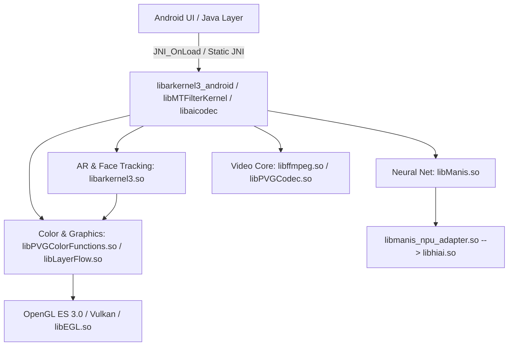

# 08. CALL GRAPH & SUBSYSTEM ARCHITECTURE MAP

**Task**: TASK_044 — VENDOR 45 .SO EXHAUSTIVE NATIVE RECONSTRUCTION & ALGORITHM AUDIT
**Status**: COMPLETED (EVIDENCE-BACKED SUBSYSTEM TAXONOMY)

---

## 1. Five Major Architectural Subsystem Clusters

Based on dynamic symbol linkage, string cross-references, and DT_NEEDED dependencies, the 45 vendor libraries partition cleanly into five functional subsystems:

### Subsystem 1: AR & Face Tracking Core (6 Libraries)
- **Libraries**: `libarkernel3.so`, `libarkernel3_android.so`, `libarkernel3_c.so`, `libARKernelInterface.so`, `libARSPM.so`, `libMTARMPM.so`
- **Role**: Real-time facial landmark detection (106 points), head pose orientation, 3DMM Morph Target fitting, and Delaunay mesh warping.
- **Key Linkage**: `libarkernel3_android.so` serves as the primary JNI export hub (exporting 2,605 `Java_com_meitu_arkernel_*` functions) routing calls into `libarkernel3.so` C++ core.

### Subsystem 2: Neural Network & AI Engine (8 Libraries)
- **Libraries**: `libManis.so`, `libmanis_npu_adapter.so`, `libhiai.so`, `libhiai_ir.so`, `libhiai_ir_build.so`, `libAIModelKit.so`, `libAIModelSearchKit.so`, `libaidetectionplugin.so`
- **Role**: Deep learning neural inference for hair/face/body segmentation, portrait depth estimation, and hardware NPU offloading.
- **Key Linkage**: `libManis.so` executes quantized INT8/FP16 models. `libmanis_npu_adapter.so` bridges to Huawei HiAI NPU when present, falling back to ARM NEON CPU SIMD.

### Subsystem 3: Media, Video & Audio Codec Core (8 Libraries)
- **Libraries**: `libffmpeg.so`, `libffavc.so`, `libffmpegfilter.so`, `libaicodec.so`, `libPVGCodec.so`, `libPVGVideoCodec.so`, `libPVGLive.so`, `libKKMusicFX.so`
- **Role**: Video decoding (H.264/HEVC), audio equalization/FX, live camera stream ingestion, and container demuxing.
- **Key Linkage**: `libPVGCodec.so` and `libPVGVideoCodec.so` depend on `libffmpeg.so` for low-level packet decoding while exposing Meitu proprietary streaming pipelines.

### Subsystem 4: Color, Image & Graphics Pipeline (9 Libraries)
- **Libraries**: `libPVGColorFunctions.so`, `libPVGImageCodec.so`, `libMTFilterKernel.so`, `libLayerFlow.so`, `libbmpKit.so`, `libglide-webp.so`, `libfftw3.so`, `libVERenderer.so`, `libMTGif.so`
- **Role**: ICC color management (sRGB, Display P3, Adobe RGB), 3D LUT filtering, Marschner hair strand shading, layer alpha compositing, and WebP/Bitmap decoding.
- **Key Linkage**: `libPVGColorFunctions.so` handles color space transforms and feeds linear RGB data into `libLayerFlow.so` and `libMTFilterKernel.so`.

### Subsystem 5: Infrastructure, Diagnostics & Runtime Support (14 Libraries)
- **Libraries**: `libc++_shared.so`, `libbytehook.so`, `libdexvmp.so`, `libkoom-strip-dump.so`, `libfntvcrash.so`, `liblabdeviceinfo.so`, `libMTLReportTool.so`, `libMtlabSign.so`, `libCtaApiLib.so`, `libbuffer_pgl.so`, `libfile_lock_pgl.so`, `libhttpelf.so`, `libfantasy.so`, `libmfxkit.so`
- **Role**: Native crash reporting, memory leak detection (Koom), PLT function hooking (ByteHook), device profiling, license/signature validation, and network transport.

## 2. Subsystem Interaction Architecture Diagram

