# TASK_044 — VENDOR 45 .SO DEPENDENCY GRAPH

## 1. System & NDK External Dependencies
All 45 native binaries link against standard Android Bionic C/C++ runtimes and NDK subsystems:
- `libEGL.so`
- `libGLESv1_CM.so`
- `libGLESv2.so`
- `libGLESv3.so`
- `libandroid.so`
- `libc.so`
- `libdl.so`
- `libjnigraphics.so`
- `liblog.so`
- `libm.so`
- `libmediandk.so`
- `libmtImageKit.so`
- `libmtee.so`
- `libmtlabrecord.so`
- `libmtmvcore.so`
- `libmtrteffectcore.so`
- `libmttypes.so`
- `libshadowhook.so`
- `libstdc++.so`
- `libvlai.so`
- `libvldp.so`
- `libvllog.so`
- `libyuv.so`
- `libz.so`

## 2. Inter-Vendor Native Library Dependency Graph

```mermaid
graph TD
    libaicodec_so --> libffmpeg_so
    libaicodec_so --> libc++_shared_so
    libaidetectionplugin_so --> libVERenderer_so
    libaidetectionplugin_so --> libc++_shared_so
    libarkernel3_so --> libMTARMPM_so
    libarkernel3_so --> libffmpeg_so
    libarkernel3_so --> libfantasy_so
    libarkernel3_so --> libARSPM_so
    libarkernel3_so --> libc++_shared_so
    libarkernel3_android_so --> libarkernel3_so
    libarkernel3_android_so --> libc++_shared_so
    libarkernel3_c_so --> libarkernel3_so
    libarkernel3_c_so --> libc++_shared_so
    libARKernelInterface_so --> libc++_shared_so
    libARKernelInterface_so --> libMTARMPM_so
    libARKernelInterface_so --> libaicodec_so
    libARKernelInterface_so --> libManis_so
    libARKernelInterface_so --> libARSPM_so
    libARSPM_so --> libc++_shared_so
    libfantasy_so --> libc++_shared_so
    libffmpegfilter_so --> libffmpeg_so
    libhiai_so --> libc++_shared_so
    libhiai_ir_so --> libc++_shared_so
    libhiai_ir_build_so --> libhiai_ir_so
    libhiai_ir_build_so --> libhiai_so
    libhiai_ir_build_so --> libc++_shared_so
    libhttpelf_so --> libc++_shared_so
    libKKMusicFX_so --> libPVGVideoCodec_so
    libKKMusicFX_so --> libc++_shared_so
    libkoom_strip_dump_so --> libbytehook_so
    liblabdeviceinfo_so --> libc++_shared_so
    libLayerFlow_so --> libARKernelInterface_so
    libLayerFlow_so --> libManis_so
    libLayerFlow_so --> libc++_shared_so
    libManis_so --> libc++_shared_so
    libmanis_npu_adapter_so --> libhiai_ir_build_so
    libmanis_npu_adapter_so --> libhiai_ir_so
    libmanis_npu_adapter_so --> libhiai_so
    libmanis_npu_adapter_so --> libc++_shared_so
    libMTARMPM_so --> libffmpeg_so
    libMTARMPM_so --> libc++_shared_so
    libMTFilterKernel_so --> libc++_shared_so
    libMTGif_so --> libffmpeg_so
    libMTGif_so --> libc++_shared_so
    libMtlabSign_so --> libc++_shared_so
    libMTLReportTool_so --> libc++_shared_so
    libPVGCodec_so --> libffmpegfilter_so
    libPVGCodec_so --> libffmpeg_so
    libPVGCodec_so --> libPVGVideoCodec_so
    libPVGCodec_so --> libPVGImageCodec_so
    libPVGCodec_so --> libPVGColorFunctions_so
    libPVGCodec_so --> libc++_shared_so
    libPVGColorFunctions_so --> libffmpeg_so
    libPVGColorFunctions_so --> libc++_shared_so
    libPVGImageCodec_so --> libc++_shared_so
    libPVGLive_so --> libc++_shared_so
    libPVGVideoCodec_so --> libffmpeg_so
    libPVGVideoCodec_so --> libc++_shared_so
    libVERenderer_so --> libc++_shared_so
```

## 3. Dependency Cluster Highlights
- **Core AR / Filter Ecosystem:** `libarkernel3.so` -> `libc++_shared.so`, `libbytehook.so`
- **AI Inference Hub:** `libManis.so` -> `libc++_shared.so`, `libhiai.so`
- **Codec / Media Framework:** `libffmpeg.so` -> `libffavc.so`, `libffmpegfilter.so`, `libfftw3.so`
- **Photo / Video Graphics (PVG):** `libPVGImageCodec.so` & `libPVGVideoCodec.so` -> `libPVGColorFunctions.so`, `libPVGCodec.so`
- **Layer Flow Compositing:** `libLayerFlow.so` -> `libMTFilterKernel.so`, `libarkernel3.so`
