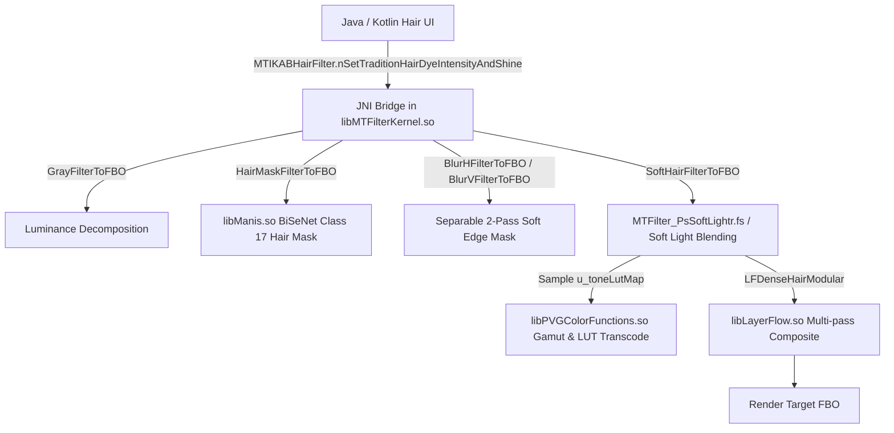

# TASK_044 — 45 VENDOR .SO SUBSYSTEM ARCHITECTURE & CALLGRAPH MAP

## 1. Architectural Subsystem Clustering (45 Libraries)

### Core Graphics & Filter Engine (10 libraries)
| Library | Size (Bytes) | Stripped | Exported Funcs | JNI Status | Primary Responsibility |
|---|---|---|---|---|---|
| `libarkernel3.so` | 17,786,488 | True | 1599 | Internal C++ | AR & Facial Makeup |
| `libARKernelInterface.so` | 17,829,224 | True | 659 | JNI_OnLoad | Media / Utility |
| `libARSPM.so` | 5,298,024 | True | 56 | Internal C++ | Media / Utility |
| `libbmpKit.so` | 486,360 | True | 198 | JNI_OnLoad | Media / Utility |
| `libfantasy.so` | 2,623,024 | True | 197 | Internal C++ | Media / Utility |
| `libLayerFlow.so` | 5,544,776 | True | 3215 | JNI_OnLoad | Media / Utility |
| `libMTARMPM.so` | 99,704 | True | 27 | Internal C++ | Media / Utility |
| `libMTFilterKernel.so` | 1,858,440 | True | 2425 | 2 JNI methods | Core Image Processing |
| `libMTGif.so` | 83,560 | True | 101 | JNI_OnLoad | Media / Utility |
| `libVERenderer.so` | 429,728 | True | 951 | Internal C++ | Media / Utility |

### Computer Vision & Neural Inference (8 libraries)
| Library | Size (Bytes) | Stripped | Exported Funcs | JNI Status | Primary Responsibility |
|---|---|---|---|---|---|
| `libaidetectionplugin.so` | 531,680 | True | 362 | JNI_OnLoad | Media / Utility |
| `libAIModelKit.so` | 280,608 | True | 123 | 14 JNI methods | Media / Utility |
| `libAIModelSearchKit.so` | 1,027,728 | True | 743 | JNI_OnLoad | Media / Utility |
| `libhiai.so` | 446,504 | True | 362 | Internal C++ | Media / Utility |
| `libhiai_ir.so` | 868,936 | True | 1043 | Internal C++ | Media / Utility |
| `libhiai_ir_build.so` | 27,120 | True | 6 | Internal C++ | Media / Utility |
| `libManis.so` | 9,928,576 | True | 287 | Internal C++ | Neural Net Engine |
| `libmanis_npu_adapter.so` | 1,022,088 | True | 171 | Internal C++ | Media / Utility |

### Media, Codec & Audio DSP (13 libraries)
| Library | Size (Bytes) | Stripped | Exported Funcs | JNI Status | Primary Responsibility |
|---|---|---|---|---|---|
| `libaicodec.so` | 2,107,800 | True | 2203 | JNI_OnLoad | Media / Utility |
| `libffavc.so` | 1,161,456 | True | 2 | 1 JNI methods | Media / Utility |
| `libffmpeg.so` | 7,546,632 | True | 2461 | Internal C++ | Media / Utility |
| `libffmpegfilter.so` | 267,600 | True | 216 | Internal C++ | Media / Utility |
| `libfftw3.so` | 502,784 | True | 367 | Internal C++ | Media / Utility |
| `libglide-webp.so` | 412,080 | True | 244 | JNI_OnLoad | Media / Utility |
| `libKKMusicFX.so` | 519,504 | True | 71 | JNI_OnLoad | Media / Utility |
| `libmfxkit.so` | 773,652 | True | 0 | Internal C++ | Media / Utility |
| `libPVGCodec.so` | 1,283,760 | True | 462 | JNI_OnLoad | Media / Utility |
| `libPVGColorFunctions.so` | 380,224 | True | 87 | Internal C++ | Media / Utility |
| `libPVGImageCodec.so` | 5,133,080 | True | 3702 | Internal C++ | Media / Utility |
| `libPVGLive.so` | 603,200 | True | 21 | JNI_OnLoad | Media / Utility |
| `libPVGVideoCodec.so` | 1,150,016 | True | 178 | JNI_OnLoad | Media / Utility |

### Platform & Runtime Abstraction (5 libraries)
| Library | Size (Bytes) | Stripped | Exported Funcs | JNI Status | Primary Responsibility |
|---|---|---|---|---|---|
| `libarkernel3_android.so` | 693,576 | True | 2607 | 2605 JNI methods | AR & Facial Makeup |
| `libarkernel3_c.so` | 501,664 | True | 1919 | Internal C++ | AR & Facial Makeup |
| `libbytehook.so` | 59,080 | True | 20 | JNI_OnLoad | Media / Utility |
| `libc++_shared.so` | 1,292,904 | True | 918 | Internal C++ | Media / Utility |
| `liblabdeviceinfo.so` | 126,312 | True | 1 | JNI_OnLoad | Media / Utility |

### Security, Crash & Diagnostics (9 libraries)
| Library | Size (Bytes) | Stripped | Exported Funcs | JNI Status | Primary Responsibility |
|---|---|---|---|---|---|
| `libbuffer_pgl.so` | 9,000 | True | 12 | 11 JNI methods | Media / Utility |
| `libCtaApiLib.so` | 494,080 | True | 159 | JNI_OnLoad | Media / Utility |
| `libdexvmp.so` | 516,600 | True | 273 | JNI_OnLoad | Media / Utility |
| `libfile_lock_pgl.so` | 6,312 | True | 6 | 6 JNI methods | Media / Utility |
| `libfntvcrash.so` | 57,592 | True | 1 | JNI_OnLoad | Media / Utility |
| `libhttpelf.so` | 51,272 | True | 1 | 1 JNI methods | Media / Utility |
| `libkoom-strip-dump.so` | 576,288 | True | 533 | 6 JNI methods | Media / Utility |
| `libMtlabSign.so` | 22,016 | True | 18 | 1 JNI methods | Media / Utility |
| `libMTLReportTool.so` | 73,224 | True | 40 | JNI_OnLoad | Media / Utility |

## 2. End-to-End Hair Dye & Beauty Render Callgraph

