# BÁO CÁO 08: KIẾN TRÚC PIPELINE XỬ LÝ HÌNH ẢNH (IMAGE ENGINE ARCHITECTURE)
## DỰ ÁN: CONVERT2 — DEEP FORENSIC SURVEY (TASK_046)

---

## 1. TỔNG QUAN CÁC MÔ HÌNH KIẾN TRÚC ĐỒ HỌA HÀNG ĐẦU

Qua giải mã 14 ứng dụng chỉnh ảnh chuyên nghiệp, ngành công nghiệp xử lý ảnh di động hiện tại chia thành 4 trường phái kiến trúc chính:

```mermaid
flowchart TD
    subgraph S1["Trường Phái 1: Render Graph C++ Native (Meitu, Facetune)"]
        UI1["UI / Compose StateFlow"] --> JNI1["JNI C-Bridge"]
        JNI1 --> RG1["C++ RenderGraph Node Scheduler"]
        RG1 --> GPU1["Vulkan Compute / OpenGL ES 3.0 Pipeline"]
        GPU1 --> FB1["Hardware Surface Framebuffer"]
    end

    subgraph S2["Trường Phái 2: Cross-Platform Deterministic Core (VSCO)"]
        UI2["Kotlin UI Views"] --> FFI2["Rust UniFFI Bridge (CEL Language)"]
        FFI2 --> CXX2["C++20 Fraggle Rock Filter Engine"]
        CXX2 --> GL2["3D LUT Cube + Film Grain Shaders"]
        GL2 --> FB2["Direct SurfaceView Output"]
    end

    subgraph S3["Trường Phái 3: Edge/Cloud Hybrid AI Cluster (Remini)"]
        UI3["100% Compose UI"] --> ONNX3["Edge Microsoft ONNX Runtime (Alignment)"]
        ONNX3 --> CLOUD3["Cloud GPU Cluster (GFPGAN / CodeFormer)"]
        CLOUD3 --> SH3["OpenGL Split-Screen Slider Shader"]
        SH3 --> FB3["Interactive Before/After View"]
    end

    subgraph S4["Trường Phái 4: Hardware 3D Texture Pipeline (FaceApp)"]
        UI4["Single-Activity MVP"] --> SIMD4["C++ ARM Neon SIMD Bridge"]
        SIMD4 --> TEX3D["glTexImage3D Hardware Interpolator"]
        TEX3D --> FB4["Zero-Latency Real-Time Screen"]
    end
```



---

## 2. TRUY VẾT CHI TIẾT CHUỖI GỌI HÀM (UI -> ENGINE TRACE)

### 2.1. Meitu ARKernel & LayerFlow Architecture
1. **Tầng Giao Diện (UI Layer):** Người dùng thao tác thanh trượt màu tóc hoặc làm mịn da trên `HairDyeFragment` / `SkinSmoothFragment`. Sự kiện chạm phát ra `StateFlow` event.
2. **Tầng Trình Diễn (ViewModel):** `BeautyEditViewModel` nhận giá trị phần trăm (0.0 đến 1.0), đóng gói thành thông số cấu hình hiệu ứng `EffectConfig`.
3. **Tầng Cầu Nối Kotlin/Java:** Gọi hàm wrapper `com.meitu.core.MTFilterKernel.applyFilter(long handle, int filterId, float[] params)`.
4. **Tầng Cầu Nối Native JNI:** Phương thức JNI nhị phân `Java_com_meitu_core_MTFilterKernel_nativeProcessHairDye` giải nén con trỏ bộ nhớ `handle` sang đối tượng C++ `meitu::hair::HairDyeKernel`.
5. **Lõi C++ Native Engine (`libARKernelInterface.so` + `libMTFilterKernel.so`):**
   - Lõi C++ trích xuất mặt nạ tóc `meitu::MaskBuffer` từ bộ nhớ đệm chia sẻ (được sinh ra trước đó bởi mô hình `Manis` On-Device AI).
   - Kiểm tra tính hợp lệ của con trỏ ảnh đầu vào `meitu::ImageBuffer`.
   - Lên lịch nút xử lý (Render Node) vào đồ thị đồ họa `LayerFlow RenderGraph`.
6. **Tầng GPU Shader / Tensor Model:**
   - Điều phối lệnh xuống Vulkan Command Buffer hoặc OpenGL ES Framebuffer Object (FBO).
   - Nạp texture ảnh gốc vào `Texture Unit 0`, mặt nạ tóc vào `Texture Unit 1`, và bảng màu tra cứu vào `Texture Unit 2`.
   - Thực thi Fragment Shader `hair_dye_blend.frag` với thuật toán bảo toàn độ sáng tự nhiên (Luminosity Preservation).
7. **Đích Xuất (Output Sink):** Đẩy kết quả ra `Vulkan Host-Coherent Framebuffer` được liên kết trực tiếp với Android `SurfaceView` để người dùng thấy kết quả ngay lập tức ở tốc độ 80-120 fps.

### 2.2. Lightricks Facetune Xeno Engine Architecture
1. **Kiến Trúc MVI Đơn Hướng:** Facetune sử dụng Model-View-Intent triệt để. Mọi thao tác người dùng đều tạo ra một Intent không thể thay đổi (`Immutable Intent`).
2. **Xeno RenderGraph Core (`libxeno_native.so`):**
   - Toàn bộ pipeline xử lý không được hard-code tuần tự mà được mô hình hóa thành một **Đồ thị không chu trình có hướng (DAG - Directed Acyclic Graph)**.
   - Mỗi hiệu ứng (Làm mịn, Trắng răng, Đổi màu mắt, 3DMM Reshape) là một `XenoNode`.
   - Xeno Engine tự động phân tích đồ thị để gộp (merge) các pass shader liền kề nhằm giảm thiểu băng thông đọc/ghi bộ nhớ VRAM (Bandwidth Reduction).
3. **Tái Lập Khuôn Mặt 3D Bằng 3DMM Mesh:**
   - Thay vì bẻ cong pixel 2D (Liquify), Facetune nạp vector trọng số hình thái vào đỉnh lưới 3D (`shape_matrix_18990x80x1.tensor`).
   - Vertex Shader `mesh_3dmm_deform.vert` thực hiện phép biến đổi affine trên 12,506 tam giác bề mặt khuôn mặt, đảm bảo da mặt xoay chuyển tự nhiên mà các vật thể ở hậu cảnh hoàn toàn đứng yên.

---

## 3. VÒNG ĐỜI BỘ ĐỆM & BỘ NHỚ (FRAME & BUFFER LIFECYCLE)

### 3.1. Kỹ Thuật Không Sao Chép Bộ Nhớ (Zero-Copy Buffer Exchange)
Trong các ứng dụng đỉnh cao (Meitu, Facetune, Remini), việc truyền tải dữ liệu ảnh giữa camera, AI inference, và GPU render **tuyệt đối không đi qua mảng byte Java byte[] hay Bitmap copy**:
- **Cơ chế:** Sử dụng `AHardwareBuffer` (Android NDK) kết hợp với phần mở rộng `EGLImageKHR` (`EGL_ANDROID_get_native_client_buffer`) và `VK_ANDROID_external_memory_android_hardware_buffer`.
- **Hiệu quả:**
  - Bộ đệm khung hình từ CameraX/Camera2 được cấp phát trực tiếp trên bộ nhớ DMA (Direct Memory Access) của phần cứng.
  - Bộ đệm này được ánh xạ cùng lúc tới:
    1. Lõi AI (`libManis.so` hoặc `libonnxruntime.so`) để chạy suy luận phân đoạn.
    2. Bộ giải mã Vulkan/OpenGL làm Texture đầu vào.
    3. Bộ nhớ hiển thị màn hình (Surface).
  - Tốc độ truyền tải: **0 ms copy overhead**, loại bỏ hoàn toàn hiện tượng Garbage Collection (GC) giật lag trên thiết bị Android.

### 3.2. Quản Lý Không Gian Màu (Color Space Pipeline)
- **Chuẩn màu nội bộ:** Mọi tính toán quang học (Làm mịn da, hòa trộn màu tóc, ánh sáng chân dung) đều được thực hiện trong **Không gian màu Tuyến tính (Linear Rec.709 / Linear sRGB)**.
- **Quy trình chuyển đổi:**
  $$\text{Input sRGB} \xrightarrow{\text{Gamma De-encode}} \text{Linear RGB} \xrightarrow{\text{Shader Blend / 3D LUT}} \text{Linear Output} \xrightarrow{\text{OETF Gamma Encode}} \text{Output sRGB}$$
- Việc xử lý trong không gian Linear giúp ngăn ngừa hiện tượng cháy sáng viền (Edge Burn) và giữ đúng tỷ lệ tán xạ ánh sáng dưới da (Subsurface Scattering).

---

## 4. MÔ HÌNH CHỈNH SỬA PHI HỦY DIỆT (NON-DESTRUCTIVE EDITING) & UNDO/REDO

Cả Meitu, Facetune và VSCO đều áp dụng mô hình **Cây Trạng Thái Tham Số (Parametric State Tree)**:
- Ảnh gốc độ phân giải cao được giữ nguyên vẹn ở chế độ chỉ đọc trong bộ nhớ lưu trữ tạm thời (`Original Immutable Asset`).
- Mỗi hành động chỉnh sửa của người dùng chỉ lưu một cấu trúc dữ liệu cực nhẹ:
  ```json
  {
    "action_id": "HAIR_RECOLOR",
    "color_hex": "#D14836",
    "intensity": 0.85,
    "blend_mode": "LUMINOSITY",
    "mask_hash": "a4f89b...",
    "timestamp": 1728028800
  }
  ```
- Khi người dùng bấm Undo / Redo: Hệ thống chỉ việc di chuyển con trỏ trong ngăn xếp lệnh (Command Stack) và render lại đồ thị RenderGraph, thời gian phản hồi tức thì mà không cần nạp lại hay sao lưu các tệp ảnh Bitmap nặng hàng chục Megabytes.

---

## 5. ĐỒNG NHẤT BẢN XEM TRƯỚC (PREVIEW) VÀ BẢN XUẤT CUỐI CÙNG (EXPORT)

Khoảng cách chất lượng lớn nhất giữa app nghiệp dư và app thương mại hàng đầu là sự sai lệch màu sắc/độ nét giữa màn hình Preview và ảnh lưu vào thư viện (Preview-vs-Export Discrepancy):
1. **Cơ Chế Chuẩn Hóa Tham Số Theo Độ Phân Giải (Resolution-Independent Scaling):**
   - Các tham số không gian như bán kính làm mịn ($\sigma_{spatial}$), độ dày viền nét ($\delta$), độ phủ hạt film được chuẩn hóa theo kích thước tỷ đối $[0.0, 1.0]$ thay vì dùng pixel tuyệt đối.
   - Khi xuất ảnh 4K/8K, bán kính kernel được nhân tỷ lệ tự động:
     $$R_{\text{export}} = R_{\text{preview}} \times \left(\frac{\text{Width}_{\text{export}}}{\text{Width}_{\text{preview}}}\right)$$
2. **Kỹ Thuật Xử Lý Khối Lưới (Tiling Pipeline):**
   - Với ảnh xuất có độ phân giải siêu cao (trên 24 Megapixels), nhằm tránh tràn bộ nhớ VRAM của GPU di động (Out-Of-Memory Crash), engine C++ tự động chia nhỏ bức ảnh thành các khối gạch `512x512` có vùng chồng lấn biên (Overlap Padding 32px), xử lý độc lập trên GPU, rồi ghép lại vào tệp ảnh JPEG/PNG uncompressed.
