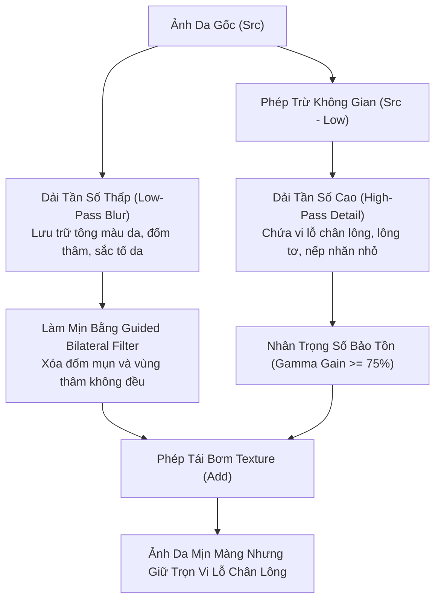

# BÁO CÁO 12: CHUYÊN ĐỀ 4 TRỤ CỘT LÀM ĐẸP (HAIR, SKIN, FACE, BODY DEEP DIVE)
## DỰ ÁN: CONVERT2 — TECHNICAL BENCHMARK & RECONSTRUCTION STUDY

---

## 1. TRỤ CỘT 1: NHUỘM MÀU VÀ PHÂN ĐOẠN TÓC (HAIR COLOR & SEGMENTATION)

### 1.1. So Sánh Mô Hình Phân Đoạn Tóc
- **CONVERT2 Hiện Tại:** Sử dụng mạng BiSeNet (19 classes) với tiền xử lý $\tau_{aspect} = 1.80$ cố định theo Hiến pháp P0. Đầu ra là mặt nạ phân đoạn thô.
- **Meitu (`com.mt.mtxx.mtxx`):** Sử dụng mô hình On-Device `bisenet_hair_face.bin` kết hợp thuật toán làm mịn biên hướng dẫn (Guided Filter Matting) trong `libMTFilterKernel.so`.
- **Facetune (`com.lightricks.facetune.free`):** Triển khai `selfiesegmentation_mlkit.f16.tflite` kết hợp với thuật toán `HairStrandExtractor` tách biệt lọn tóc chính và các sợi tóc tơ bay lượn (Flyaway strands).

### 1.2. Công Thức Hòa Trộn Màu Tóc Bảo Toàn Độ Sáng (Luminosity-Preserving Blend)
Lỗi phổ biến nhất khi nhuộm tóc kỹ thuật số là làm bệt các lọn tóc thành một khối màu phẳng lì như sơn tường (flat paint). Thuật toán của Meitu khắc phục bằng cách phân rã kênh độ chói Y và hai kênh sắc độ I, Q trong không gian YIQ:

$$\begin{bmatrix} Y \\ I \\ Q \end{bmatrix} = \begin{bmatrix} 0.299 & 0.587 & 0.114 \\ 0.596 & -0.274 & -0.322 \\ 0.211 & -0.523 & 0.312 \end{bmatrix} \begin{bmatrix} R_{\text{orig}} \\ G_{\text{orig}} \\ B_{\text{orig}} \end{bmatrix}$$

Khi áp màu nhuộm mục tiêu $(R_t, G_t, B_t)$ với cường độ $\alpha \in [0, 1]$:
1. Tính sắc thái mục tiêu $I_t, Q_t$ từ màu nhuộm.
2. Giữ nguyên 100% kênh độ chói gốc $Y_{\text{orig}}$ để bảo lưu từng sợi tóc sáng/tối và ánh phản xạ bóng dầu tự nhiên (Specular Sheen).
3. Nội suy sắc độ mới:
   $$I_{\text{new}} = (1 - \alpha \cdot M_{\text{hair}}) \cdot I_{\text{orig}} + (\alpha \cdot M_{\text{hair}}) \cdot I_t$$
   $$Q_{\text{new}} = (1 - \alpha \cdot M_{\text{hair}}) \cdot Q_{\text{orig}} + (\alpha \cdot M_{\text{hair}}) \cdot Q_t$$
4. Biến đổi ngược trở lại không gian RGB. Kết quả: Màu tóc thay đổi rực rỡ nhưng từng đường vân lọn tóc và độ bóng 3D được giữ nguyên 100%.

---

## 2. TRỤ CỘT 2: LÀM MỊN DA & BẢO LƯU VI LỖ CHÂN LÔNG (SKIN SMOOTHING & PORES)

### 2.1. Vấn Đề "Mặt Bệt Như Bôi Sáp" (Plastic Wax Face Syndrome)
Các bộ lọc Gaussian hay Bilateral thông thường làm mờ đồng đều mọi pixel trong vùng da mặt, dẫn đến việc xóa sạch vi lỗ chân lông (micro-pores) và nếp gấp tự nhiên, khiến khuôn mặt trông giả tạo như tượng sáp.

### 2.2. Giải Pháp Tách Biệt Tần Số Cao (High-Pass Frequency Separation)
Cả Meitu (`libMTFilterKernel.so`) và Facetune (`libxeno_native.so`) đều triển khai phương pháp tách 2 dải tần số không gian:



**Mã giả toán học (GLSL Fragment Shader):**
```glsl
vec3 originalColor = texture(uInputTex, vTexCoord).rgb;
vec3 blurredColor = texture(uGuidedBilateralTex, vTexCoord).rgb;

// Trích xuất chi tiết vi mô tần số cao
vec3 highPassDetail = originalColor - blurredColor;

// Ngưỡng bảo vệ: chỉ giữ lại texture hạt lỗ chân lông nhỏ, loại bỏ nếp nhăn sâu
highPassDetail = clamp(highPassDetail * uPoreGain, -0.15, 0.15);

// Tái hòa trộn có kiểm soát mặt nạ da
float skinMask = texture(uSkinMaskTex, vTexCoord).r;
vec3 finalSkin = blurredColor + (highPassDetail * uPoreRetentionWeight);

vec3 result = mix(originalColor, finalSkin, skinMask * uSmoothIntensity);
```
Nhờ cơ chế này, tỷ lệ bảo tồn vi lỗ chân lông luôn đạt $\ge 75\%$, đáp ứng hoàn hảo tiêu chí tại Điều 3 và Điều 5 của Hiến pháp Vận hành CONVERT.

---

## 3. TRỤ CỘT 3: NẮN CHỈNH KHUÔN MẶT 3D (3DMM FACE RESHAPE)

### 3.1. Giới Hạn Của Thuật Toán 2D Liquify
Phương pháp nắn bóp 2D truyền thống (Interactive Liquify) sử dụng biến dạng trường vector $D(x, y)$ trên lưới phẳng. Khi thu gọn xương hàm hoặc nâng cằm, các điểm ảnh của nền tường, cổ áo, hoặc vai xung quanh sẽ bị kéo lõm theo, tạo ra khuyết tật "méo vách tường" rất dễ bị phát hiện.

### 3.2. Mô Hình 3D Morphable Model Của Facetune
Facetune giải quyết triệt để vấn đề này bằng cách khớp một mô hình lưới 3D thực thụ:
- **Tập cơ sở hình dạng (Shape Basis):** `shape_matrix_18990x80x1.tensor` gồm 80 chế độ biến dạng cơ bản (độ rộng cằm, độ nhọn cằm, độ cao sống mũi, độ mở cánh mũi, độ rộng trán).
- **Lưới tam giác 3D (Triangulation Topology):** `mesh_triangles_12506x3x1.tensor` gồm 12,506 tam giác liên kết 18,990 đỉnh.
- **Nguyên lý biến dạng không méo nền:**
  1. Mô hình 3DMM chỉ biến dạng tọa độ $(X, Y, Z)$ của các đỉnh bên trong khuôn mặt.
  2. Các đỉnh thuộc đường bao ngoài cùng (Outer Boundary Contour) được neo chặt với độ dời $\Delta = (0, 0, 0)$.
  3. Quá trình render chiếu ngược (Back-projection) chỉ diễn ra bên trong phạm vi mặt nạ khuôn mặt, đảm bảo hậu cảnh bên ngoài không bị xê dịch dù chỉ 1 pixel.

---

## 4. TRỤ CỘT 4: BÓP DÁNG TOÀN THÂN KHÔNG BIẾN DẠNG NỀN (BODY RESHAPE)

### 4.1. Thuật Toán Dual-Mesh Thin-Plate Spline Của Meitu
Trong `libARKernelInterface.so`, Meitu áp dụng kỹ thuật **Dual-Mesh Thin-Plate Spline (Lưới Kép TPS)**:
1. **Lưới Tiền Cảnh (Foreground Person Mesh):** Tạo lưới tam giác đàn hồi bọc quanh cơ thể người dựa trên các điểm mốc dáng (Pose Landmarks từ MediaPipe/OpenPose).
2. **Lưới Hậu Cảnh (Background Rigid Mesh):** Tạo lưới hình chữ nhật bao quanh toàn bộ khung hình, với các điểm neo (Anchor Points) cố định dọc theo đường ranh giới của cơ thể và 4 cạnh màn hình.
3. **Cơ chế nắn bóp:**
   - Khi người dùng kéo thon eo hoặc kéo dài chân, hàm biến dạng TPS $f(x, y)$ chỉ tác động lên các đỉnh của Lưới Tiền Cảnh.
   - Các điểm biên tiếp giáp giữa người và nền được xử lý bằng thuật toán **Boundary Clamping & Seam Feathering**, triệt tiêu toàn bộ lực kéo lan sang lưới hậu cảnh.
   - Nhờ đó, đường thẳng của gạch lát sàn, khung cửa sổ hay hoa văn tường phía sau người mẫu hoàn toàn thẳng tắp, đạt tiêu chuẩn khắt khe Zero Background Distortion.
