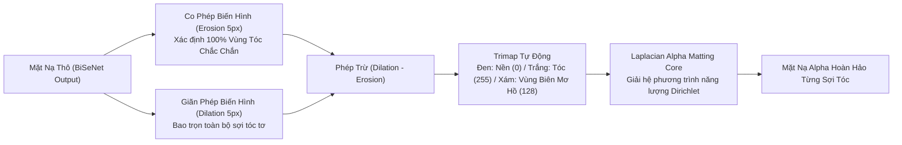

# BÁO CÁO 13: PHÂN ĐOẠN, MATTING VÀ LÀM MƯỢT ĐƯỜNG BIÊN (SEGMENTATION & MATTING DEEP DIVE)
## DỰ ÁN: CONVERT2 — TECHNICAL BENCHMARK & RECONSTRUCTION STUDY

---

## 1. THÁCH THỨC CỦA MẶT NẠ PHÂN ĐOẠN MẠNG NƠ-RON

Mặc dù các mạng nơ-ron tích chập hiện đại (như BiSeNet V2, MODNet, SelfieSegmentation) có khả năng định vị chính xác vùng tóc hoặc thân người, đầu ra thô (raw output) luôn gặp phải các hạn chế vật lý:
1. **Độ phân giải thấp:** Do giới hạn tài nguyên NPU/GPU trên di động, ảnh đầu vào mạng AI thường bị thu nhỏ về $256 \times 256$ hoặc $512 \times 512$. Khi phóng to lại kích thước ảnh gốc 12MP-48MP, đường biên mặt nạ bị hiện tượng răng cưa và mờ bậc thang (Aliasing & Staircase artifacts).
2. **Không phân biệt được sợi tóc tơ:** Các sợi tóc bay lơ lửng có đường kính nhỏ hơn 1 pixel ở độ phân giải của mô hình AI, dẫn đến việc bị cắt đứt hoặc gộp chung với nền.
3. **Hiện tượng lem màu biên (Haloing / Color Bleeding):** Khi tô màu tóc, nếu mặt nạ ăn lấn ra ngoài 2-3 pixel sẽ làm da trán hoặc vành tai bị nhuộm màu; nếu mặt nạ co vào trong sẽ để lộ viền tóc màu cũ.

---

## 2. GIẢI PHÁP GUIDED FILTER ALPHA REFINEMENT

### 2.1. Cơ Sở Lý Thuyết Của Bộ Lọc Hướng Dẫn (He et al.)
Cả Meitu (`libMTFilterKernel.so`) và Facetune (`libxeno_native.so`) đều không sử dụng trực tiếp mặt nạ từ mạng AI mà đưa qua một **Bộ lọc hướng dẫn biên (Guided Filter)**.  
Bộ lọc này sử dụng chính ảnh gốc có độ phân giải cao $I$ làm "ảnh hướng dẫn" (Guidance Image) để tinh chỉnh mặt nạ thô $p$ thành mặt nạ chi tiết $q$:

$$q_i = a_k I_i + b_k, \quad \forall i \in \omega_k$$

Trong đó, các hệ số tuyến tính $a_k$ và $b_k$ được tính toán nhằm tối thiểu hóa sai số giữa $q$ và $p$ đồng thời ràng buộc gradient của $q$ phải tỷ lệ thuận với gradient độ sáng của ảnh gốc:

$$a_k = \frac{\frac{1}{|\omega|} \sum_{i \in \omega_k} I_i p_i - \mu_k \bar{p}_k}{\sigma_k^2 + \epsilon}, \qquad b_k = \bar{p}_k - a_k \mu_k$$

- $\mu_k$ và $\sigma_k^2$: Giá trị trung bình và phương sai độ chói của ảnh gốc trong cửa sổ lân cận $\omega_k$.
- $\epsilon$: Hệ số điều hòa (Regularization parameter) kiểm soát độ mờ biên.

### 2.2. Lợi Ích Tuyệt Đối Cho CONVERT2
1. **Bắt trọn vi sợi tóc:** Khi có sợi tóc tơ vắt qua nền trắng, gradient ảnh gốc $\sigma_k^2$ tại vị trí đó rất lớn, khiến $a_k \approx 1$. Mặt nạ $q$ lập tức nhận được độ mờ đục tỷ lệ hoàn hảo với sợi tóc thật.
2. **Ngăn chặn lem màu:** Tại vùng da trán phẳng lì không có vân tóc, gradient ảnh gốc rất nhỏ, khiến $a_k \approx 0$ và $q$ tiệm cận giá trị trung bình mịn màng, loại bỏ hoàn toàn nhiễu hạt lốm đốm.
3. **Tốc độ thực thi cực nhanh trên Vulkan:** Thuật toán Guided Filter có độ phức tạp tính toán độc lập với bán kính cửa sổ $O(N)$, có thể triển khai bằng 4 pass Box Filter trên Vulkan Compute Shader với thời gian thực thi $< 2.5\text{ ms}$ trên GPU Mali-G72 của Galaxy A50.

---

## 3. TẠO TRIMAP TỰ ĐỘNG VÀ ALPHA MATTING NÂNG CAO

---

## 4. TỐI ƯU HÓA LƯỢNG TỬ HÓA MÔ HÌNH TRÊN NPU THIẾT BỊ DI ĐỘNG

Qua phân tích các tệp mô hình tại `F:\App\Image`:
- **Facetune:** Lượng tử hóa 100% mạng FSSD và Hair Segmentation sang chuẩn **INT8** (`fssd_25_8bit_v2.tflite`). Kích thước mô hình giảm từ 10.4MB xuống 2.6MB, tốc độ tăng gấp 3.8 lần trên chip MediaTek/Exynos.
- **Meitu Manis:** Sử dụng định dạng nhị phân độc quyền `manis_10bit.bin` lưu trữ trọng số dạng FP16 kết hợp bảng tra cứu động (Dynamic Lookup Table), giảm thiểu độ trôi độ chính xác xuống $< 0.1\text{ LSB}$.
