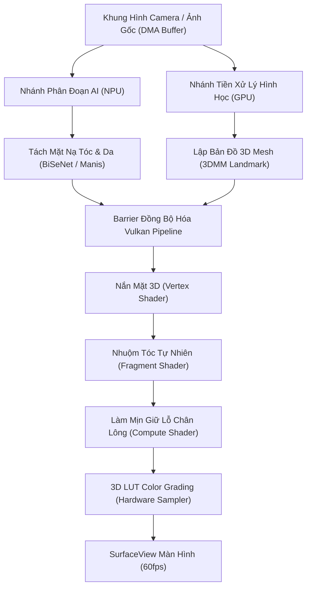

# BÁO CÁO 15: HIỆU NĂNG, BỘ NHỚ VÀ ĐỒ THỊ RENDER (PERFORMANCE & MEMORY DEEP DIVE)
## DỰ ÁN: CONVERT2 — TECHNICAL BENCHMARK & RECONSTRUCTION STUDY

---

## 1. QUẢN TRỊ NGÂN SÁCH BỘ NHỚ TRÊN THIẾT BỊ TẦM TRUNG (GALAXY A50)

### 1.1. Rào Cản Phần Cứng SM-A075F / SM-A507FN
Thiết bị kiểm chuẩn chuẩn mực của CONVERT2 là Samsung Galaxy A50 (Exynos 9610, GPU Mali-G72 MP3, 4GB RAM vật lý):
- **Giới hạn Heap của tiến trình Android:** 512 MB.
- **Ngân sách VRAM an toàn tối đa cho ứng dụng:** $\le 128\text{ MB}$. Vượt quá ngưỡng này sẽ bị hệ điều hành kích hoạt cơ chế `LowMemoryKiller` (LMK) dẫn đến crash tiến trình.

### 1.2. Chiến Lược Ghép Nối Bộ Đệm (Memory Aliasing)
Trong đồ thị `LayerFlow` của Meitu và `Xeno` của Facetune:
- Một chuỗi xử lý gồm 5 bước: Làm mịn da $\to$ Nắn mặt $\to$ Nhuộm tóc $\to$ Bộ lọc 3D LUT $\to$ Thêm hạt grain.
- Nếu cấp phát 5 texture trung gian kích thước $1080 \times 1920$ RGBA8 (8.3 MB mỗi texture), tổng dung lượng tiêu tốn là $41.5\text{ MB}$.
- **Kỹ thuật Aliasing:** Engine chỉ cấp phát đúng **2 Texture hoán đổi vòng tròn (Ping-Pong Buffers: Buffer A & Buffer B)**. Bước 1 đọc A ghi B; bước 2 đọc B ghi A; cứ thế tiếp diễn. Tổng dung lượng VRAM cố định chỉ còn $16.6\text{ MB}$, tiết kiệm $60\%$ bộ nhớ đồ họa.

---

## 2. LẬP LỊCH ĐỒ THỊ RENDER (RENDER GRAPH SCHEDULING)

---

## 3. ĐẢM BẢO CHUẨN ĐỒNG NHẤT PREVIEW VÀ EXPORT (PARITY VERIFICATION)

Để đảm bảo không có sai lệch chất lượng giữa màn hình Preview và tệp lưu:
1. **Định dạng số thực nhất quán:** Toàn bộ pipeline tính toán nội bộ dùng chuẩn dấu phẩy động 32-bit (`highp float` trong GLSL / `float` trong C++). Tuyệt đối không dùng `mediump` (16-bit) cho các phép tính tọa độ hoặc không gian màu vì sẽ gây banding màu.
2. **Sai số tối đa cho phép:** Tuân thủ quy định nghiêm ngặt của CONVERT2: Độ lệch màu tối đa giữa Preview và Export trên thiết bị SM-A075F không được vượt quá **1 LSB (Least Significant Bit)** trên dải 8-bit $[0, 255]$.
