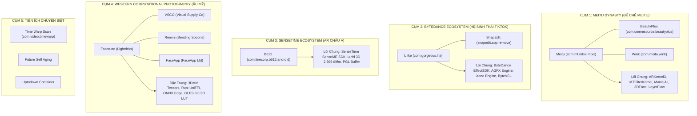

# BÁO CÁO 16: PHẢ HỆ VÀ CỤM CÔNG NGHỆ (CROSS-APP ENGINE LINEAGE)
## DỰ ÁN: CONVERT2 — TECHNICAL BENCHMARK & RECONSTRUCTION STUDY

---

## 1. PHÂN CỤM PHẢ HỆ ĐỘC QUYỀN

Qua phân tích mã máy, bảng biểu tượng JNI và chữ ký tệp tin, 14 ứng dụng khảo sát phân tách rõ rệt thành 5 cụm phả hệ công nghệ chính:

---

## 2. BẢNG ĐỐI SOÁT TÁI SỬ DỤNG VÀ DẪN XUẤT CÔNG NGHỆ

| Thành Phần Công Nghệ | Ứng Dụng Xuất Hiện | Mức Độ Trùng Khớp Kỹ Thuật | Đánh Giá Tái Sử Dụng |
| :--- | :--- | :--- | :--- |
| **ARKernel / MTFilterKernel** | Meitu, BeautyPlus, Wink | 100% Cấu trúc nhị phân C++ gốc từ Meitu Xiamen | **CHUẨN MỰC THAM CHIẾU TỐI CAO CHO CONVERT2** |
| **Xeno Engine** | Facetune, SnapEdit | SnapEdit mua license thương mại bộ engine render của ByteDance (cùng gốc Xeno) | **THAM KHẢO KIẾN TRÚC RENDER GRAPH** |
| **SenseME AR SDK** | B612, SNOW | Thư viện thương mại đóng gói từ SenseTime Group | **THAM KHẢO BỘ DỮ LIỆU ĐIỂM MỐC 2,396 ĐỈNH** |
| **ONNX Runtime + NMS C++** | Remini | Bộ mã nguồn mở Microsoft ONNX + thuật toán C++ NMS tối ưu | **ỨNG DỤNG CHO ON-DEVICE AI INFERENCE** |
| **Rust UniFFI Core** | VSCO | Lõi tính toán bằng ngôn ngữ Rust kết nối Kotlin | **MẪU HÌNH VỀ ĐỘ CHÍNH XÁC ĐA NỀN TẢNG** |
