# BÁO CÁO 18: TOP 10 KỸ THUẬT ĐỀ XUẤT TÁI DỰNG CHO CONVERT2
## DỰ ÁN: CONVERT2 — CLEAN-ROOM RECONSTRUCTION ROADMAP

---

Dựa trên kết quả khảo sát toàn diện 14 ứng dụng, đội ngũ kỹ sư đề xuất danh sách **Top 10 kỹ thuật có giá trị cao nhất** cần được nghiên cứu và tái dựng theo phương pháp phòng sạch (Clean-Room Implementation) để đóng hoàn toàn khoảng cách chất lượng giữa CONVERT2 và các ứng dụng đỉnh cao thế giới:

```mermaid
graph TD
    T1["1. Guided Filter Hair Matting (Meitu/Facetune)<br/>Khắc phục dứt điểm lem màu tóc & rụng tóc tơ"] --> P1["Module Tóc (P1-P6 Hair Pipeline)"]
    T2["2. High-Pass Pore Preservation (Meitu/Facetune)<br/>Làm mịn da đạt chuẩn bảo lưu vi lỗ chân lông >= 75%"] --> P2["Module Da Mặt (Face Beauty Core)"]
    T3["3. 3DMM Face Reshaping (Facetune)<br/>Nắn chỉnh chi tiết mặt 3D không làm méo hậu cảnh"] --> P3["Module Nắn Mặt (Face Reshape Core)"]
    T4["4. Dual-Mesh TPS Body Reshape (Meitu)<br/>Bóp eo, kéo dài chân với Zero Background Distortion"] --> P4["Module Vóc Dáng (Body Beauty Core)"]
    T5["5. Hardware 3D LUT Texture Sampler (FaceApp/VSCO)<br/>Tra cứu bộ lọc màu thời gian thực 60fps siêu mượt"] --> P5["Module Render GPU (Vulkan Engine)"]
    T6["6. Rust/C++ Deterministic Core (VSCO)<br/>Loại bỏ triệt để sai lệch Preview vs Export (<= 1 LSB)"] --> P6["Kiến Trúc Lõi (Architecture Parity)"]
    T7["7. Zero-Copy AHardwareBuffer Exchange (Remini/Meitu)<br/>Triệt tiêu độ trễ sao chép bộ nhớ giữa AI và GPU"] --> P7["Tầng JNI Bridge Native"]
    T8["8. Dense 2,396-pt Face Mesh Tracking (B612)<br/>Nhận diện biểu cảm vi mô và định vị chính xác góc nghiêng"] --> P8["Module AI Landmarking"]
    T9["9. Fast PatchMatch Inpainting (SnapEdit/Meitu)<br/>Xóa vật thể và vết bẩn không để lại vệt nhòe"] --> P9["Module AI Inpainting / Tẩy Xóa"]
    T10["10. Temporal Anti-Flicker Bilateral (Wink)<br/>Ổn định khung hình làm đẹp cho video không bị nhấp nháy"] --> P10["Kế Hoạch Mở Rộng Video"]
```

---

## BẢNG KẾ HOẠCH TRIỂN KHAI VÀ TIÊU CHUẨN NGHIỆM THU

| Thứ Tự Ưu Tiên | Kỹ Thuật Đề Xuất | Độ Phức Tạp | Thời Gian Dự Kiến | Tiêu Chuẩn Nghiệm Thu Trên Thiết Bị Thật (Galaxy A50) |
| :---: | :--- | :---: | :---: | :--- |
| **01** | **Guided Filter Hair Alpha Matting** | Vừa | 1 Tuần | Vi sợi tóc tơ hiển thị rõ; Không lem màu da trán/tai; Độ trễ Compute Shader $< 3.5\text{ ms}$. |
| **02** | **High-Pass Pore Preservation** | Thấp | 3 Ngày | Tỷ lệ bảo tồn cấu trúc vi lỗ chân lông $\ge 75\%$; Không xuất hiện quầng sáng viền (halo). |
| **03** | **Hardware 3D Texture Sampler** | Thấp | 2 Ngày | Sử dụng `VkSampler3D`; Tốc độ render $\le 2.0\text{ ms}$; Sai lệch màu sắc $= 0\text{ LSB}$. |
| **04** | **Dual-Mesh TPS Body Reshape** | Cao | 2 Tuần | Vùng nền tiếp giáp người (tường/cửa) có độ dịch chuyển $\le 0.5\text{ pixel}$ (Zero distortion). |
| **05** | **3DMM Mesh Face Reshape** | Rất Cao | 3 Tuần | Cằm/mũi biến dạng tự nhiên ở góc quay $\pm 45^\circ$; Biên ngoài khuôn mặt đứng yên $100\%$. |
