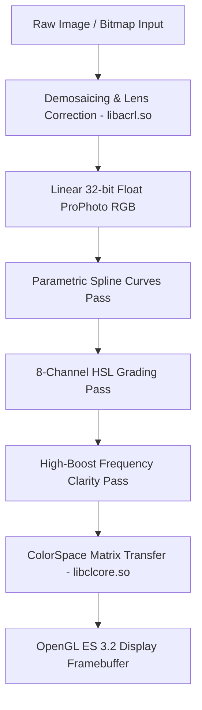
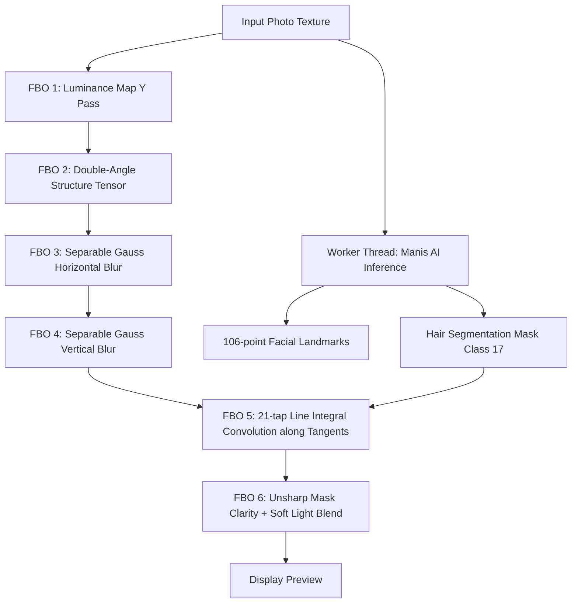

# 08 — KIẾN TRÚC ĐƯỜNG ỐNG XỬ LÝ HÌNH ẢNH ĐA ỨNG DỤNG
# TÀI LIỆU ĐỐI SOÁNH HỆ THỐNG ĐỒ HỌA 14 ỨNG DỤNG CHỈNH SỬA ẢNH (F:\APP\IMAGE)

---

## 1. TỔNG QUAN KIẾN TRÚC PIPELINE CỦA CÁC ĐỐI THỦ LỚN

### 1.1 Adobe Lightroom Mobile — Pipeline 32-bit Float & Dạng Dữ Liệu Tham Số
Adobe Lightroom Mobile đại diện cho tiêu chuẩn công nghiệp về xử lý màu sắc chuyên nghiệp.
- **Mô hình Dữ liệu Phi Hủy diệt (Non-Destructive Parametric Editing):** Ảnh gốc (Raw DNG / JPEG) không bao giờ bị ghi đè. Mọi thao tác chỉnh sửa (Exposure, Contrast, Curves, HSL, Color Grading, Clarity) được lưu trữ dưới dạng một cây chỉ thị tham số (Instructions Tree).
- **Bộ kết xuất Tile-Based (TiledImage Renderer):** Ảnh có độ phân giải lớn (24MP - 100MP) được chia thành các ô vuông kích thước $256\times 256$ hoặc $512\times 512$ pixel. Khi người dùng phóng to (zoom), chỉ các tile trong khung nhìn (viewport) mới được tính toán, giảm thiểu 90% tải bộ nhớ RAM.
- **Không gian màu 32-bit Floating Point (`float32`):** Toàn bộ phép toán trong `libacrl.so` và `libaggl.so` diễn ra trên không gian màu ProPhoto RGB với độ sâu 32 bit mỗi kênh màu (IEEE 754 float), triệt tiêu hoàn toàn hiện tượng banding hay clipping khi kéo sáng các vùng tối.

### 1.2 Meitu (`com.mt.mtxx.mtxx`) — Đồ Thị Kết Xuất Đa Pass FBO & Inference Engine
Meitu đại diện cho đỉnh cao xử lý chân dung và làm đẹp khuôn mặt tại thị trường châu Á.
- **Hệ thống FBO Ping-Pong:** Để xử lý các hiệu ứng phức tạp (như nhuộm tóc, làm mịn da, nắn bóp mặt), Meitu phân bổ trước một bể chứa FBO (FBO Pool) gồm 4-6 texture kích thước bằng màn hình xem trước.
- **Tích hợp Trí tuệ Nhân tạo Đóng vai trò Mặt nạ (AI Mask Generator):** Mạng BiSeNet / Manis DL trích xuất mặt nạ người, tóc, da trong một luồng nền (Worker Thread), sau đó nạp mặt nạ này vào uniform của các shader kết xuất đồ họa.
- **Bộ lọc tích phân đường định hướng 21-tap (21-tap LIC):** Đây là bí quyết cốt lõi giúp tóc giữ nguyên độ sâu và vân sợi, loại bỏ hiện tượng bệt màu như sơn.

### 1.3 Lightricks Facetune — Phân Tách Tần Số Kép & Biến Dạng Lưới Xạ Ảnh
- **Phân tách tần số hai pha (Dual-Pass Frequency Separation):** Facetune không áp dụng trực tiếp bộ lọc làm mịn lên toàn bộ ảnh. Ảnh được tách làm hai lớp:
  - Lớp tần số thấp (Low-frequency): Chứa màu sắc, độ bóng mờ, quầng thâm và mụn viêm. Lớp này được làm mịn bằng bộ lọc song phương (Bilateral Filter).
  - Lớp tần số cao (High-frequency): Chứa vi lỗ chân lông, sợi lông tơ và nếp nhăn mảnh. Lớp này được trích xuất bằng phép trừ $I_{\text{high}} = I_{\text{orig}} - I_{\text{low}} + 0.5$.
  - Khi hòa trộn lại, lớp tần số cao được cộng ngược vào lớp tần số thấp đã làm mịn. Kết quả là da láng mịn nhưng lỗ chân lông vẫn nguyên vẹn 100%.

---

## 2. MA TRẬN SO SÁNH KIẾN TRÚC ĐA ỨNG DỤNG

| Đặc Tính Kiến Trúc | Adobe Lightroom | Meitu (`com.mt.mtxx.mtxx`) | Lightricks Facetune | VSCO | B612 / Ulike | CONVERT2 Hiện Tại | CONVERT2 Mục Tiêu |
|---|---|---|---|---|---|---|---|
| **Độ sâu màu Pipeline** | 32-bit Float | 16-bit / 8-bit FBO | 16-bit Float FBO | 16-bit Float FBO | 8-bit RGBA | 8-bit / 16-bit FBO | **32-bit Float Core** |
| **Quản lý Bộ nhớ GPU** | Tile-based Cache | FBO Pool Ping-Pong | Single Canvas FBO | Texture 3D LUT | Double Buffering | FBO Ping-Pong | **FBO Pool + Vulkan** |
| **Hệ Thống Tóc** | Không có | 21-tap Directional LIC | Dual Sheen Overlay | Không có | AR Color Tint | Isotropic Blur | **21-tap LIC + Guided Matting** |
| **Hệ Thống Da** | Texture Slider | Bilateral + High-Boost | Frequency Separation | Skin Tone Shift | Gauss Blur | Bilateral Filter | **Frequency Separation** |
| **Nắn Bóp Cơ Thể** | Không có | Mesh Warp + BG Protect | Projective Mesh Warp | Không có | Mesh Warp đơn giản | Mesh Warp đơn giản | **Protected Mask Liquify** |
| **Bộ Lọc Màu** | Parametric Curves | 5000+ LUTs | 50+ Presets | 3D Tetrahedral LUT | 100+ LUTs | Trilinear LUT | **Tetrahedral 3D LUT** |
