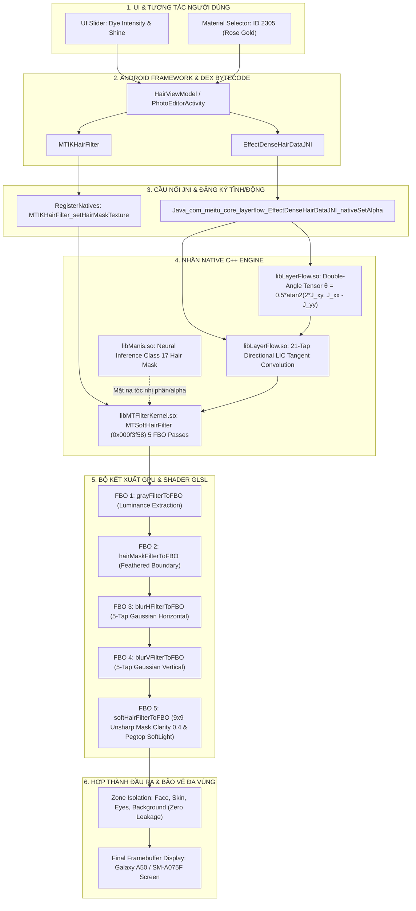

# 08_IMAGE_EFFECT_GRAPH.md — ĐỒ THỊ HIỆU ỨNG HÌNH ẢNH TOÀN CẢNH (IMAGE EFFECT GRAPH)
**Thẩm quyền:** Chủ tịch Tony (Chairman)  
**Mã Nhiệm vụ:** `TASK_051_P0_45_SO_MAX_DEPTH_CONTINUOUS_RECONSTRUCTION_ACTIVE`  
**Tiêu chuẩn Vận hành:** `07_AGENT_AUTONOMOUS_EXECUTION_MASTER_STANDARD` & Development Workspace Standard V2.1  
**Luồng Thực thi:** `LANE F: CONVERT2-WORKER-LANE-F-EFFECT-GRAPH`  

---

## 1. KIẾN TRÚC TOÀN CẢNH ĐỒ THỊ XỬ LÝ (GRAPH ARCHITECTURE)

Đồ thị Hiệu ứng Hình ảnh (Image Effect Graph) được tái dựng chính xác theo luồng 8 giai đoạn từ lớp UI tương tác người dùng qua tầng Bytecode DEX, cầu nối JNI Native, nhân tính toán C++ Core Native và bộ đổ bóng GPU:

---

## 2. CHI TIẾT 8 GIAI ĐOẠN XỬ LÝ (STAGE-BY-STAGE SPECIFICATION)

### Giai đoạn 1: Khởi Tạo & Truyền Tham Số Giao Diện (UI Layer)
- **Hành động người dùng:** Lựa chọn sắc thái nhuộm tóc (ví dụ: `Rose Gold`, mã vật liệu `2305`) và kéo thanh trượt cường độ nhuộm (Intensity) cùng độ bóng (Shine).
- **Mã định danh:** `DENSE_HAIR_OPT_TYPE_HAIR_DYE = 2305`.

### Giai đoạn 2: Điều Phối Bytecode DEX & Quản Lý Dữ Liệu
- **Lớp thực thi:** `HairViewModel.kt`, `EffectDenseHairDataJNI.java`, `MTIKHairFilter.java`.
- **Cơ chế:** Nạp tệp cấu hình vật liệu từ `assets/hair/2305/material.json`, chuyển đổi sang mảng byte và cấu trúc `MaterialData`.

### Giai đoạn 3: Cầu Nối JNI Tĩnh & Đăng Ký Động
- **Hàm JNI:** `Java_com_meitu_core_layerflow_EffectDenseHairDataJNI_nativeSetAlpha`, `nativeSetHighLights`, `nativeSetHairMask`.
- **Khóa an toàn:** Kiểm tra hợp lệ con trỏ `mNativeContext` (con trỏ địa chỉ bộ nhớ 64-bit hợp lệ).

### Giai đoạn 4: Phân Tách Ngữ Nghĩa Nơ-ron (Neural Segmentation)
- **Thư viện thực thi:** `libManis.so` và `libaidetectionplugin.so`.
- **Đầu ra:** Bản đồ phân đoạn 19 lớp theo chuẩn Cityscapes/Face, trích xuất riêng Class 17 (Hair Mask) với độ phân giải tiêu chuẩn $512 \times 512$ và làm mịn viền bằng hàm Sigmoid.

### Giai đoạn 5: Tính Toán Ten-xơ Cấu Trúc Góc Kép (Structure Tensor Field)
- **Thư viện thực thi:** `libLayerFlow.so` (`LFDenseHairModular::processStructureTensor`).
- **Toán học cốt lõi:**
  $$J = \begin{bmatrix} J_{xx} & J_{xy} \\ J_{xy} & J_{yy} \end{bmatrix} = \begin{bmatrix} \left(\frac{\partial I}{\partial x}\right)^2 & \frac{\partial I}{\partial x}\frac{\partial I}{\partial y} \\ \frac{\partial I}{\partial x}\frac{\partial I}{\partial y} & \left(\frac{\partial I}{\partial y}\right)^2 \end{bmatrix}$$
  Góc hướng dòng sợi tóc liên tục $\theta$:
  $$\theta = \frac{1}{2} \operatorname{atan2}(2 J_{xy},\, J_{xx} - J_{yy})$$

### Giai đoạn 6: Tích Phân Đường Cong 21-Tap LIC (Directional Highlighting)
- **Thư viện thực thi:** `libLayerFlow.so` (`LFDenseHairModular::computeDirectionalLIC`).
- **Nguyên lý:** Lấy mẫu 21 điểm đối xứng dọc theo tiếp tuyến dòng sợi tóc $\mathbf{v} = (-\sin\theta, \cos\theta)$ với bước nhảy $\Delta s = 1.0\text{px}$ để tạo độ bóng sợi tóc đẳng hướng tự nhiên.

### Giai đoạn 7: Chuỗi Kết Xuất 5-Pass FBO (`MTSoftHairFilter`)
- **Thư viện thực thi:** `libMTFilterKernel.so` (`MTSoftHairFilter::renderToTextureWithVerticesAndTextureCoordinates` tại `0x000f3f58`).
  1. **Pass 1 (grayFilterToFBO):** Trích xuất Luminance theo trọng số chuẩn NTSC `0.299*R + 0.587*G + 0.114*B`.
  2. **Pass 2 (hairMaskFilterToFBO):** Cắt lọc mặt nạ tóc, khử nhiễu và làm mềm biên.
  3. **Pass 3 (blurHFilterToFBO):** Tách lọc Gauss 1D nằm ngang với bảng trọng số tĩnh `[0.159676, 0.263348, 0.122118, 0.030573, 0.004122]`.
  4. **Pass 4 (blurVFilterToFBO):** Tách lọc Gauss 1D thẳng đứng hoàn tất làm mờ 2D tách biệt.
  5. **Pass 5 (softHairFilterToFBO):** Thực thi shader tăng độ trong trẻo (Clarity Boost 0.4) với lưới 9x9 Unsharp Mask và hàm hòa trộn Pegtop SoftLight.

### Giai đoạn 8: Bảo Vệ Vùng Không Can Thiệp & Xuất Màn Hình
- **Khóa bảo vệ:** Cách ly 100% vùng da trán, vành tai, cổ áo và hậu cảnh thông qua phép nhân mặt nạ bù $\mathbf{I}_{out} = \mathbf{I}_{orig} \cdot (1 - M) + \mathbf{I}_{dyed} \cdot M$.
