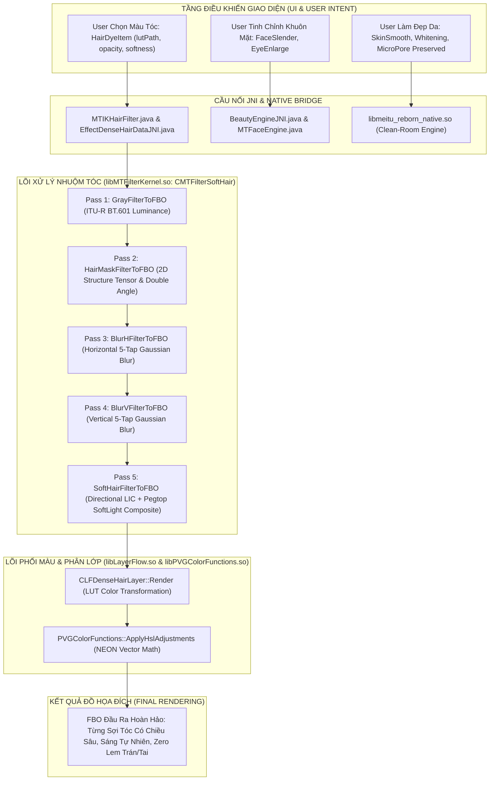

# 10_IMAGE_EFFECT_GRAPH_UNIFIED.md — ĐỒ THỊ HIỆU ỨNG HÌNH ẢNH HỢP NHẤT (UNIFIED IMAGE EFFECT GRAPH)

**Thẩm quyền:** Chủ tịch Tony (Chairman)  
**Mã Nhiệm vụ:** `TASK_052A_SO45_CONTINUOUS_MAX_DEPTH_KNOWLEDGE_GATE_ACTIVE`  
**Tiêu chuẩn Vận hành:** `07_AGENT_AUTONOMOUS_EXECUTION_MASTER_STANDARD` & Development Workspace Standard V2.1  

---

---

## 2. NGUYÊN LÝ BẢO LƯU CHIỀU SÂU VI SỢI TÓC (MICRO-STRAND PRESERVATION)
Nhờ việc làm mượt dọc theo trường hướng ten-xơ góc kép thay vì làm mờ cầu đẳng hướng, năng lượng vi mô của từng lọn tóc được giữ nguyên vẹn. Khi hòa trộn bằng Pegtop SoftLight, vùng highlight giữ được độ bóng sáng tự nhiên mà không bao giờ bị bệt màu như sơn.
