# 10_IMAGE_EFFECT_GRAPH_UNIFIED.md — ĐỒ THỊ HIỆU ỨNG HÌNH ẢNH HỢP NHẤT TOÀN DIỆN (UNIFIED IMAGE EFFECT GRAPH)

**Thẩm quyền:** Chủ tịch Tony (Chairman)  
**Mã Nhiệm vụ:** `TASK_052A_SO45_CONTINUOUS_MAX_DEPTH_KNOWLEDGE_GATE_ACTIVE`  
**Tiêu chuẩn Vận hành:** `07_AGENT_AUTONOMOUS_EXECUTION_MASTER_STANDARD` & Development Workspace Standard V2.1.2  
**Trạng thái Tri thức:** GROUND TRUTH / BITWISE VERIFIED  

---

## 1. SƠ ĐỒ ĐỒ THỊ TOÀN TRÌNH ĐA PHÂN HỆ (MASTER END-TO-END EFFECT GRAPH)

```mermaid
flowchart TD
    subgraph UI_INPUT["1. TẦNG ĐIỀU KHIỂN & Ý ĐỊNH NGƯỜI DÙNG (UI & USER INTENT)"]
        UI_PHOTO["Ảnh Gốc (RGBA8 12MP / 4K)"]
        UI_HAIR["User Chọn Nhuộm Tóc (Swatch LUT, Opacity, Shimmer)"]
        UI_SKIN["User Làm Đẹp Da (Smooth Radius, Melanin, Pore Retention)"]
        UI_BODY["User Nắn Bóp Thể Dáng (Waist Slim, Hip Deform, Swan Neck)"]
        UI_COLOR["User Phối Màu & Tone (3D LUT, Curve, HSL Vibrance)"]
        UI_BOKEH["User Xóa Phông Bokeh (Aperture CoC, Focal Depth)"]
    end

    subgraph AI_PARSING["2. TẦNG PHÂN ĐOẠN NGỮ NGHĨA AN TOÀN (AI VISION & MATTING)"]
        AI_FACE["MediaPipe Face Landmarker (106 Keypoints Mesh)"]
        AI_BODY["MoveNet/BlazePose (17 Body Keypoints)"]
        AI_SEG["BiSeNet CelebAMask (19 Classes Semantic Mask)"]
        AI_MATTE["MediaPipe SelfieSegmentation (Hair/Portrait Feather Alpha)"]
    end

    subgraph JNI_DISPATCH["3. HÀNG ĐIỀU PHỐI JNI & NATIVE BRIDGE"]
        JNI_HCE["MTIKHairFilter.java & EffectDenseHairDataJNI.java"]
        JNI_ARK["com.meitu.mtlab.arkernel3.arkernel3JNI"]
        JNI_PVG["ColorFunctionJNI.java & PVGColorJNI.java"]
        JNI_CORE["libmeitu_reborn_native.so (Clean-Room Engine)"]
    end

    subgraph NATIVE_PIPELINES["4. SÁU PHÂN HỆ XỬ LÝ LÕI C++ NATIVE"]
        subgraph P1_HAIR["Phân Hệ 1: Lõi Nhuộm Tóc (libMTFilterKernel.so: CMTFilterSoftHair)"]
            H_P1["Pass 1: GrayFilterToFBO (ITU-R BT.601 Luminance)"]
            H_P2["Pass 2: HairMaskFilterToFBO (2D Structure Tensor Double-Angle)"]
            H_P3["Pass 3: BlurHFilterToFBO (Separable Gaussian 5-Tap H)"]
            H_P4["Pass 4: BlurVFilterToFBO (Separable Gaussian 5-Tap V)"]
            H_P5["Pass 5: SoftHairFilterToFBO (Anisotropic LIC + Pegtop SoftLight)"]
            H_LUT["DenseHairLayer::Render (3D LUT Swatch Mapping)"]
        end

        subgraph P2_SKIN["Phân Hệ 2: Lõi Mịn Da & Vi Lỗ Chân Lông (MTStackBlurWithRadiusFilter)"]
            S_MASK["CalEyeMouthEyeBrowMask (Bảo Vệ Mắt, Môi, Lông Mày)"]
            S_BILAT["Bilateral Edge-Preserving Filter (sigma_s=3.5, sigma_r=0.12)"]
            S_PORE["High-Pass Laplacian Pore Retention (>= 75% Micro-Pores)"]
            S_TONE["MTFaceColorFilter (Skin Melanin & Warmth Tone Correction)"]
        end

        subgraph P3_BODY["Phân Hệ 3: Lõi Nắn Dáng Thể Hình (CLFSlimmingLayer & ArKernel3)"]
            B_ANAT["Anatomical Proportions Guard (HeadUnits Check >= 2.2)"]
            B_ROUND["BodySlimManualRound (Cubic Radial Falloff: d(p) = v*(1-r^2/R^2)^3)"]
            B_LINE["BodySlimManualLine (1D Guide Axis Stretching)"]
            B_HIP["HipDeformControl & SwanNeckControl (Pelvic / Neck Contouring)"]
            B_MESH["64x64 GPU Grid Displacement VBO (Zero Boundary Distortion)"]
        end

        subgraph P4_COLOR["Phân Hệ 4: Lõi Phối Màu & 3D LUT (MTLookupFilter & PVGColor)"]
            C_LUT["MTLookupFilter (512x512 Square 3D LUT Texture Sampler)"]
            C_TETRA["Tetrahedral Simplex Color Space Interpolation"]
            C_NEON["PVGColorFunctions::ApplyHslAdjustments (ARM64 NEON Vector)"]
            C_CURVE["ToneControl (Monotonic Cubic Hermite Spline Curve)"]
        end

        subgraph P5_BOKEH["Phân Hệ 5: Lõi Xóa Phông Bokeh (CMTBokehBlurFilter)"]
            D_COC["Circle of Confusion Radius Calc: CoC = abs(depth - focus) * aperture"]
            D_DISC["Poisson Disc 16/32 Sample Aperture Blades Convolution"]
            D_LUMA["Highlight Threshold Boost (pow(luma, 2.5) Facula Discs)"]
        end

        subgraph P6_ENHANCE["Phân Hệ 6: Lõi Độ Nét Vi Mô (CMTDetailsFilter & XTDetails)"]
            E_UNSHARP["High-Pass Subtraction: detail = src - gaussianBlur(src)"]
            E_CLARITY["Clarity Boost Factor 0.35 on Eyelashes & Hair Strands"]
        end
    end

    subgraph GPU_COMPOSITOR["5. BỘ HỢP THÀNH ĐỒ HỌA ĐÍCH (GPU FBO COMPOSITOR)"]
        COMP_ZERO["Kiểm Soát Vùng Cấm Tuyệt Đối: Zero Leakage Trán, Vành Tai, Cổ Áo"]
        COMP_OUT["FBO Hoàn Chỉnh: Đạt 100% Bộ 8 Tiêu Chuẩn Chất Lượng Hình Ảnh"]
    end

    UI_PHOTO --> AI_PARSING
    UI_HAIR --> JNI_HCE
    UI_SKIN --> JNI_ARK
    UI_BODY --> JNI_ARK
    UI_COLOR --> JNI_PVG
    UI_BOKEH --> JNI_CORE

    AI_PARSING --> JNI_DISPATCH
    JNI_DISPATCH --> NATIVE_PIPELINES

    H_P1 --> H_P2 --> H_P3 --> H_P4 --> H_P5 --> H_LUT
    S_MASK --> S_BILAT --> S_PORE --> S_TONE
    B_ANAT --> B_ROUND --> B_LINE --> B_HIP --> B_MESH
    C_LUT --> C_TETRA --> C_NEON --> C_CURVE
    D_COC --> D_DISC --> D_LUMA
    E_UNSHARP --> E_CLARITY

    NATIVE_PIPELINES --> GPU_COMPOSITOR
    GPU_COMPOSITOR --> COMP_ZERO --> COMP_OUT
```

---

## 2. NGUYÊN LÝ BẢO TOÀN PIXEL & CHỐNG LEM MÀU (ZERO LEAKAGE PRINCIPLE)

| Phân Hệ | Vùng Tác Động Hợp Pháp | Vùng Cấm Xâm Phạm (Forbidden Mask) | Cơ Chế Bảo Vệ Bitwise C++ |
| :--- | :--- | :--- | :--- |
| **Nhuộm Tóc (Hair Dye)** | Biểu bì sợi tóc, lọn tóc rìa ngoài | Da trán, vành tai, chân mày, cổ áo, phông nền | Mặt nạ nhị phân BiSeNet Class 10 có làm mềm biên 0.15 + bảo vệ góc tiếp tuyến тензор |
| **Làm Mịn Da (Skin Retouch)** | Vùng da má, trán, cằm, cổ | Mắt, con ngươi, viền mi, lỗ mũi, răng, bờ môi | Mặt nạ `CalEyeMouthEyeBrowMask` loại trừ 100% vùng ngũ quan; giữ lỗ chân lông $\ge 75\%$ |
| **Nắn Dáng (Body Slim)** | Đường cong eo, cơ đùi, đường hông | Khung hình nền, bàn ghế, cửa sổ, vật thể thẳng | Hàm suy giảm bán kính bậc 3 (Cubic Falloff) triệt tiêu đạo hàm $
abla d(p) = 0$ tại bán kính $R$ |
| **Xóa Phông (Bokeh)** | Phông nền phía sau cự ly lấy nét | Tóc tơ rìa ngoài, vai áo, phụ kiện trang sức | Bản đồ độ sâu Depth Map kết hợp Alpha Matte đa tầng ngăn ngừa viền sáng hào quang (Halo) |
| **Phối Màu (Color Grading)** | Toàn khung hình theo đường cong thẩm mỹ | Mất chi tiết vùng tối (Crushed Shadows), cháy sáng (Clipped Highlights) | Nội suy khối đa diện 3D LUT bảo toàn tính đơn điệu của không gian màu |

---

## 3. CƠ CHẾ QUẢN TRỊ BỘ NHỚ VÀ FBO CACHE ZERO-ALLOCATION
- Toàn bộ 5 pass nhuộm tóc và các pass xử lý da tái sử dụng bộ đệm FBO từ pool `GPUImageFramebuffer` (tối đa 16 framebuffers được cấp phát sẵn).
- Thời gian tráo đổi FBO trên vi xử lý ARM Mali-G72 (Samsung Galaxy A50) $< 0.4$ ms mỗi pass.
- Đảm bảo tốc độ thực thi tĩnh tức thời $< 65$ ms cho ảnh độ phân giải 12 Megapixels.
