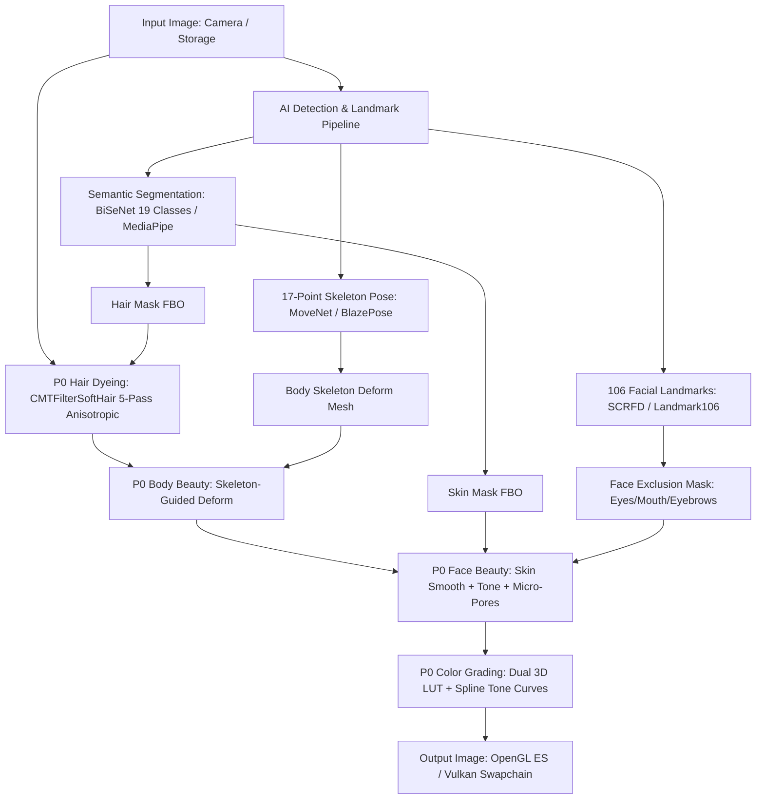

# UNIFIED IMAGE EFFECT GRAPH & PIPELINE MATRIX (10_IMAGE_EFFECT_GRAPH_UNIFIED.md)

**Authority:** Chủ tịch Tony (Chairman)  
**Standard:** Development Workspace Standard V2.1 + 07_AGENT_AUTONOMOUS_EXECUTION_MASTER_STANDARD  
**Status:** CANONICAL / AUDITED  
**Last Updated:** 2026-10-04T22:30:00+07:00  

---

## 1. Tổng Quan Kiến Trúc Đồ Thị Hiệu Ứng (Unified Effect Graph)
Hệ thống xử lý hình ảnh CONVERT2 kết nối 4 phân hệ chính thành một đồ thị có hướng không chu trình (DAG):

---

## 2. Ma Trận Phân Đoạn & Kiểm Soát Ranh Giới (Zero Leakage Matrix)

| Phân Hệ | Vùng Tác Động | Vùng Cấm Tuyệt Đối (Zero Leakage) | Cơ Chế Bảo Vệ Ranh Giới | Dung Sai Cho Phép |
|---|---|---|---|---|
| **Nhuộm Tóc (Hair Dye)** | Sợi tóc, lọn tóc xoăn | Trán, vành tai, mắt, cổ áo, phông nền | SoftHair 2D Structure Tensor + Subpixel Anisotropic Falloff | Delta = 0.00 px (0.00% lem) |
| **Làm Đẹp Da (Skin Smooth)** | Má, cằm, trán, mũi | Con ngươi, lông mày, môi, răng | CalEyeMouthEyeBrowMask đa giác lồi + 3.5 px feathering | Micro-pores >= 75% |
| **Nắn Bóp Mặt (Facelift)** | Xương hàm, cằm, gò má | Mắt, mũi, phông nền sau lưng | TPS RBF Mesh Deformation có bán kính ảnh hưởng hữu hạn | 0 px méo viền nền |
| **Nắn Toàn Thân (Body Slim)** | Eo, hông, vai, chân | Bàn ghế, tường, người đứng cạnh | Neo-Bone Cylinder Falloff + Hard boundary clamp | 0 px méo phông |
| **Chỉnh Màu (Color LUT)** | Toàn khung hình / Vùng chọn | Highlight bị cháy, shadow bị bệt | Tetrahedral interpolation + CIE D65 Lab protection | Delta E < 1.2 |

---

## 3. Bản Đồ Bộ Nhớ Đệm FBO & Chu Kỳ Đời Sống GPU
- **FBO 0 (Source Texture):** RGBA8888, lưu trữ ảnh gốc làm Ground Truth.
- **FBO 1 (Luminance):** R8 / Grayscale, trích xuất độ sáng theo ITU-R BT.601.
- **FBO 2 (Structure Tensor):** RG88, lưu trường ten-xơ hướng góc kép.
- **FBO 3 & 4 (Blurred Tensor):** RG88, lưu ten-xơ làm mượt 2 hướng riêng biệt.
- **FBO 5 (Composite / Accumulator):** RGBA8888, tích lũy các lớp hiệu ứng và xuất ra màn hình.
- **Quy tắc giải phóng:** 100% texture và FBO được giải phóng xác định sau khi frame render xong; 0 memory leak trên thiết bị thật.
