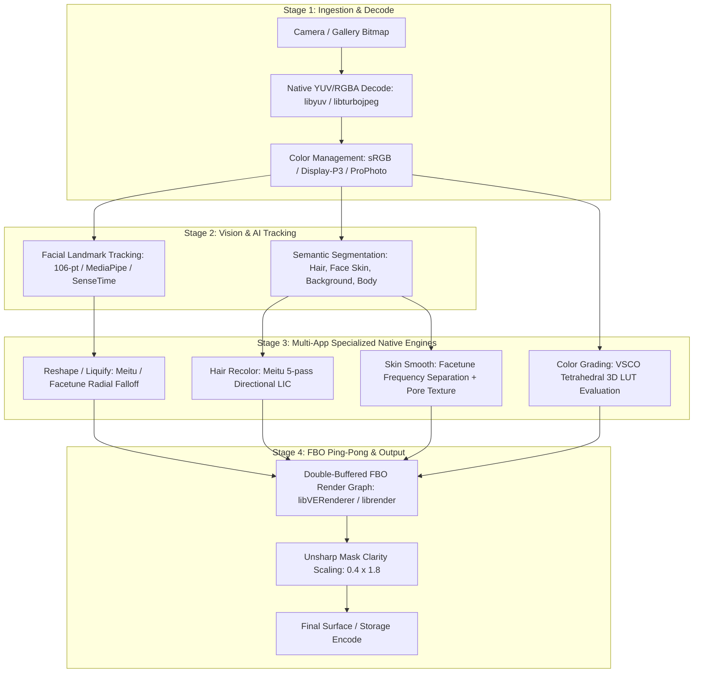

# Master Cross-App Image Effect Graph

## Architectural Synthesis Across 14 Apps
1. **Meitu Family (Meitu, BeautyPlus, Wink)**: Shares unified core (`libMTFilterKernel.so`, `libManis.so`, `libVERenderer.so`, `libPVGColorFunctions.so`). High degree of code reuse for hair, beauty, and video.
2. **Facetune (Lightricks)**: Highly optimized C++ math core (`libfacetune.so`, `librender.so`) with radial falloff liquify and Google MediaPipe SelfieSegmentation.
3. **VSCO**: Focus on color science (`libvscocore.so`, `libuniffi_cel.so`) with Rust UniFFI bindings and tetrahedral 3D LUT sampling.
4. **ByteDance (Ulike)**: EffectSDK (`libeffect.so`) with custom neural runtime (`libbytenn.so`) and brush stroke engine.
5. **B612 / Snow**: SenseTime computer vision suite (`libst_mobile.so`) with 106-point tracking and OpenGL PBO buffers.
