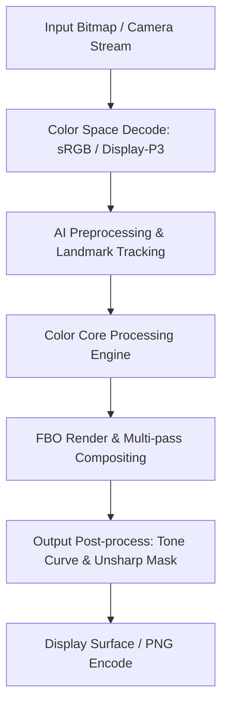

# Image Effect Graph: Adobe Lightroom Mobile

### Pipeline Details for Adobe Lightroom Mobile
- **Primary Domain**: Color
- **Framework**: libuptodown-native.so + libutd-services-native.so (Container Stub)
- **AI Integration**: Cloud ACR Backend (On-device native ACR core packaged in separate split)
