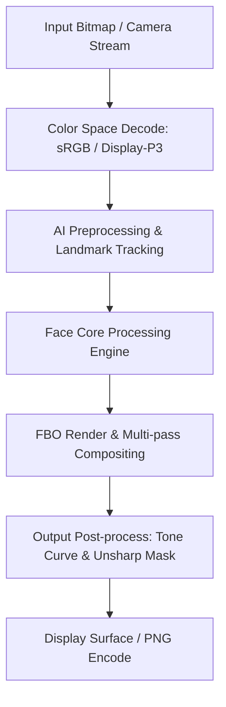

# Image Effect Graph: B612

### Pipeline Details for B612
- **Primary Domain**: Face
- **Framework**: libb612_glnativehelper.so + libst_mobile.so (SenseTime)
- **AI Integration**: TensorFlow Lite + SenseTime STMobile SDK
