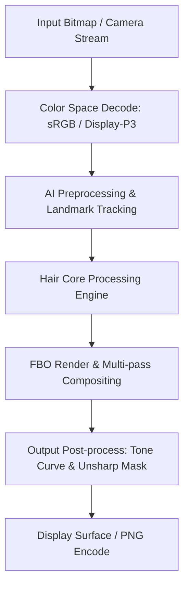

# Image Effect Graph: FaceApp

### Pipeline Details for FaceApp
- **Primary Domain**: Hair
- **Framework**: OpenGL ES FBO Blending + Android Canvas
- **AI Integration**: FaceSSD Local Landmark Tracker + Server Neural Generative Pipeline
