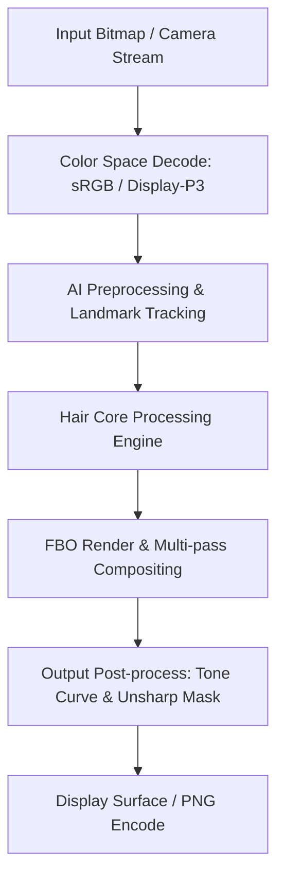

# Image Effect Graph: Facetune

### Pipeline Details for Facetune
- **Primary Domain**: Hair
- **Framework**: libfacetune.so + librender.so + libfs-native.so
- **AI Integration**: TensorFlow Lite + MediaPipe SelfieSegmentation FP16 + FaceSSD
