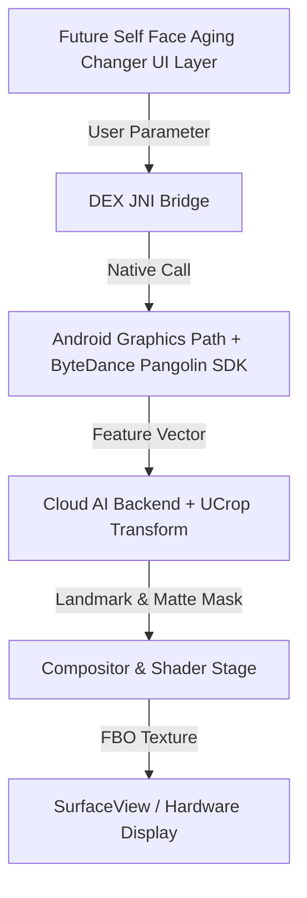

# Image & Video Effect Graph: Future Self Face Aging Changer

### Pipeline Stage Analysis
1. **Input & Parameter Normalization:** User adjustments from `Future Self Face Aging Changer` UI are marshaled into C++ structs.
2. **Vision Preprocessing:** `Cloud AI Backend + UCrop Transform` performs landmark alignment, bounding box crop, and segmentation.
3. **Shader Transformation:** Core shaders apply pixel transforms (color space conversion, LUT mapping, mesh warping).
4. **Compositing:** Multi-layer blending combines base image, effect matte, and highlight passes.
