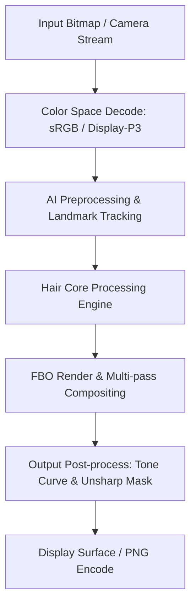

# Image Effect Graph: Meitu

### Pipeline Details for Meitu
- **Primary Domain**: Hair
- **Framework**: libMTFilterKernel.so (5-pass LIC) + libVERenderer.so + libLayerFlow.so
- **AI Integration**: Manis NCNN/MNN Engine + BiSeNet 19-class + AIModelKit
